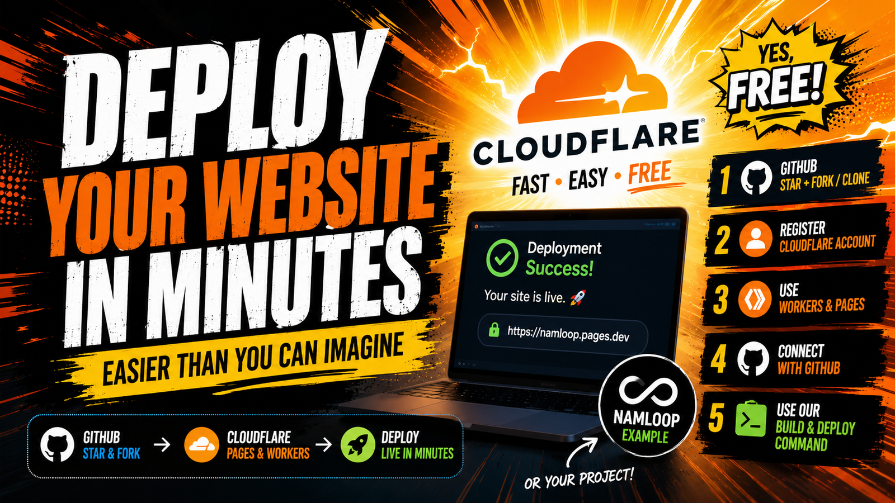
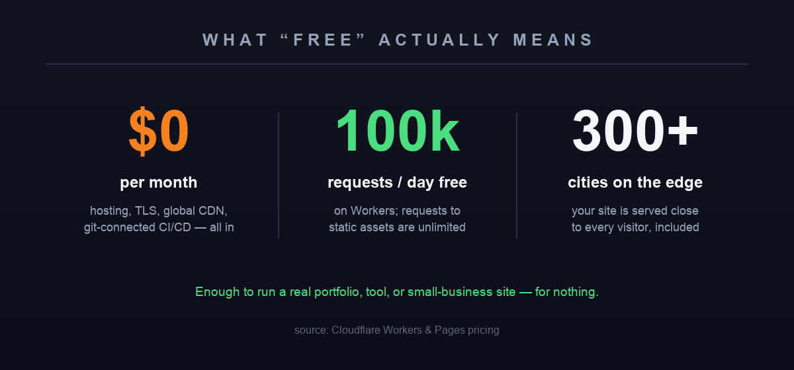

The last three websites I put on the internet each took **under ten minutes** to deploy and cost me **exactly £0 a month**. No server, no nginx, no TLS certificate to renew, no invoice. I push to `main`; about a minute later the change is live on a global CDN.

If you learned to deploy websites more than a few years ago, that sentence should sound suspicious. It isn't — it's just that the boring parts got absorbed into free tooling while nobody threw a parade. In [NamLoop, Part II](/posts/namloop-part-2-cloudflare-cicd/) I wrote about *why* this feels so different. This post is the other half: the **exact recipe**, click by click, so you can do it today.

I'll use my little side project **[NamLoop](https://github.com/NamNamChanChan/NamLoop)** (an ad-free YouTube looper) as the worked example, but the same five steps deploy *any* site — a static portfolio, an Astro blog, a Next.js app.

## Table of contents

## What you're building — and what it costs

The end state: your GitHub repo is connected to Cloudflare, and every push automatically builds and deploys your site to Cloudflare's edge network, served over HTTPS from a `*.workers.dev` URL (a custom domain is one extra click). That's continuous deployment — CI/CD — and on the free tier it genuinely costs nothing.



*The honest numbers. A static site is effectively free forever; a Worker app gets 100,000 requests/day before you'd even think about paying. Source: Cloudflare Workers & Pages pricing.*

> [!note] "Free" with the asterisk stated up front
> Cloudflare's Workers free plan allows **100,000 requests/day**, and requests to **static assets are unlimited** on every plan. For a portfolio, a brochure site, or a tool like NamLoop, you will almost certainly never hit a paid tier. I'll list the real limits honestly at the end.

## Step 1 — Star it, then fork or clone

Head to the repo you want to deploy — for this walkthrough, **[github.com/NamNamChanChan/NamLoop](https://github.com/NamNamChanChan/NamLoop)**.


*Any public repo you can see, you can fork. The Star and Fork buttons live together at the top-right.*

Three buttons matter here, and they do different jobs:

- **Star** ⭐ — a bookmark plus a quiet thank-you to the author. It doesn't copy anything; it just makes the repo easy to find again (and, honestly, it makes an open-source author's day).
- **Fork** — makes *your own copy* of the repo under your GitHub account. This is the one you want if you're deploying someone else's project, because Cloudflare will deploy from a repo **you** control.
- **Clone** — downloads a copy to your laptop so you can run it locally:

```bash
git clone https://github.com/NamNamChanChan/NamLoop.git
cd NamLoop
npm install
npm run dev        # open http://localhost:3000 to see it running locally
```

For deploying your own project, skip the fork and just push your code to a GitHub repo of your own. Either way, **the rule is simple: Cloudflare deploys from a GitHub repo you own.**

## Step 2 — Get a free Cloudflare account

Go to [dash.cloudflare.com/sign-up](https://dash.cloudflare.com/sign-up), enter an email and a password, verify the email. That's it — **no credit card** for the free tier. Two minutes, and you never have to touch DNS or servers to follow this recipe.

## Step 3 — Open "Workers & Pages"

In the Cloudflare dashboard sidebar, click **Workers & Pages**. This one section is the home for both of Cloudflare's site-hosting products, and a quick word on which to use in 2026:

- **Workers** is the one to reach for now. It hosts everything from a folder of static files to a full server-rendered app, and it's where Cloudflare is putting all its new work. All three of my sites (this blog, [krystle.hk](https://krystle.hk), NamLoop) run on Workers.
- **Pages** is the older sibling, built for purely static sites. It still works well, and if you only have a folder of HTML it's a perfectly fine choice — but for anything new I'd start on Workers.

> [!tip] Don't overthink Workers vs Pages
> For a beginner deploying a static site, either works. Pick **Workers** and move on — the git-connected flow below is nearly identical for both, and Workers is the path Cloudflare is investing in.

Click **Create**, then find **Import a repository**.

## Step 4 — Connect GitHub

Cloudflare will ask to connect your Git account. Choose **GitHub**, authorise it (you can grant access to *all* your repos or just selected ones — selecting only the repo you're deploying is the tidy option), then pick your repo from the list — your **NamLoop fork**, or your own project's repo.

This is the handshake that makes the magic recurring: from now on, Cloudflare watches that repo and redeploys whenever you push.

## Step 5 — The build & deploy command

This is the only technical step, and it's two fields. When Cloudflare builds your site it runs a **build command** (which turns your source into a folder of files or a Worker) and then a **deploy command** (which ships it). Here's exactly what to put:


*Two recipes cover almost everything. The deploy command defaults to `npx wrangler deploy`, so most of the time you only set the build command.*

**For a static site** (an Astro blog, a Vite app, plain HTML — like this blog):

- **Build command:** `npm run build`
- **Deploy command:** `npx wrangler deploy` (this is the default — you often leave it untouched)

A static site needs a two-line config file in the repo, `wrangler.jsonc`, telling Cloudflare "this is just a folder of files":

```jsonc
{
  "name": "my-site",
  "compatibility_date": "2026-07-04",
  "assets": {
    "directory": "./dist",
    "not_found_handling": "404-page"
  }
}
```

**For a Next.js app** (like NamLoop, which uses the [OpenNext](https://opennext.js.org/cloudflare/) adapter to run on Cloudflare):

- **Build command:** `npx opennextjs-cloudflare build`
- **Deploy command:** `npx wrangler deploy`

NamLoop's `wrangler.jsonc` already ships in the repo (it points `main` at the built `.open-next/worker.js`), so if you forked it, there's nothing to write — Cloudflare will find it.

> [!note] If your repo has no config, Cloudflare writes it for you
> Connect a repo with no `wrangler.jsonc` and Cloudflare's **autoconfig** detects your framework (Astro, Next.js, etc.) and opens a **pull request** adding the right config, plus a preview deployment to test before you merge. You can genuinely start from "just my code" and let the platform propose the wiring.

Click **Save and Deploy**. Cloudflare clones the repo, runs your build, deploys it, and hands you a live `https://<project>.workers.dev` URL — served worldwide, HTTPS included, in about a minute.

> [!tip] Prefer the command line? One-shot deploy from your laptop
> You don't strictly need the dashboard. With the repo cloned, this ships it straight from your machine:
> ```bash
> npx wrangler login    # one-time browser auth with Cloudflare
> npm run deploy        # NamLoop's script: builds with OpenNext, then deploys
> ```
> The git-connected setup above is just this, automated on every push so you never have to remember to run it.

## From now on, `git push` *is* deploy

That's the whole point. Once step 5 is done, deployment stops being a task:

```bash
git add -A
git commit -m "tweak the hero copy"
git push origin main   # ~1 minute later, it's live worldwide
```

Cloudflare rebuilds and redeploys automatically. Want a real address instead of `*.workers.dev`? In the project's settings, **add a custom domain** — if your domain is on Cloudflare, the DNS record and TLS certificate are created for you in one click. I did this for `loop.nam-ai.uk` in about thirty seconds.

## The honest catches

Because I won't sell you a free lunch without reading the menu:

- **The free tier is generous, not infinite.** Workers free = **100,000 requests/day**; static-asset requests are unlimited. Fine for a portfolio or a tool; a viral launch day is when you'd look at the $5/month plan.
- **The edge runtime isn't quite Node.** A Worker isn't a normal server. Most things work, but the exceptions (e.g. NamLoop disables Next's image optimizer, which the Worker runtime doesn't run) announce themselves at build time.
- **"Trivial" assumes no backend.** The moment you need a database, logins, or queues, you're back to real architecture — Cloudflare will sell you its versions (D1, KV, R2), and that's a fine road, but it's a *road*, not a checkbox.
- **A little lock-in is the price of the magic.** A `wrangler.jsonc` here, a build setting there. For a static folder it's minutes to move elsewhere; lean on platform storage and it's more.

I go deeper on all of this in [NamLoop, Part II](/posts/namloop-part-2-cloudflare-cicd/) — this post is the recipe; that one is the reflection.

## Takeaway

Somewhere in the last few years, deploying a website quietly turned into a **save button**. The recipe above is the same whether you're shipping a weekend toy or a client's site: star, fork, connect, one build command, push. The hard part was never getting it online — it's deciding the thing is worth putting online at all.

So pick a repo — mine, a template, or something you built this week — and give it an address. It'll cost you ten minutes and nothing else.

*Stuck on a step, or want a second pair of eyes before you point a real domain at it? [Email me](mailto:nam@wistkey.com) — I'm happy to help you get it live.*

---

*If this helped, there's more where it came from: [follow me on Medium](https://nam0403.medium.com/), [subscribe or bookmark nam-ai.uk](https://nam-ai.uk) for new build-in-public posts, and come [connect on LinkedIn](https://www.linkedin.com/in/nam-chan/) — I like meeting people who ship things.*
