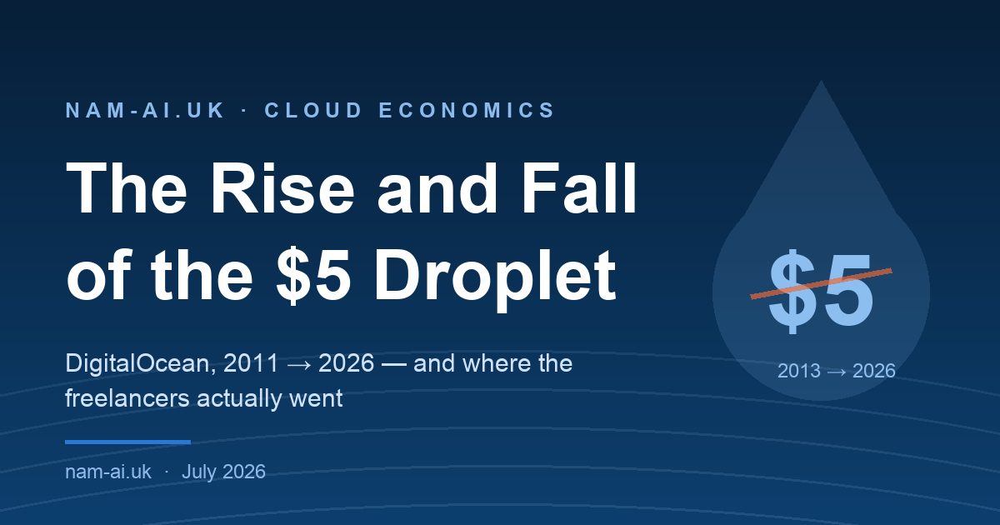
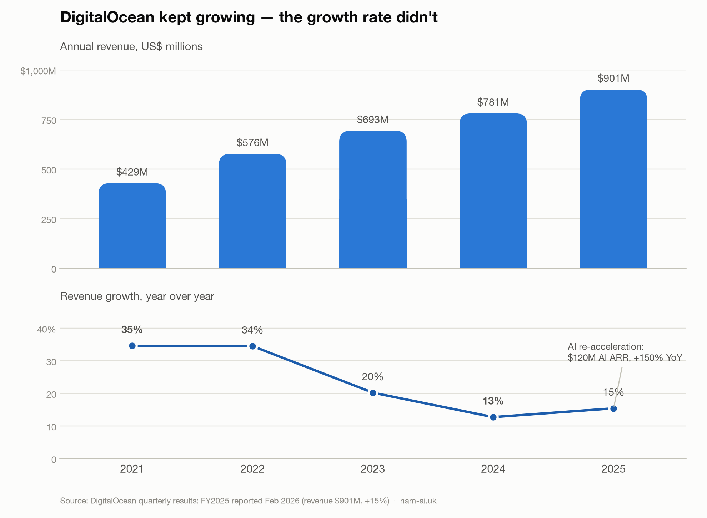
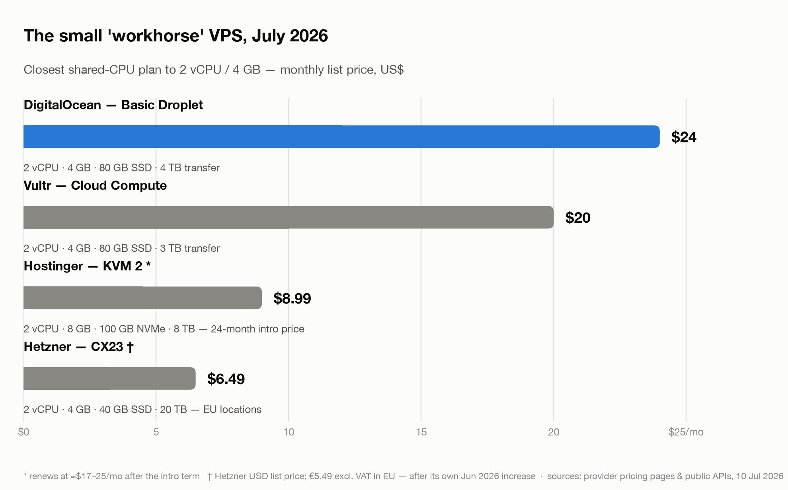

For about a decade, there was one universally correct answer to "where do I host this?" if you were a freelancer or a tiny team: **get a $5 DigitalOcean droplet**. It held a client's WordPress site, a staging box, a side project, your VPN. The price never moved, the UI didn't fight you, and whatever broke at 2am, there was a DigitalOcean community tutorial for it — usually the first Google result, usually better than the official docs of the thing you were fixing.

In 2026, when I ask the same crowd where their stuff runs, the answers are Hetzner, Vultr, Hostinger, a Coolify box, "some PaaS". Almost nobody says DigitalOcean anymore.

Here's the thing though: DigitalOcean didn't collapse. Revenue just crossed **$901 million**, growing again after a long slide. What actually happened is quieter and more interesting — **the company moved upmarket and left its original audience behind**, one reasonable-sounding decision at a time. If you sell to freelancers, or you *are* one, the whole arc is worth studying, because the same playbook is coming for every tool you love.


*Fifteen years in one line: a decade of being the developer's cloud, then four years of drifting toward bigger customers and, eventually, AI. Sources: company announcements and filings.*

## Table of contents

## Why everyone loved it

DigitalOcean won the freelancer market around 2013 with a genuinely radical product: an SSD server for **$5/month, flat**. No calculator with forty inputs, no surprise line items, no "it depends" pricing page. The bill was *boring*, and for a solo dev invoicing clients, boring is exactly what a cost should be.

The moat wasn't really the servers, though — it was the **tutorials**. DigitalOcean's community docs taught a generation of us nginx, systemd, UFW, Postgres backups. Add Hacktoberfest and a clean control panel, and DO wasn't just a host; it was where you *learned to be* the kind of person who runs servers. AWS sold to CTOs. DigitalOcean sold to the person doing the work.

That trust is why what came next stung.

## The turn: July 2022

In March 2021 DigitalOcean IPO'd on the NYSE as DOCN — and a public company inherits a mandate: grow, every quarter, forever. Sixteen months later, in [July 2022, came the first price increase in the company's history](https://www.digitalocean.com/blog/new-4-dollar-droplet-updated-pricing): the beloved $5 droplet became **$6**, with rises of **up to 20%** across products, softened by a new cut-down $4 tier (512 MB — enough for a DNS resolver, not a client site).

A dollar is not an outrage; that's not the point. The point is that "the price never moves" *was the product*, and now it moved. The psychological contract broke.

The clearer signal was what happened to **support**. Response times are now [a paid product line](https://www.digitalocean.com/pricing/support):

| Plan | Price | First response |
|---|---|---|
| Starter | Free | < 24 h, email |
| Developer | $24/mo | < 8 h |
| Standard | $99/mo | < 2 h, + live chat |
| Premium | $999/mo | < 30 min, + Slack channel |

Read that middle row again: **being answered within a working day costs $24/month — more than the server it supports.** For a freelancer with a client site down, "free" means *tomorrow*. Nothing communicates "you are no longer the customer" quite like a support paywall priced above your entire monthly spend.

## Follow the money

The financials tell the story without any editorializing:



*Revenue kept climbing, but growth cooled from 35% to 13% by 2024 — then AI money re-accelerated it. Source: DigitalOcean quarterly results; FY2025 reported February 2026.*

Between the IPO and 2024: growth fell from ~35% to ~13%, the company [cut about 11% of staff in February 2023](https://www.theregister.com/2023/02/15/digitalocean_layoffs/), bought Cloudways ($350M, managed hosting) and [Paperspace ($111M, GPU cloud)](https://techcrunch.com/2023/07/06/digitalocean-acquires-cloud-computing-startup-paperspace-for-111m-in-cash/), and in February 2024 brought in a new CEO, Paddy Srinivasan. The fix for slowing growth was never going to be more $6 droplets.

By 2025 the pivot had a name: **[Gradient](https://www.digitalocean.com/blog/introducing-digitalocean-gradient)**, DigitalOcean's "agentic inference cloud" — GPU droplets, model serving, agent tooling. And it's working: [FY2025 closed at $901M, +15%](https://investors.digitalocean.com/news/news-details/2026/DigitalOcean-Announces-Fourth-Quarter-and-Fiscal-Year-2025-Financial-Results/), with **$120M of AI ARR growing 150% year-on-year** and guidance of ~21% growth for 2026. Revenue from customers spending $1M+ a year grew 123%.

Then there's the detail that gives this essay its thesis. In Q4 2025, DigitalOcean **restructured its reported customer metrics to exclude accounts spending under $500 a month**. The cohorts it now highlights to investors start at $100k a year.

The $5-droplet customer didn't just stop being the priority. They stopped being *counted*.

> [!NOTE] To be fair
> None of this is a scandal — it's strategy, executed openly. The platform still works, the docs are still good, and the January 2026 move to per-second billing is genuinely customer-friendly. DigitalOcean isn't dying; FY2025 was arguably its best year in a while. It has simply, deliberately, stopped being *for you and me* — and pretending otherwise is how you end up overpaying out of nostalgia.

## The math in 2026

Sentiment aside, here's what the money buys today. The workhorse spec for small production work — 2 vCPU / 4 GB, shared CPU — priced in July 2026:



*The same shape of machine, four bills. Hostinger's price is a 24-month intro rate (renews at roughly $17–25); Hetzner's is its USD list price — €5.49 before VAT in EU locations — after Hetzner's own June 2026 increase. Sources: provider pricing pages and public APIs, 10 July 2026.*

The [$24 Basic Droplet](https://www.digitalocean.com/pricing/droplets) ships 80 GB SSD and 4 TB of transfer. Hetzner's CX23 ships the same cores and RAM with **20 TB** of transfer for about a quarter of the price. Vultr's identical-shape plan is $20. Egress overage on DigitalOcean runs [$0.01/GiB](https://docs.digitalocean.com/products/droplets/details/pricing/) — roughly **$10 per extra TB versus Hetzner's ~€1**.

If you're a DigitalOcean customer of long standing, the first honest step is seeing what you actually rent. The API will tell you (`doctl` is DO's official CLI):

```bash
# Every size slug with its specs and monthly price, straight from DO
doctl compute size list --format Slug,VCPUs,Memory,Disk,PriceMonthly
```

Then compare what your slugs cost against the chart above. That ten-minute audit is how most people discover they're paying 2019 prices for 2026 compute — the same "un-revisited assumptions" problem I wrote about in [the cloud-bill post](/posts/cut-cloud-costs-with-claude-and-gcloud/), wearing a different logo.

## Where the freelancers actually went

Watching this community for the past couple of years — and having moved client workloads myself — the exodus sorted itself into five destinations.

### Hetzner: the value king, with a fresh asterisk

The German provider became the enthusiast default from about 2023: absurd specs per euro, 20 TB of included traffic in EU locations, real hardware. The asterisk is new and important: **Hetzner raised cloud prices twice in 2026** — in April, and then again [on 15 June, when its shared Intel line went from €3.99 to €5.49 and dedicated-vCPU plans more than doubled](https://docs.hetzner.com/general/infrastructure-and-availability/price-adjustment/) (CCX13: €15.99 → €42.99). Existing instances keep their price; new orders pay the new one.

Even after the hikes, the CX23 at €5.49 embarrasses a $24 droplet. But the lesson generalizes: **the cheap provider will also raise prices eventually. Loyalty is not a strategy; portability is.**

```bash
# Hetzner's CLI — a CX23 in Falkenstein, Ubuntu 24.04
hcloud server create --name app-01 --type cx23 --image ubuntu-24.04 --location fsn1
```

Mind the geography: the famous 20 TB of included traffic applies to EU locations; US and Singapore locations include far less (about 1 TB and 0.5 TB respectively) and carry a different, pricier plan line-up.

### Vultr: the like-for-like swap

If you want "DigitalOcean, but cheaper and with more regions" rather than a new philosophy: 32 data centres, a $5 1-GB plan, the 2 vCPU / 4 GB workhorse at **$20**, no prepay games. The closest drop-in replacement on this list — same mental model, slightly better unit prices, far more locations (including plenty in Asia, which matters from Hong Kong).

### Hostinger: the beginner wave

The provider every YouTube sponsor segment sells. The hardware is honestly generous — KVM 2 is 2 vCPU / **8 GB** / 100 GB NVMe at **$8.99/month** — but that price requires a 24-month prepay and **renews at roughly $17–25/month**. Fine value even at renewal; just do the maths on the renewal price, not the banner price, and set a calendar reminder for month 23.

### The Coolify wave: your own Heroku on any of the above

The most interesting shift isn't a provider — it's a workflow. [Coolify](https://coolify.io) (58,000+ GitHub stars) and Dokploy give you a self-hosted PaaS: push-to-deploy, automatic HTTPS, one dashboard for every client app, on any VPS you own. This is what actually replaced the "$5 droplet + a DO tutorial" culture — the tutorial is now a product.

```bash
# On a fresh Ubuntu LTS box (Coolify wants 2 cores / 2 GB / 30 GB minimum — a CX23 fits)
curl -fsSL https://cdn.coollabs.io/coolify/install.sh | sudo bash
```

A freelancer running six client apps on one €10 Hetzner box behind Coolify is paying less than one DigitalOcean droplet used to cost them. That arithmetic, repeated a few thousand times, *is* the exodus.

### Managed PaaS: for those who never wanted a server

Railway, Render, Fly.io — the "I bill for shipped features, not for patching nginx" option. Costlier per unit of compute, cheaper per unit of *attention*. The right answer for a subset of freelancers, and the wrong comparison for a raw-VPS price chart, so I'll leave it at that.

> [!TIP] Match the destination to the job
> One WordPress site for a client → Hostinger (mind the renewal) or any $5-class VPS. A portfolio of client apps → Coolify on Hetzner or Vultr. A product with real traffic and no ops appetite → a managed PaaS, or honestly, staying on DigitalOcean's App Platform. There is no single winner — that's rather the point of leaving a defaults-based decision behind.

## If you do leave: the unglamorous migration

For a typical small site the move is an afternoon, not a project.

```bash
# 1. Freeze a restorable copy of the old droplet (power off first for consistency)
doctl compute droplet-action snapshot 123456789 --snapshot-name "pre-migration-2026-07"

# 2. Sync the payload to the new box (archive mode, compressed)
rsync -avz /var/www/ root@203.0.113.10:/var/www/
```

Drop your DNS TTL to 300 the day before, restore the database from a fresh dump (not the filesystem), test on the new IP with an `/etc/hosts` override, then flip the record. Outbound transfer for the copy counts against your included pool; at $0.01/GiB overage, even a 100 GB move is at most a dollar — the egress ransom that keeps people on the big clouds barely exists here.

> [!WARNING] The boring failure modes
> The migrations that go wrong don't fail on rsync — they fail on the forgotten cron job, the Let's Encrypt renewal, the `.env` that never left the old box. Diff `crontab -l`, `systemctl list-units --type=service`, and your certbot state before you kill the old server, and keep that snapshot for a month.

## And if you stay

Staying is defensible: your team knows the console, App Platform plus a managed database is a genuinely tidy bundle, invoices come from a US public company (some clients' procurement cares), the docs remain excellent, and per-second billing has made bursty CI workloads meaningfully cheaper. The $4 and $6 droplets still exist and are still fine for small things.

Just stay *deliberately*, at 2026 prices, knowing what the alternatives charge — not out of 2015 gratitude.

## The takeaway

Nobody villain-twirled here. A public company followed growth upmarket, then followed it into AI, and each step made sense in a boardroom. But the sum of sensible steps is that the platform which taught freelancers to run servers now literally doesn't count them in its metrics — and the crowd, rationally, took the skills those tutorials gave them and moved somewhere that still prices for them.

Two habits protect you from every future rerun of this story: **keep workloads portable** (containers, a deploy layer like Coolify, config in git — moving in an afternoon must stay cheap), and **re-audit the bill yearly** like any other assumption. Platforms change strategy; your loyalty should be to the arithmetic.

*Paying 2019 prices for 2026 compute — or not sure whether your stack could actually move in an afternoon? I do this for a living: [email me](mailto:nam@wistkey.com) and I'm happy to look at your setup.*

---

*If this was worth your time: [follow me on Medium](https://nam0403.medium.com/), [subscribe or bookmark nam-ai.uk](https://nam-ai.uk) for the next post, and [connect on LinkedIn](https://www.linkedin.com/in/nam-chan/) — I enjoy comparing infrastructure notes.*
