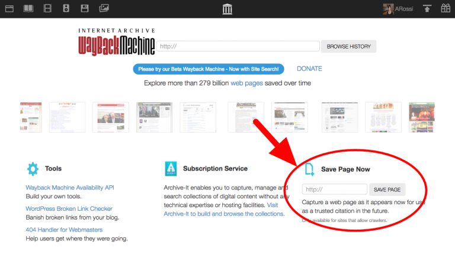
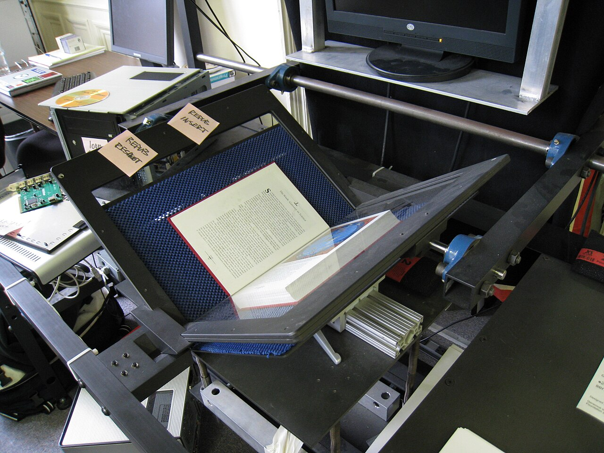

*Web archaeology is often the fastest route to understanding a legacy system.*

My last post started with a recovered Facebook game. The trail began, as many of my best web explorations do, at [Internet Archive](https://archive.org/).

That made me realise I owed the website a proper thank-you.

Across roughly a decade in software development, the [Wayback Machine](https://web.archive.org/) has repeatedly helped me find the missing piece of a legacy system: an old manual after the vendor disappeared, a previous page structure after a redesign, documentation that was silently rewritten, or the visual state of a product nobody thought to screenshot.

It is not part of my IDE, monitoring stack or source control. Yet it has often behaved like an unofficial debugger for the history around the code.

## Table of contents

## More than old screenshots

Internet Archive is a non-profit digital library for websites and other cultural material. Its collections cover books, audio, video, images and software; the Wayback Machine alone now offers the history of [more than one trillion web pages](https://web.archive.org/).

The scale matters, but the simple interaction matters more: enter a URL, choose a capture date, and visit a version of the web that its original owner may no longer provide.

*The interface has changed over time; the essential idea has not. Screenshot from the [Internet Archive Help Center](https://archivesupport.zendesk.com/hc/en-us/articles/360001513491-Save-Pages-in-the-Wayback-Machine).*

For ordinary browsing, that is nostalgia. During legacy maintenance, it can be evidence.

## The questions it has answered for me

Old systems rarely arrive with a clean handover. You inherit fragments: a repository, a database, a domain, perhaps a ticket mentioning a feature that no longer exists.

The Archive has helped me answer practical questions such as:

- What did this page do before the current redesign?
- Which download, script or support document did this dead link once point to?
- Was this field part of the original workflow, or added later?
- How did the company explain the product when the code was written?
- Which assets and URLs existed before a migration broke them?

A capture does not explain the implementation, but it gives the code a historical user interface and business context. That is often enough to turn a mysterious branch or database column into something understandable.

## My small preservation habit

I now check the Wayback Machine early, not after every other investigation fails. I start with the exact URL, compare captures around a release or migration date, and follow archived links rather than assuming the latest capture is complete.

When I am about to replace or retire something useful, I also use [Save Page Now](https://archivesupport.zendesk.com/hc/en-us/articles/360001513491-Save-Pages-in-the-Wayback-Machine). It captures one page, including available images and CSS; it is not a whole-site crawl. That modest limitation is still better than expecting somebody else to preserve the page later.

*Preservation is physical work as well as software. Photo by [Dvortygirl](https://commons.wikimedia.org/wiki/File:Internet_Archive_book_scanner_1.jpg), licensed [CC BY-SA 4.0](https://creativecommons.org/licenses/by-sa/4.0/).*

> [!warning] An archive is not a backup
> Internet Archive itself warns that captures may have missing images, broken JavaScript or no server-side behaviour. Password-protected pages and workflows that require the original server may never be captured. Treat a snapshot as historical evidence, not a guaranteed restorable system.

That distinction shaped the game project too. Internet Archive helped me discover the recovered game and its contributors. But making it survive independently required bringing the permitted artifact, emulator and provenance into my own repository. Discovery and preservation are related; they are not identical.

## A public service for people maintaining private history

Most legacy maintenance is not dramatic. It is patient reconstruction: what existed, why it existed, and which parts still matter.

Internet Archive has saved me many hours of guessing across that work. More importantly, it has preserved pieces of the web that no commercial roadmap had any reason to keep. The old pages may look awkward now, but they contain decisions, communities and explanations that still help us understand the systems left behind.

So: thank you to the people who build, crawl, operate and support it. A surprising amount of modern software work depends on being able to look backwards.

*Maintaining a legacy platform or reconstructing a vanished web workflow? I am always happy to compare notes — [email me](mailto:nam@wistkey.com).*

---

*For more practical stories from old and new systems, [follow me on Medium](https://nam0403.medium.com/), [subscribe or bookmark nam-ai.uk](https://nam-ai.uk), or [connect with me on LinkedIn](https://www.linkedin.com/in/nam-chan/) — no hard sell, just an open door for people who enjoy web archaeology too.*
