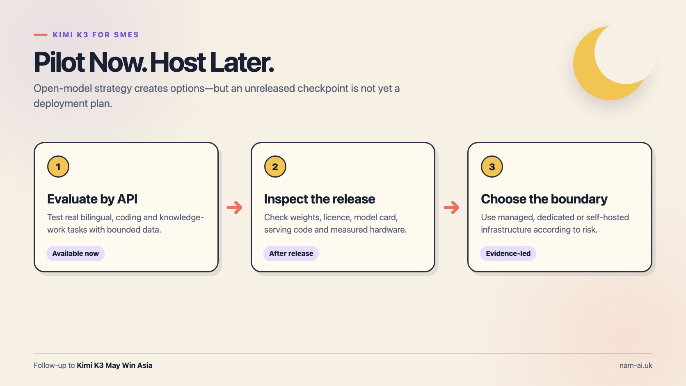
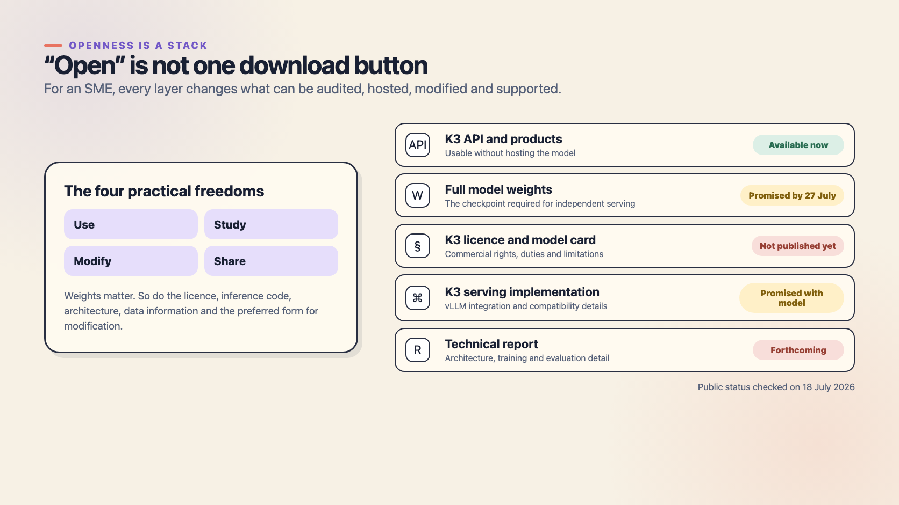
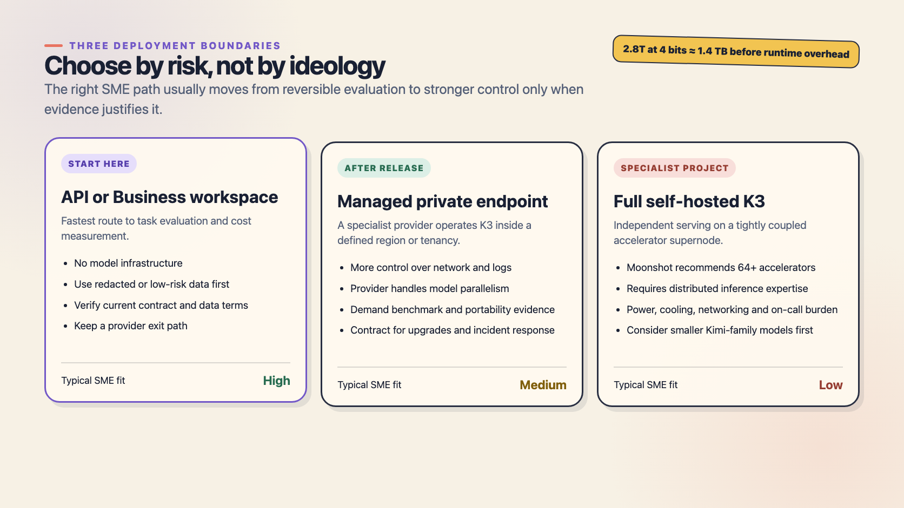

_For an SME, Kimi K3's open-model strategy creates options—but an unreleased checkpoint is not yet a deployment plan._

In my [first Kimi K3 article](/posts/kimi-k3-may-win-asia/), I argued that Moonshot does not need to beat GPT or Claude everywhere to change Asia's AI market. Regional fit, price, product distribution and open deployment can create a serious alternative.

This follow-up asks the question a managing director or CTO will ask next:

**Can my company deploy it?**

The short answer on 18 July 2026 is:

- you can evaluate K3 through Kimi's products and API now;
- Moonshot says full model weights and matching vLLM work will arrive by 27 July;
- the K3 licence, model card and technical report are not yet available to inspect; and
- Moonshot recommends **64 or more accelerators** for full K3 serving.

So an SME should not begin by pricing a giant GPU rack. Begin with a controlled API pilot, measure whether K3 creates a genuine advantage, then revisit the hosting boundary after the release artefacts exist.

## Table of contents

## First: K3 is open by direction, not yet by inspection

Moonshot describes K3 as the first open model in the 3-trillion-parameter class. The [official technical blog](https://www.kimi.com/blog/kimi-k3) says the 2.8T model uses Kimi Delta Attention, Attention Residuals and a sparse mixture-of-experts architecture that activates 16 of 896 experts. It also promises full weights by 27 July 2026, a technical report, and a corresponding vLLM implementation.

Those promises are meaningful. They are not the same as released artefacts.

As of 18 July, I cannot find a K3 repository, checkpoint, model card or licence in Moonshot's official [GitHub organisation](https://github.com/MoonshotAI) or [Hugging Face organisation](https://huggingface.co/moonshotai/models). Independent coverage from [Tom's Hardware](https://www.tomshardware.com/tech-industry/artificial-intelligence/moonshot-releases-2-8-trillion-parameter-kimi-k3) makes the same timing distinction: today's performance evidence comes from Moonshot's disclosures and API access; independent weight-based evaluation must wait for the release.

That is why I would describe today's position as an **open-model commitment with a pending open-weight release**. On 27 July, we can inspect what was actually shipped.

> [!important] “Open” has several layers
> An API can be publicly available without being open source. Downloadable weights can enable independent hosting without disclosing enough to reproduce the training process. A permissive licence can allow commercial use while infrastructure requirements still make deployment inaccessible to most companies.

The [Open Source Initiative's AI definition](https://opensource.org/ai/open-source-ai-definition) asks whether people have the freedom and preferred form to use, study, modify and share the system. That includes parameters, relevant code and sufficient data information—not merely a download link.

I am not using that definition to award K3 a label before release. I am using it as a procurement checklist.



_Openness is a stack. Every missing layer changes what an SME can audit, host, modify, support and insure._

## Why 16 active experts does not make K3 a small model

K3's sparsity is clever: only 16 of 896 routed experts are active for a token. That reduces the compute used for each token compared with activating the whole model.

It does not mean the other experts disappear from storage.

Moonshot says K3 uses MXFP4 weights and MXFP8 activations. A transparent lower-bound calculation is:

> 2.8 trillion parameters × 4 bits ÷ 8 ≈ **1.4 TB of raw parameter values**

That estimate excludes quantisation scales, metadata, runtime buffers, activations, redundancy and the KV cache. A one-million-token context can add a substantial memory and throughput burden of its own. The actual deployment footprint must come from the released model and measured serving configuration, not this back-of-an-envelope number.

Moonshot's own recommendation is the more important fact: deploy K3 on a **supernode with at least 64 accelerators**, keeping expert-parallel traffic inside a large high-bandwidth domain.

For most SMEs, that is not “buy a server”. It is a distributed-inference programme involving:

- accelerator availability and compatibility;
- high-bandwidth interconnects;
- power, cooling and rack capacity;
- model parallelism and failure recovery;
- observability, upgrades and security patches; and
- engineers who can diagnose latency across a multi-node serving system.

Open weights can remove a vendor permission boundary. They do not remove physics or operational work.

## The three realistic deployment boundaries



_Choose by risk and evidence, not by ideology. Stronger control is useful only when the workload justifies the extra operational burden._

### Route 1: API or Kimi Business—available now

This is the sensible starting point for most companies.

The [official K3 quickstart](https://platform.kimi.ai/docs/guide/kimi-k3-quickstart) exposes an OpenAI-compatible chat-completions endpoint using the model name `kimi-k3`. A minimal smoke test is:

```bash
export MOONSHOT_API_KEY="replace-with-your-project-key"

curl https://api.moonshot.ai/v1/chat/completions \
  --header "Authorization: Bearer ${MOONSHOT_API_KEY}" \
  --header "Content-Type: application/json" \
  --data '{
    "model": "kimi-k3",
    "messages": [
      {
        "role": "user",
        "content": "Create a three-item checklist for evaluating an AI support assistant. Do not use customer data."
      }
    ]
  }'
```

That is access, not production architecture. Put the API behind your own service so you can redact inputs, enforce budgets, log model versions, apply timeouts, route failures and replace the provider later.

Kimi Business is another low-operations route for employees using Kimi directly. Its [product page](https://www.kimi.com/business) says enterprise workspaces are isolated and enterprise data is not used for training. Treat that as a vendor statement to verify in the signed agreement before sensitive deployment.

There is also a detail careful buyers should not skip. Kimi's [API data-security help page](https://www.kimi.com/help/kimi-api/api-data-security) says API inputs and outputs are not used to train or improve models. The broader [OpenPlatform privacy policy](https://platform.kimi.ai/docs/agreement/userprivacy) says user content may help improve and refine underlying technology and that collected information is stored on servers in Singapore. These pages may cover different scopes or reflect different update dates, but an SME should not guess which wording controls its workload.

Ask for product-specific answers in the order form or data-processing agreement:

- Is prompt and output content retained, and for how long?
- Is it used for training, safety review or service improvement?
- In which region is it processed and backed up?
- Which subprocessors can access it?
- What deletion, audit and incident-notification commitments apply?

Start with public, synthetic, redacted or low-risk data until those answers are contractual.

### Route 2: A managed private endpoint—possible after release

After the weights and serving code exist, a specialist inference provider may offer K3 in a dedicated tenancy or defined region. That can give an SME more network, logging and data-residency control without employing a team to operate expert parallelism.

The word **private** needs evidence. Ask the provider to demonstrate:

- the exact K3 checkpoint and licence used;
- whether accelerators, memory and storage are dedicated or shared;
- network isolation and administrator access controls;
- encryption, log retention and deletion behaviour;
- measured throughput at your prompt and context distribution;
- upgrade, rollback and vulnerability-response procedures; and
- an export path for prompts, evaluations and application state.

Do not sign a long reservation because a benchmark looked impressive. Run the same acceptance suite against the official API and managed endpoint first.

### Route 3: Full self-hosting—a specialist project

Full self-hosting gives the greatest infrastructure control, but it is the weakest default fit for a normal SME. A 64-plus-accelerator supernode may make sense for a regional cloud, government programme, university consortium or company with sustained high-volume demand and strict sovereignty requirements.

It rarely makes sense merely because an API invoice feels uncomfortable.

Before approving a full K3 build, compare the three-year cost of:

- accelerators, networking, storage, power and facilities;
- engineering, security and 24-hour operational cover;
- capacity left idle outside peak demand;
- upgrades, spare hardware and vendor support; and
- the business cost of slower model refreshes.

Also test whether a smaller member of Moonshot's open-model family can do the job. Moonshot already publishes models such as Kimi Linear 48B-A3B and several 16B-class Kimi or Moonlight models in its [Hugging Face organisation](https://huggingface.co/moonshotai/models). They are not K3 substitutes by default, but a smaller model that meets the acceptance threshold is usually a better private deployment than a frontier model the team cannot operate safely.

## K3's official limitations should shape the architecture

Moonshot's K3 documentation is unusually direct about several operational limits:

1. K3 needs the complete assistant message—including thinking history—returned in later turns. Dropping that history, or switching to K3 midway through a session from another model, can make quality unstable.
2. K3 can be excessively proactive on ambiguous tasks and may make unexpected decisions for the user.
3. At launch, `reasoning_effort` supports only `max`, while several sampling parameters are fixed.
4. Moonshot says its official web-search tool is being updated and is not recommended for near-term production workflows.

For an SME agent, these are not footnotes. They become system requirements:

- pin a tested harness and model version;
- preserve conversation state correctly;
- avoid silent mid-session model switching;
- sandbox tools and apply least privilege;
- use explicit system instructions or `AGENTS.md` boundaries;
- require human approval before consequential actions; and
- supply your own verified retrieval layer rather than depending on a tool the vendor does not yet recommend for production.

An open model does not make an unsafe agent safe. The application boundary still matters more than the logo on the model card.

## A practical four-phase SME rollout

### Phase 1: Prove the task

Choose one bounded workflow with a human owner—for example, bilingual tender summarisation, internal support-draft preparation or a contained coding review. Prepare 30 to 50 representative cases, including awkward and adversarial ones.

Measure accepted quality, reviewer minutes, latency, retries, tool failures, input and output tokens, and cost per accepted result. Compare K3 with the model already in use; do not compare it with an imaginary zero-cost baseline.

### Phase 2: Prove the data boundary

Classify the fields before sending anything:

- public;
- internal;
- confidential;
- personal data;
- regulated or contract-restricted.

Redact or replace sensitive fields in the pilot. Document where prompts, outputs, logs, embeddings and evaluation results live. Confirm deletion and access controls.

### Phase 3: Prove the control boundary

Run K3 behind an internal gateway. Set per-project budgets, rate limits, timeouts and allowed tools. Log the model identifier, policy version, user approval and final outcome. Test provider failure and rollback.

The exit criterion is not “the demo worked”. It is a repeatable accepted-result rate with understood failures.

### Phase 4: Revisit hosting after 27 July

When Moonshot publishes the K3 release, inspect:

- the exact licence and commercial conditions;
- model-card limitations and intended use;
- checkpoint format, hashes and provenance;
- the released vLLM version and supported accelerators;
- measured memory, prefill, decode and long-context behaviour;
- quantisation and quality trade-offs;
- security and update ownership; and
- independent evaluations using the released weights.

Only then choose between staying on the API, contracting a managed private endpoint or funding self-hosted infrastructure.

## What K3's open approach really gives an SME

The immediate benefit is not a free 2.8T model under the office desk.

It is **optionality**:

- another credible API to benchmark;
- a future path to independent or regional hosting;
- visibility into architecture and serving work;
- competitive pressure on closed providers;
- the possibility of smaller derivatives and a broader tool ecosystem; and
- more leverage when negotiating price, data terms and portability.

That is strategically valuable even when the SME never self-hosts K3.

My recommendation is simple: **pilot now, inspect the release, host only when the evidence and risk justify it**.

Open models are not automatically cheap, private or production-ready. But handled carefully, they give smaller companies something the frontier market badly needs: a real choice of where intelligence runs and who controls the surrounding system.

_Planning a bilingual Kimi pilot or comparing API, managed and private AI boundaries? I am happy to help structure the evaluation and deployment decision—[email me](mailto:nam@wistkey.com)._

---

_For more practical notes on models, infrastructure and the decisions between them, [follow me on Medium](https://nam0403.medium.com/), [subscribe or bookmark nam-ai.uk](https://nam-ai.uk), or [connect with me on LinkedIn](https://www.linkedin.com/in/nam-chan/)—I am always interested in what survives beyond the launch announcement._
