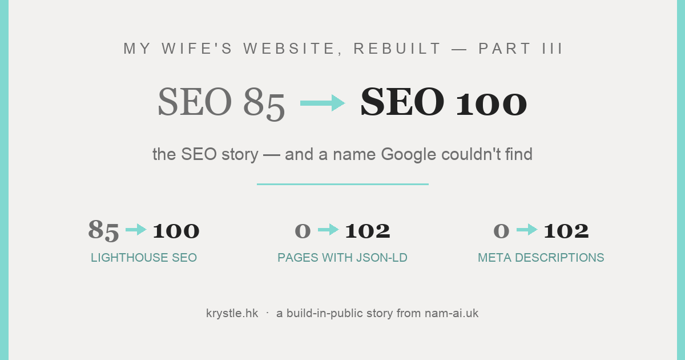
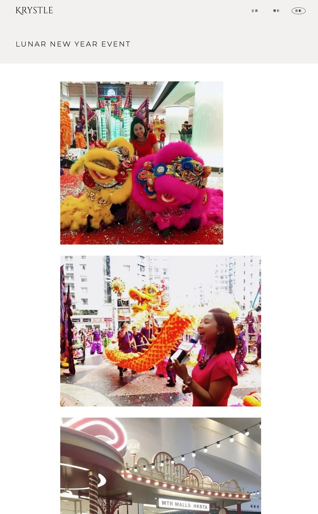
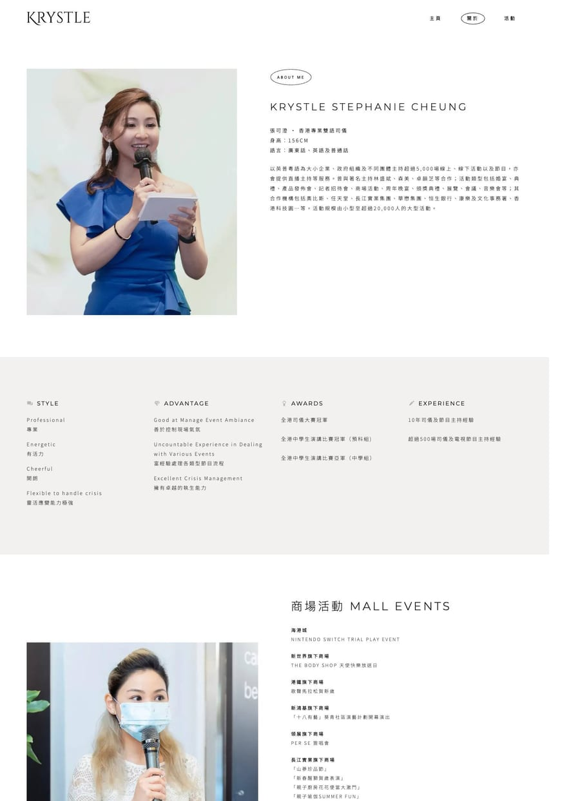
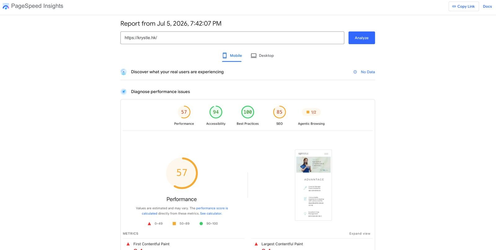
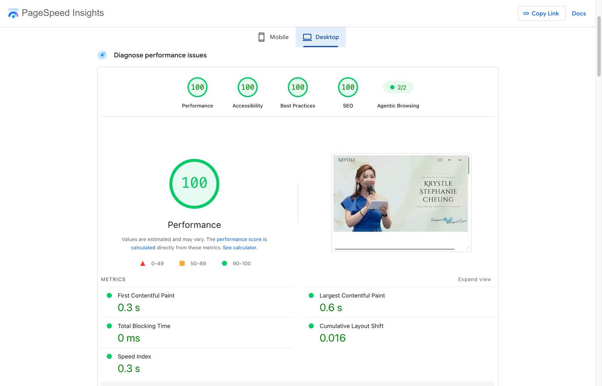

In [Part I](/posts/rebuilding-my-wifes-website-part-1/) we rebuilt my wife Krystle's site, **[krystle.hk](https://krystle.hk)**, as static HTML; in [Part II](/posts/rebuilding-my-wifes-website-part-2/) we fixed the interface — including the broken button that had been hiding **76 of her 85 events** from every visitor. What a button hides from humans, it also hides from crawlers.

But even the pages Google *could* see were telling it almost nothing. This part is the search side of the story: what the site wasn't saying, how the rebuild says it on every page automatically, and how Lighthouse SEO went from **85 to 100 on all 102 pages**.

## Table of contents

## What the site wasn't telling Google

The audit's SEO list was long and mundane:

- **No meta descriptions. Anywhere.** Google was left to improvise every snippet.
- **No Open Graph or Twitter cards** — shared links rendered as bare URLs.
- **No structured data at all** — no `Person`, no `LocalBusiness`, nothing for a business whose entire premise is *a person providing a local service*.
- The homepage title was just **"Krystle"**.
- The footer logo linked to the **theme vendor's demo site** on every page — leaking link equity sitewide, on every single page, to a template company.
- The sample post `hello-world` was still live and indexable, along with WooCommerce cart/checkout pages for a shop with no products.
- And the name thing: anyone searching **「張可澄 司儀」** — her actual name plus "MC" — could not find her, because 張可澄 wasn't on the site. Not in the titles, not in the text, not in the code.

None of these is exotic. That's the point — this is what an unaudited site accumulates.

## The fix, piece by piece

### Same URLs, so the index survives

Rule one of the rebuild: **every existing URL keeps working**. Google's index of the site carried over intact — no 404s, no rank roulette from a migration. The junk that shouldn't have been indexed (`hello-world`, cart, checkout) got **301s** to sensible destinations.

And the Part II fix matters here too: because all 85 events are now **pre-rendered in the HTML**, a crawler doesn't need to click anything or execute a fragile API call to see the entire portfolio. Content Google's renderer previously never reached is now just… there, in the source.

### Every page tells Google what it is

The build script stamps each of the 102 pages with a unique title, a **bilingual meta description**, Open Graph + Twitter cards, and a canonical URL. And structured data everywhere it means something:

- **`Person`** — with `alternateName: 張可澄`, linking her English and Chinese identities
- **`LocalBusiness`** — she is one
- **`BreadcrumbList`** — on every nested page
- **`ImageGallery`** — one per event page, describing the photos

*Each of the 85 event pages: unique title, description, canonical, and its own ImageGallery markup.*

Because pages are stamped from data by one script, this metadata **cannot drift**: a new event added to the JSON gets all of it automatically. (That's Part I's bulk-editing win wearing its SEO hat.)

Plus the housekeeping: a real `sitemap.xml`, a sane `robots.txt`, a favicon that isn't a 404, and that footer link finally pointing at her own homepage instead of a template company's demo.

### The name

張可澄 is now in the titles, the meta descriptions, the About page, the footer, and the JSON-LD. Someone searching her Chinese name finally lands on **[her own site](https://krystle.hk)** — instead of nothing.

*The About page — with 張可澄 on the site at last.*

## The scoreboard

| | WordPress | Static rebuild |
| :--- | :--- | :--- |
| Lighthouse SEO | 85 | **100** (every template) |
| Pages with meta descriptions | 0 | **102** |
| Pages with structured data | 0 | **102** |
| Social share cards | none | **all pages** |
| Events a crawler can reach without JS | 9 of 85 | **85 of 85** |
| 張可澄 findable on the site | no | **yes** |
| Junk URLs indexed (cart, hello-world) | yes | **301'd** |

Independently confirmed on the live site — the old site's last PSI run hours before cutover, and the rebuild after:

*The old site, live, hours before the DNS flip: SEO 85.*

*The rebuild, live at krystle.hk: SEO 100 — alongside 100s everywhere else.*

> [!note] What's left is patience
> Rankings don't move overnight. The index has the same URLs with much better signals; now it's Search Console, and waiting — while watching whether 「張可澄 司儀」 starts surfacing her. That's a future part of this series.

## The takeaway

Nothing in this post is advanced SEO. No tricks, no "hacks" — just a site that finally *shows its content* and *describes itself accurately*, on every page, automatically. Most small-business sites don't have an SEO strategy problem; they have a "Google literally cannot see the good stuff" problem.

Fix the visibility first. The strategy can come after.

---

**This series:** [Part I — WordPress → static HTML, and the honest pros and cons](/posts/rebuilding-my-wifes-website-part-1/) · [Part II — the UI](/posts/rebuilding-my-wifes-website-part-2/) · Part III — you're here · [Part IV — the site was live, then came the lessons](/posts/rebuilding-my-wifes-website-part-4/).

*Suspect your site is hiding things from Google? I'm happy to take a look — [email me](mailto:nam@wistkey.com).*
