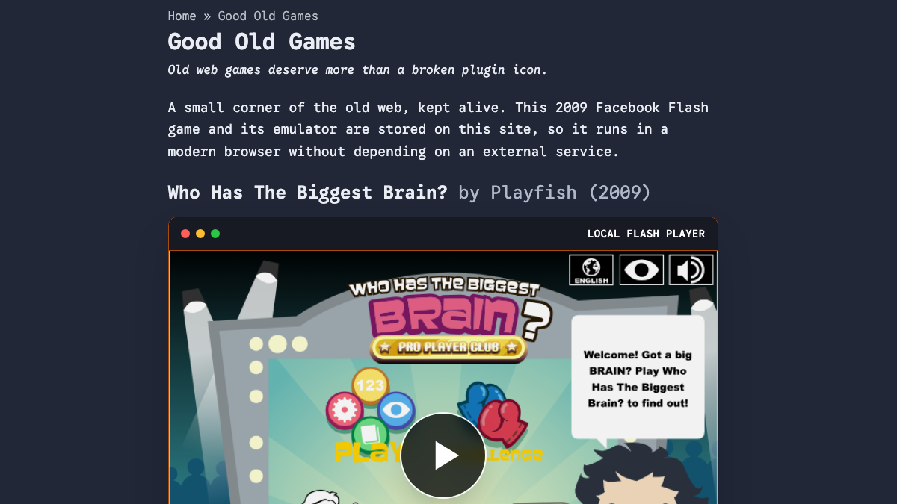
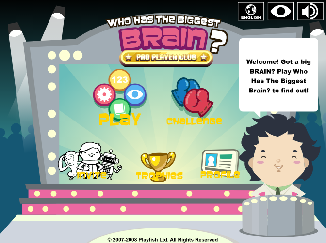
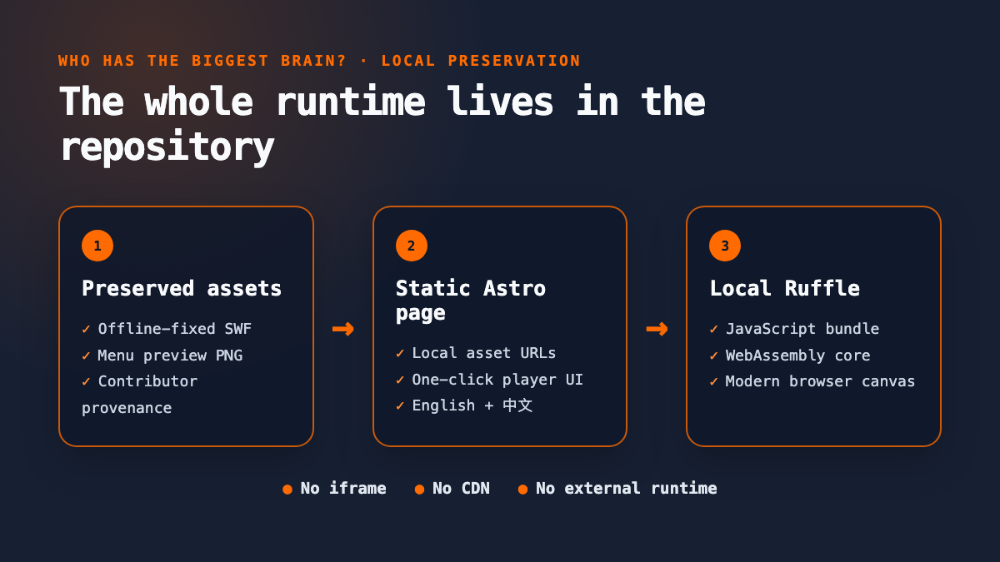
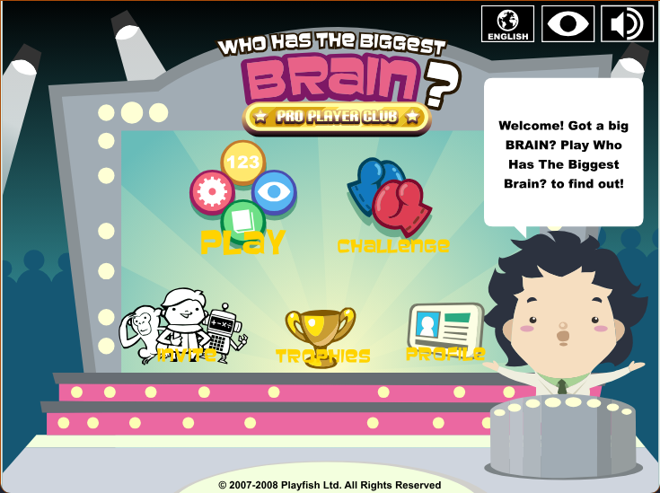

*The finished page: an old Facebook game, a modern browser, and no external runtime dependency.*

There is a difference between making an old game playable and **preserving it**.

I was reminded of that while adding *Who Has The Biggest Brain?* — a Playfish Facebook game from 2009 — to my personal website. I first found a working copy on [Internet Archive](https://archive.org/details/whtbb). Embedding that page would have taken minutes. It would also have meant that if the Archive item, its player or its network path ever disappeared, my “preserved” game would disappear with it.

So this little weekend feature became a proper mini-project: keep the SWF, the Flash emulator, the preview image and the contributor history in the repository; make the game run from my own static site; and still give full credit to the people who actually brought it back.

## Table of contents

## A game that belonged to a platform

*Who Has The Biggest Brain?* came from the optimistic phase of social gaming, when a Facebook account was not just a login but part of the game itself. Playfish built the title around scores, challenges and friends. EA acquired Playfish in 2009; EA's own announcement listed this game among Playfish's popular titles and described a company reaching tens of millions of monthly players ([EA acquisition announcement](https://ir.ea.com/press-releases/press-release-details/2009/Electronic-Arts-Acquires-Playfish/default.aspx)).

That scale did not make the software durable. Once the service went away, the client was still a Flash file, but parts of its experience depended on Facebook-era servers that no longer existed. The original stats, challenges and leaderboards could not simply be summoned back by finding the right `.swf`.

This is the uncomfortable thing about “cloud software” before we called everything cloud software: sometimes the executable survives, but the product does not.

## The people who brought it back

The [Internet Archive item](https://archive.org/details/whtbb) is valuable not just because it contains a file. Its description records the chain of people behind the recovery:

- **PandaFake⚡** archived the game, modified it to run offline and uploaded the preservation item.
- **BattleAncient (Rachid)** supplied the main game file.
- **floydian (Alejandro)** helped repair several glitches.
- The **Ruffle contributors** maintain the open-source emulator that makes Flash content usable in a modern browser.

The item also records an update as `9/8/25`: it fixed a Car Path sign glitch, added a Hexagon Path reset sequence based on the iPhone version, and removed two obsolete score-related interfaces.

> [!IMPORTANT] Preservation is a chain of custody
> Finding a file is only one step. Someone had to keep the main asset, someone had to make it work without the dead servers, someone had to fix the broken paths, and someone had to build the emulator. A mirror should preserve those names as carefully as it preserves the bytes.



*The recovered menu. The offline build is playable, although its server-backed social features cannot return.*

## Playable is not the same as preserved

My first implementation used an Archive embed. It worked, and it looked reasonable. But the dependency graph was wrong:

**my page → Archive iframe → Archive-hosted emulator → Archive-hosted game**

That is access, not independent preservation.

The requirement I settled on was stricter: after the initial deployment, a visitor should only need my website. No iframe. No emulator CDN. No runtime request to Internet Archive. The Archive page remains linked as the source and historical record, but it is no longer required to play.

That distinction matters beyond games. If a valuable asset is merely embedded from its current home, we have made another bookmark. If the asset, runtime and provenance travel together, we have made a copy that can survive its source.

## Putting the whole runtime in the repository

The preserved SWF is only 1,771,296 bytes. I downloaded the exact offline-fixed file from the Archive item and recorded a checksum beside it:

```bash
curl -fsSL "https://archive.org/download/whtbb/brain_game_2_6_7_translated_v1.swf" \
  -o public/games/whtbb/brain_game_2_6_7_translated_v1.swf

openssl dgst -sha256 \
  public/games/whtbb/brain_game_2_6_7_translated_v1.swf
```

The expected SHA-256 is `a2bc047379274cc0f1556749c326b47d971849aa4a87c70a88da80aca448af96`. That is not security theatre: it gives the next person a quick way to tell whether their copy is the same preservation build.

The emulator is [Ruffle's self-hosted web package](https://ruffle.rs/downloads), pinned here at version 0.3.0. I kept its JavaScript, both WebAssembly variants, package metadata and MIT/Apache licence files under `public/vendor/ruffle/`.

Astro is a good fit for this job because files in `public/` are copied into the static build untouched ([Astro project structure](https://docs.astro.build/en/basics/project-structure/)). A SWF does not need to pass through an image optimizer or JavaScript bundler. It just needs a stable path and the correct web server response.



*The preservation stack: asset, page and runtime all deploy together from one repository.*

The resulting layout is deliberately boring:

- `public/games/whtbb/` contains the SWF, preview and provenance record.
- `public/vendor/ruffle/` contains the pinned emulator and its licences.
- an Astro component owns the player UI and the local URLs.
- English and Traditional Chinese pages share the same preserved assets.

Boring is good here. A preservation copy should be easy to inspect, move and rebuild.

## One click from preview to real game

Ruffle's default click-to-play screen proves the emulator loaded, but it says nothing about the game behind it. I replaced that generic idle state with a screenshot captured from the recovered main menu. The image is a normal repository asset; clicking it creates the real player and swaps the preview out.

The important part of the integration is small:

```js
const player = window.RufflePlayer.newest().createPlayer();
container.replaceChildren(player);

await player.ruffle().load({
  url: "/games/whtbb/brain_game_2_6_7_translated_v1.swf",
  autoplay: "on",
  unmuteOverlay: "hidden",
  splashScreen: false,
});
```

Those values are part of Ruffle's documented [`URLLoadOptions`](https://ruffle.rs/js-docs/master/interfaces/Config.URLLoadOptions.html). Because the load begins inside the visitor's click, the custom preview becomes a single, understandable action rather than a preview followed by a second emulator play screen.



*After the click: the same menu is now the live Flash game, rendered locally by Ruffle.*

## What I deliberately did not “fix”

The offline build cannot restore the original Facebook service. Statistics, social challenges and leaderboards depended on infrastructure and data that are gone. The preservation build removes or bypasses some dead interfaces, but it does not pretend to recreate the whole 2009 network.

> [!CAUTION] A playable copy is not a licence rewrite
> Self-hosting makes the technical preservation stronger; it does not erase original ownership. Playfish remains the game's creator, the restoration contributors deserve attribution, and the Archive item remains the source record. The local `PROVENANCE.md` exists so those facts do not get separated from the binary.

This is also why I resisted “improving” the game. The goal was not to remaster it, inject new leaderboards or redesign its mechanics. The goal was to provide a faithful, usable access point to the recovered build.

## Verification: could it really stand alone?

The normal production build was the first gate:

```bash
npm run build
```

Then I opened the built page in a Chrome session where outside hosts were blocked but localhost remained available. The game still reached its menu. The request log showed the page loading the SWF, Ruffle JavaScript and WebAssembly from local paths; there was no Archive request in the game runtime.

Finally I tested the interaction rather than stopping at a screenshot: click the custom preview, wait for Ruffle to initialize, confirm that a live canvas exists, and confirm that the game reports itself as playing. Preservation is not complete because a file exists in Git. It is complete when the path from file to human still works.

## The small-project lesson

This was not a large system. It was one game, one static page and a few dozen megabytes of emulator files. But it contained the same questions that appear in much bigger digital-preservation projects:

1. **Do we have the actual artifact?**
2. **Can we run it without its current host?**
3. **Have we preserved the people and history around it?**
4. **Can an ordinary visitor reach it without specialist setup?**

The code was the easy part. The useful outcome was turning a fragile external embed into a small, inspectable preservation package — while making the people who did the recovery visible instead of quietly taking credit for their work.

You can play the result on the site's [Good Old Games](/good-old-games/) page.

*Working on a legacy web experience or a small preservation project of your own? I am always happy to compare approaches — [email me](mailto:nam@wistkey.com).*

---

*If this kind of practical rebuild is useful, [follow me on Medium](https://nam0403.medium.com/), [subscribe or bookmark nam-ai.uk](https://nam-ai.uk) for the next one, or [connect with me on LinkedIn](https://www.linkedin.com/in/nam-chan/) — old systems usually have better stories than their error messages suggest.*
