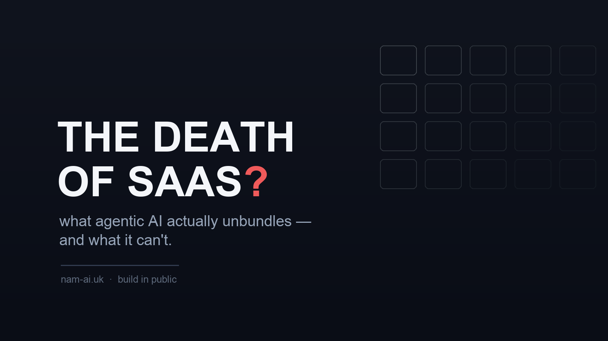
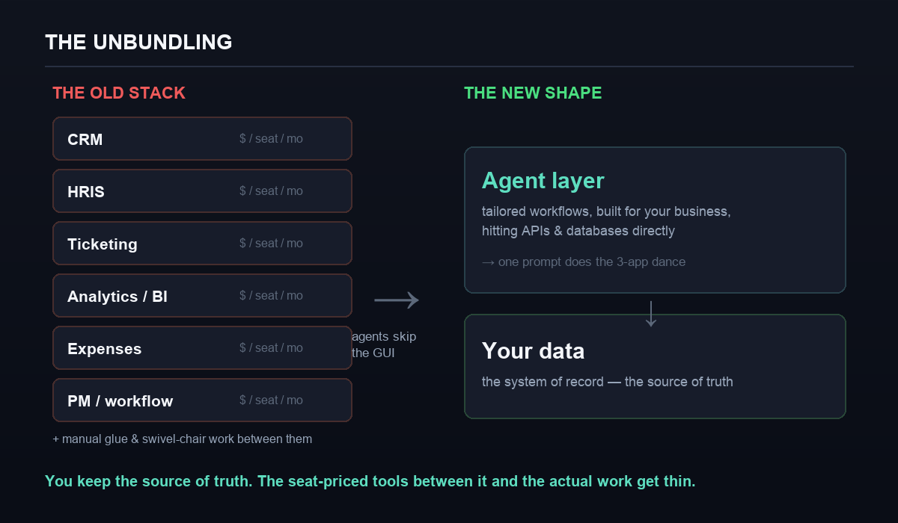
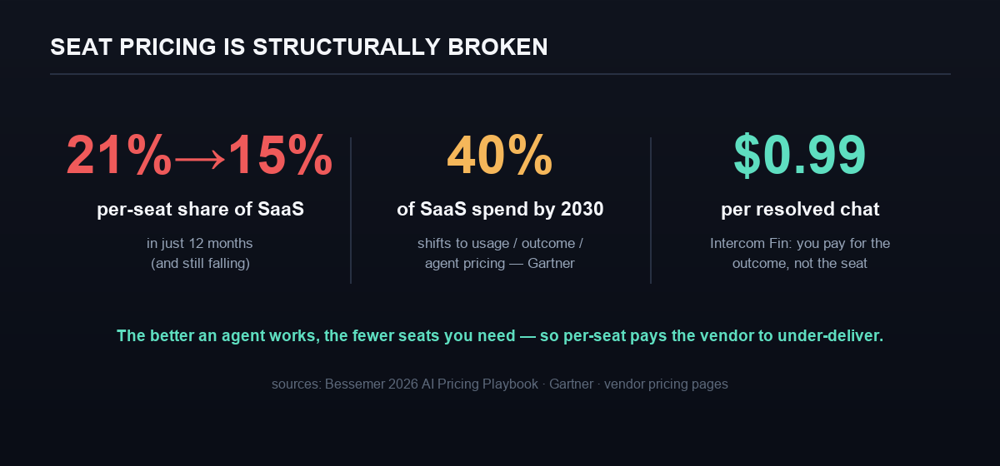

Satya Nadella said a version of "SaaS is dead" on a podcast, and the internet did what it does. His actual claim was sharper and more interesting than the headline: business applications, he argued, are mostly ["CRUD databases with a bunch of business logic"](https://www.windowscentral.com/microsoft/hey-why-do-i-need-excel-microsoft-ceo-satya-nadella-foresees-a-disruptive-agentic-ai-era-that-could-aggressively-collapse-saas-apps) — and in the agent era, that logic migrates *out* of the individual apps and *into* the AI tier. Microsoft's own Charles Lamanna went further, [predicting traditional business apps are obsolete by 2030](https://thenewstack.io/microsoft-ai-business-agents-will-kill-saas-by-2030/).

I build the things that replace SaaS — at [Wistkey](https://wistkey.com) my day job is designing custom agentic workflows for companies — so I have opinions, and most of them are more boring than the headline. SaaS is not dying. But it is being **unbundled and re-priced**, and the layer that's exposed is precisely the layer companies were already tired of paying for. Here's the honest version.

## Table of contents

## What Nadella actually meant

Strip a typical business app down and you find three things: a database (the records), some business logic (the rules and workflows), and a UI with a per-seat license (the way humans poke at it). For thirty years you bought all three as one product, once per function — a CRM, an HRIS, a ticketing tool, a BI dashboard, an expense app — and you paid per human, per month, per app.

The agent thesis is that the middle layer — the business logic — stops needing to live inside each app. An agent can hold the rules, read and write across several databases at once, and *do the workflow* without a human clicking through three dashboards to make it happen. The database survives. The logic moves up into the agent. And the seat-based UI in between — the part you were mostly paying for — gets thin.

> [!note] "Dying" is the wrong verb
> This isn't death, it's **migration**. The value doesn't vanish; it moves — down into the system of record, and up into the agent layer — leaving the seat-priced app in the middle with less to justify its price. Where you land on "SaaS is dead" mostly depends on whether you were selling the middle.

## The unbundling, drawn

*You keep the source of truth. The seat-priced tools between it and the actual work get thin.*

The old shape is a shelf of single-purpose apps, each priced per seat, with a surprising amount of **human glue** between them — the exports, the copy-paste, the "swivel-chair" work of logging into one system to move data into another. That glue was never a product anyone sold you; it was the tax you paid for owning twelve tools that don't talk.

The new shape is flatter. Your **data** — the system of record — stays put and, if anything, becomes *more* central. On top sits an **agent layer** that runs workflows tailored to your business, hitting APIs and databases directly, doing the three-app dance in one step because it doesn't need any of the three GUIs. The tailored workflow that used to require buying a SaaS, or wiring five of them together, is now something you can just… build.

## The pricing was the tell all along

If you want to know which way a market is going, watch how it prices. Per-seat SaaS pricing isn't just unfashionable in the agent era — it's **structurally broken**.

*The better an agent works, the fewer seats you need — so per-seat quietly pays the vendor to under-deliver. Sources: Bessemer's 2026 AI Pricing Playbook, Gartner, vendor pricing.*

Here's the trap in one sentence: **when the "user" is an agent, seats measure the wrong thing.** Worse, the incentive inverts — the better an agent performs, the fewer human seats a customer needs, so a per-seat vendor is literally [paid to under-deliver](https://www.mindstudio.ai/blog/saas-pricing-ai-agent-era). That's why per-seat's share of SaaS pricing [fell from 21% to 15% in a single year](https://www.aimagicx.com/blog/death-of-per-seat-saas-pricing-ai-agents-2026), and why Gartner expects a large slice of enterprise SaaS spend to move to usage-, outcome-, or agent-based models by 2030.

You can watch the incumbents flail in real time. Salesforce's Agentforce went through [three pricing models in about eighteen months](https://www.saastr.com/salesforce-now-has-3-pricing-models-for-agentforce-and-maybe-right-now-thats-the-way-to-do-it/) — $2 per conversation, then action-based credits, then a per-user "digital workforce" license — because nobody has settled how to charge for work a human no longer does seat-by-seat. Meanwhile outcome pricing quietly arrives at the edges: Intercom's Fin charges around **$0.99 per resolved conversation** — you pay when the problem is actually solved, not for a login.

## The Klarna asterisk (read this before you rip anything out)

The poster child for "replace SaaS with AI" is Klarna, and it's also the best cautionary tale — which is exactly why it's worth citing honestly.

Klarna was juggling something like **1,200 SaaS applications** and set out to consolidate them onto an internal, AI-native stack. Great story. But the reality was more nuanced than the headline: Klarna [didn't replace those tools with pure AI so much as with *other* software](https://www.cxtoday.com/crm/klarna-didnt-replace-salesforce-it-replaced-them-with-alternative-saas-apps/) — Deel for HR, a re-platformed data layer, a different mix — and its own CEO [publicly doubted that other companies would follow](https://techcrunch.com/2025/03/04/klarna-ceo-doubts-that-other-companies-will-replace-salesforce-with-ai/), saying he didn't think it was the end of Salesforce, "might be the opposite."

> [!warning] Don't confuse "consolidate" with "delete"
> The real Klarna lesson isn't "fire your SaaS vendors and build everything." It's that a company drowning in 1,200 half-used tools can **collapse the sprawl** — the glue, the overlap, the nine seats nobody fully uses — onto a smaller stack with an agent layer doing the workflows. The system of record survived. The mess around it didn't.

## What dies, and what endures

So which SaaS is actually exposed? Sort it by one question: *is this mostly a form over a database with some workflow?* If yes, it's in the blast radius.

*The losers sit between your data and your work. The winners are the data itself — and the agent layer on top.*

**Exposed:** thin wrappers over a model; single-workflow or one-report tools you bought for exactly one thing; seat-heavy internal dashboards; the integration and export glue; and, bluntly, anything an enterprise could now build for itself in a week instead of procuring over a quarter.

**Durable:** the **systems of record** (your source of truth — agents make this *more* valuable, not less, because they need somewhere authoritative to read and write); infrastructure and data platforms; regulated and compliance-heavy software where "we built it ourselves" is a liability, not a flex; and anything with deep integrations or genuine network effects that a prompt can't reproduce.

## What I actually see building these

The replacements I'm asked to build are almost never "rebuild Salesforce." They're narrower and more useful than that: *replace the nine seat-licenses for a tool the team half-uses; kill the swivel-chair workflow between the CRM and the finance system; retire the $40k/year point solution we bought for one monthly report.* You keep the system of record and put an agent in front of the workflow. Build-vs-buy has genuinely flipped for a whole class of internal tools — not because building got glamorous, but because a tailored workflow went from a procurement cycle to an afternoon.

That flip has an honest cost, and I say it to every client: **when you build, you become the vendor.** No more paying someone else to handle uptime, security patches, and the edge cases. For a workflow that's core to how you run, that ownership is worth it. For a commodity you'd have to maintain forever, the SaaS was doing you a favour. The skill now isn't "build everything" — it's knowing which line each workflow falls on.

> [!tip] If you sell SaaS, the survival move is clear
> Get off pure per-seat before the market forces you. Become the thing agents *call* — expose clean APIs and tools (this is a lot of what MCP is about) so you're in the workflow rather than routed around it. And if you can, own the **system of record**, because that's the layer the agents depend on. The dangerous place to be is the seat-priced middle: business logic over a database, sold by the login.

## The takeaway

SaaS isn't dying. The **seat-priced, business-logic-over-a-database middle** is getting hollowed out, and the value is moving to the two ends: the system of record beneath it and the agent layer above it. If you buy software, the question quietly changed from "which SaaS do we get for this?" to "is this a workflow we should just own?" If you sell it, the question is whether an agent goes *through* you or *around* you.

The word "death" makes better headlines than "unbundling and re-pricing." But unbundling is the thing actually happening — and it's the more useful thing to plan for.

*If your company is staring at a pile of overlapping SaaS and wondering what an agent layer could actually replace — and what it shouldn't — that's the exact conversation I have at Wistkey. [Email me](mailto:nam@wistkey.com) and I'll give you a straight read.*

---

*Found this useful? [Follow me on Medium](https://nam0403.medium.com/), [subscribe or bookmark nam-ai.uk](https://nam-ai.uk) for more on AI adoption without the hype, and [connect on LinkedIn](https://www.linkedin.com/in/nam-chan/) — I'm always up for a good argument about this stuff.*
