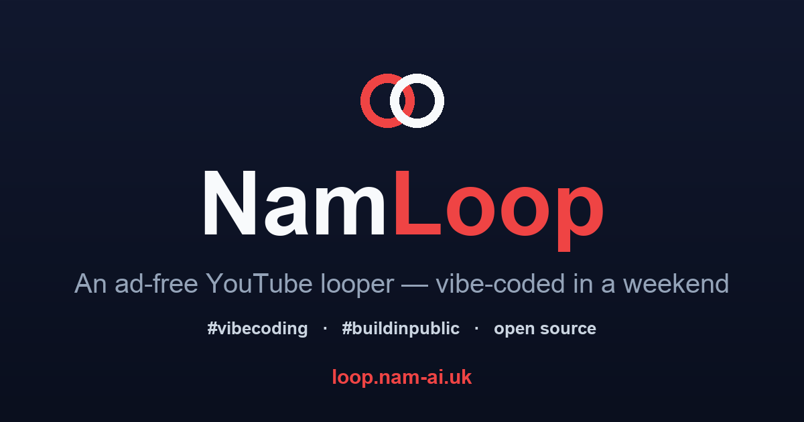
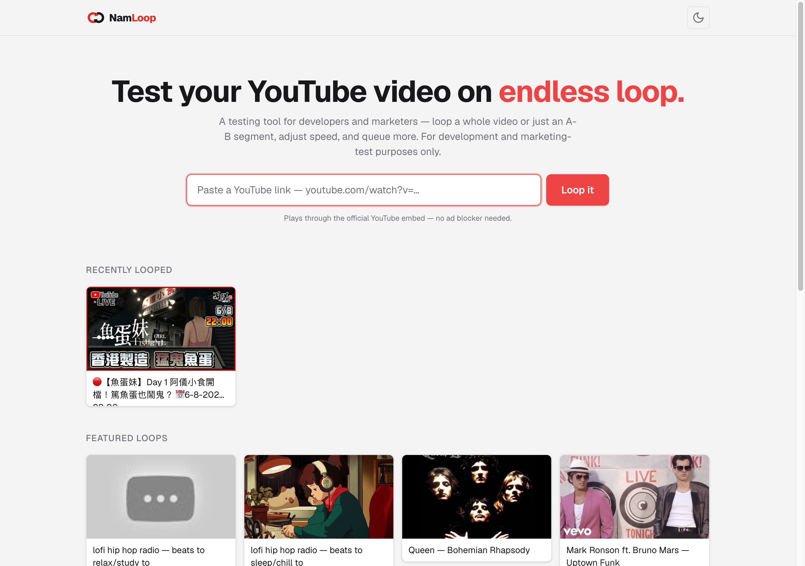
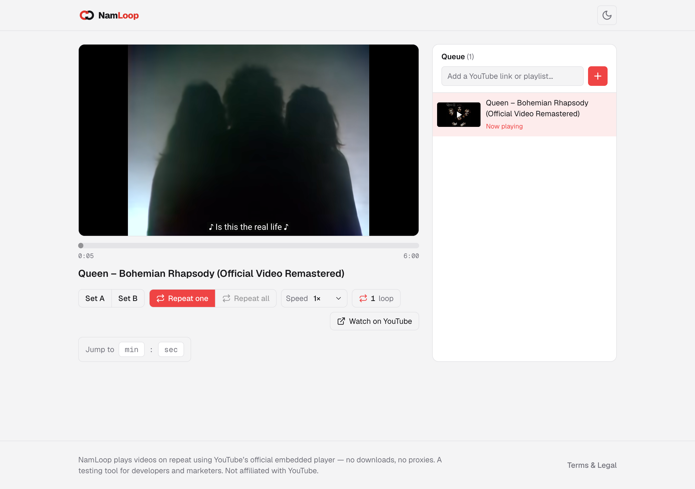

Last weekend, with some tokens to spare and half an hour before bed, I vibe-coded a little tool. It's called **NamLoop**, and it does one thing: it loops a YouTube video — the whole clip, or a precise A–B segment — through YouTube's own player, no ad blocker and no downloads.

You can try it at **[loop.nam-ai.uk](https://loop.nam-ai.uk)**, and the source is on [GitHub](https://github.com/NamNamChanChan/NamLoop).



## Table of contents

## The itch

I keep needing to put a video on repeat. A bar of music while I practise something. A ten-second clip I'm studying frame by frame. A track on in the background that I don't want to *end* and drop me into an autoplay rabbit hole.

The usual options are all a bit annoying. Right-click → "Loop" only does the whole video. The "loop a section" sites are covered in ads, or they proxy the video through some sketchy player. Browser extensions want permissions I don't want to give for something this small.

I just wanted: paste a link, pick a start and end, let it run. So I built exactly that.

## What NamLoop does

- **Full-video or A–B loop** — drag two markers to loop just the segment you care about.
- **Speed control**, 0.25× to 2×.
- **A queue with repeat modes** — one video on repeat, or a small playlist on "repeat all".
- **A loop counter** in the UI and the browser tab, so you can see how many times it's gone round.
- **Shareable URLs** — every setting (video, A, B, speed) lives in the link, so you can send someone a ready-made loop.
- Dark mode, and it's **lightweight** — it plays through YouTube's official embed, so there's nothing dodgy going on.



## How the looping actually works

The trick is to not fight YouTube — let its **official IFrame Player API** do the playing, and just *react* when a video ends.

You load the API, and when a player's state changes to `ENDED`, you send it back to the start:

```js
// Load https://www.youtube.com/iframe_api, then:
function onYouTubeIframeAPIReady() {
  new YT.Player("player", {
    videoId: "fJ9rUzIMcZQ",
    events: { onStateChange: onStateChange },
  });
}

function onStateChange(event) {
  if (event.data === YT.PlayerState.ENDED) {
    event.target.seekTo(0);     // full loop: back to the start…
    event.target.playVideo();   // …and round again
  }
}
```

> [!tip] Let the player tell you
> Reacting to the `ENDED` state is far cleaner than polling the clock to guess when the video finished. The player already knows — you just listen.

The **A–B loop** is the one place you *do* watch the clock: poll the current time a few times a second, and whenever it passes point **B**, jump back to **A**.

```js
// A–B loop: jump back to A whenever we pass B
setInterval(() => {
  if (player.getCurrentTime() >= B) player.seekTo(A, true);
}, 250);
```

Speed is a one-liner — `player.setPlaybackRate(1.5)` (0.25×–2×, whatever the video allows). The rest is plumbing: paste a link, parse out the 11-character video ID, route to `/loop/<id>`, pull the title from YouTube's oEmbed endpoint for a nice page, and mount the player. Next.js, React, TypeScript, Tailwind — but honestly the shape of it is those few event handlers above.

## What "vibe coding" actually changed

Here's the part worth saying out loud. This tool has existed as a vague "I wish…" in my head for *years*. I never built it, because the friction was never worth it for something so small — an evening of reading API docs, wiring up state, fighting CSS, for a tool only I would use.

That calculus is what changed. With AI in the loop, the boring middle — the docs-reading, the boilerplate, the "how do I center this again" — shrinks to minutes. The gap between *"I wish this existed"* and *"it exists"* collapsed to a weekend, most of it before bed.

> [!caution] Vibe-coded, not vibe-shipped
> Fast doesn't mean unowned. You still have to read what came out, handle the edge cases, and be honest about what it is — NamLoop plays through YouTube's official embed and is explicitly **not for commercial use**. AI writes the code; you're still responsible for it.

That's the real story of "AI adoption" for me, and it's the same one I tell companies: the win isn't that AI does the hard thinking. It's that it clears the tedious part out of the way, so the small good ideas you kept shelving finally get built.

## The takeaway

NamLoop is a toy. That's the point. The interesting thing isn't the tool — it's that the distance between wanting it and having it got short enough that I actually crossed it, on a Sunday, half asleep.

If there's a small thing you've been not-building because it wasn't worth the evening — it might be worth a weekend now. Build it.

*Try NamLoop at [loop.nam-ai.uk](https://loop.nam-ai.uk), poke at the [code](https://github.com/NamNamChanChan/NamLoop), or tell me what you'd loop — [email me](mailto:nam@wistkey.com).*
