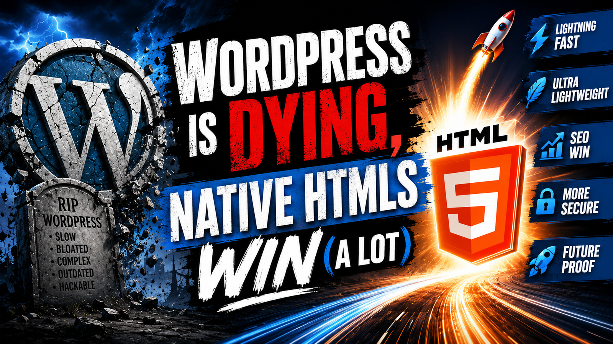
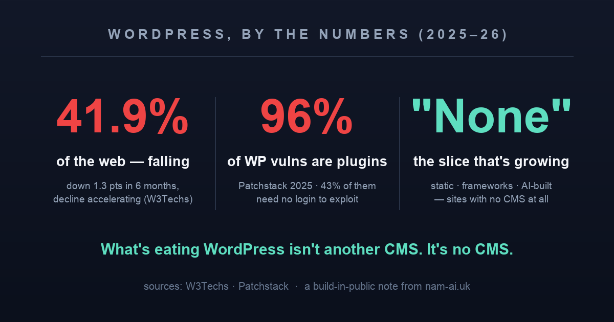

A friend sent me that thumbnail last week. *"WordPress is DYING."* Gravestone, rocket, the works. It's the kind of headline that's engineered to make you angry enough to click — and I almost scrolled past it, because it's wrong.

WordPress isn't dying. It still runs roughly **42% of every website on earth**. Something that large doesn't die; there are more WordPress sites today than there were programmers alive a decade ago.

But "dying" and "healthy" aren't the only two options. The honest word is **decaying** — slowly, unevenly, and fastest exactly where it hurts: with the **developers** who have to maintain it and the **small businesses** who quietly pay its taxes. I know because I spent last weekend tearing WordPress out of a site I care about a great deal — my wife's — and the reasons I did map almost one-to-one onto why the wider web is drifting away from it.

Here's the grounded version of that thumbnail, minus the gravestone.

## Table of contents

## "Dying" is wrong. "Decaying" is right.

Start with the number everyone argues about. By [W3Techs' tracking](https://www.searchenginejournal.com/wordpress-market-share-in-decline/576042/), WordPress fell from **43.2% of the web in December 2025 to 41.9% by late May 2026** — a 1.3-point drop in six months, roughly *double* what it lost across all of the previous year. The decline isn't just happening; it's **accelerating**, and no other major platform on the same chart is moving like that.

*Three figures that tell the whole story. Sources: W3Techs, Patchstack.*

But the share number isn't even the interesting part. Look at **who's gaining**. It isn't Wix or Shopify or some rival CMS mounting a coup — they picked up a rounding error between them. The slice that actually grew is the one labelled **"None"**: sites with *no detectable CMS at all*. Static-site generators, front-end frameworks, hand-rolled HTML, and the new wave of AI-built sites that leave no WordPress fingerprint in the page source.

> [!note] The quiet headline
> The thing eating WordPress isn't another content-management system. It's **no** content-management system. For a growing share of sites, the answer to "which CMS?" is turning into "we didn't need one."

And the leading indicator is worse than the installed base. WordPress's share of *newly built* sites is running below its share of the web overall — old WordPress sites stay WordPress out of inertia, but fewer new projects reach for it. That gap is what decay looks like in slow motion: the back catalogue holds while the front door narrows.

## Why developers are done with it

Ask a working developer about WordPress and you'll rarely get neutrality. The notoriety has three distinct sources, and they've all gotten worse lately.

**1. The bloat is structural, not sloppy.** When I audited my wife's site — a *portfolio*, not a shop — the homepage alone shipped **122 requests and 2.2 MB**, including React, ReactDOM and lodash *on every page*, loaded by WooCommerce for a store with zero products. Plus Contact Form 7, for a site with zero forms. Nobody chose any of that. It's what accumulates when a theme, a page builder, and a decade of plugins each quietly bring their own dependencies. WordPress's plugin model is its superpower and its curse: every convenience arrives welded to code you didn't write, can't see, and now have to keep alive.

**2. The security surface is the plugins — overwhelmingly.** This is the part that turns eye-rolls into genuine wariness. Per [Patchstack's 2025 security research](https://patchstack.com/whitepaper/state-of-wordpress-security-in-2025/), **96% of new WordPress vulnerabilities live in plugins** (about 4% in themes, and *core itself is rarely the problem*). Of 2024's roughly 4,000+ new disclosures, the vast majority were plugin flaws — and around **43% required no authentication at all**, which is exactly the profile automated bots hunt for at scale. You don't run WordPress; you run WordPress plus fifteen third-party codebases of wildly varying quality, any one of which can be your breach. On my wife's old site, that abstract risk had already become concrete: a plugin failure had been *silently hiding 76 of her 85 events* from every visitor for who knows how long — not a hack, just the plugin stack failing quietly, which is arguably worse because nobody gets an alert.

**3. The governance broke the trust.** For years, developers treated WordPress.org as neutral public infrastructure — the plumbing everyone builds on. Then in late 2024, in the [Automattic–WP Engine dispute](https://techcrunch.com/2025/10/24/automattic-files-counterclaims-against-wp-engine-in-wordpress-lawsuit-alleging-trademark-misuse/), that plumbing got weaponised: access to WordPress.org was cut off in a way that **broke plugin and theme updates for hundreds of thousands of sites** caught in the crossfire. In December 2025 a federal judge ordered access restored within 72 hours, but the damage to the mental model was done — a court had to intervene to keep the updates flowing. Add Automattic laying off ~16% of staff in 2025 and the lawsuit grinding on with no trial date, and the message a lot of developers absorbed was simple: *the foundation I've been standing on has an owner, and the owner can pull the floor.*

None of these are fatal on their own. Together they explain why "WordPress" has become a slightly dirty word in a lot of engineering rooms — and why so many new builds start with "not that."

## Why small businesses quietly suffer

Developers are loud about WordPress. Small and medium businesses are the ones actually paying for it, usually without a vocabulary for what's wrong. Four taxes, all of which my wife was paying:

*The old WordPress build, scored on the same test as everyone else's site. This is what "it works fine" quietly costs you in 2026.*

- **The performance tax.** Her portfolio scored **56 on Lighthouse** with a **13.8-second** largest paint. On mobile, that's not "a bit slow" — that's clients bouncing before her first photo loads, and Google noticing. Speed is a ranking and conversion factor now; a heavy WordPress stack spends that budget on plugins nobody's using.
- **The maintenance tax.** WordPress is never *done*. Core updates, plugin updates, theme updates, PHP-version bumps, the security plugin, the backup plugin, the caching plugin to paper over the first three. For a business without an in-house developer, that's either a monthly bill to an agency or a time bomb nobody's watching.
- **The "you still need a developer anyway" tax.** WordPress is sold as the no-code option, but the moment something breaks — a plugin conflict, a white screen, a hacked footer — the small-business owner is right back to needing a specialist. The autonomy was partly an illusion; they were dependent all along, just on a more fragile stack.
- **The bulk-editing tax — the one that actually pushed us over.** As Krystle's business grew, she needed *fast, batch* changes: recategorise a season of events, swap a block of photos, add ten bookings after a busy quarter. In Elementor, each of those was **page after page of clicking** — which is precisely why those edits kept *not happening*. A CMS built for editing one page at a time quietly punishes a business that's growing in batches. For her, that friction mattered more than the load time.

> [!important] The tax nobody itemises
> A slow, plugin-heavy site rarely fails loudly. It just underperforms — a little worse in search, a little slower on mobile, a little more of the owner's evening spent on updates, a little too painful to bulk-edit — and everyone calls it "fine" because nothing is technically broken. Decay is the accumulation of *fine*.

## The Krystle case, in one paragraph

So I rebuilt it. [My wife Krystle](https://krystle.hk) is a professional bilingual MC in Hong Kong; her site is how clients find her. One Sunday evening with an AI agent later, the WordPress + Elementor + heavy-theme stack became **102 pages of dependency-free static HTML** — same design, same URLs, **~5 KB of JavaScript** instead of ~700 KB. First paint went from 13.8 s to **1.7 s**; Lighthouse SEO from 85 to **100**; the silently-hidden-events bug became *structurally impossible*, because there's no plugin left to fail. And the bulk edits she actually needs? Her events now live in JSON — a batch change is a search-and-replace and one build command, not an afternoon of clicking. The full teardown, the honest trade-offs, and the SEO scoreboard are a four-part series: [Part I — the rebuild](/posts/rebuilding-my-wifes-website-part-1/), [Part II — the UI](/posts/rebuilding-my-wifes-website-part-2/), [Part III — the SEO](/posts/rebuilding-my-wifes-website-part-3/), [Part IV — the post-launch lessons](/posts/rebuilding-my-wifes-website-part-4/).

*The old portfolio. A failed "Load More" plugin call was hiding 76 of 85 events from every visitor — silent, un-alerted, and exactly the class of failure that disappears when the plugins do.*

She isn't a special case. She's the *typical* case: a small business whose site slowly rotted under a stack built for a different job, until the friction got loud enough to fix.

## When WordPress is still the right call

Here's where I lose the clickbait crowd, because credibility matters more than a clean narrative: **WordPress is often still the correct choice**, and pretending otherwise is how you end up rebuilding a site that should've been left alone.

Static-from-data — the thing that replaced Krystle's WordPress — is the right answer when a site's content is **structured and changes in batches**: portfolios, brochures, menus, event lists, docs. It's the *wrong* answer for:

- **An owner who publishes daily and needs to self-edit.** A blogger or news site that lives in the editor should not be filing a git commit to fix a typo. That's what a CMS is *for*, and WordPress is a very good one.
- **A site genuinely built on plugins.** Real e-commerce, memberships, complex forms, booking systems with live inventory. WooCommerce exists for a reason; don't hand-roll a checkout to save 40 KB.
- **A team with no developer at all, ever.** My wife's rebuild works because her in-house developer shares a bed with her. Take that away and a managed WordPress host is a perfectly rational place to be.

> [!tip] The actual decision rule
> The question was never "is WordPress bad?" It's *who edits this site, how often, and in what shape?* Structured content that changes in batches, with a technical owner → leaving WordPress is a huge win. Freeform content that changes daily, with a non-technical owner → WordPress is still doing exactly the job it's good at.

## The takeaway

So, is WordPress dying? No — and anyone who tells you otherwise is selling a thumbnail. But is it *decaying*? Yes, measurably: share falling and accelerating, new projects choosing it less, a security story that's really a plugin story, and a governance crisis that spooked the developers who kept the ecosystem alive.

The most interesting part is what's replacing it — because it isn't a rival CMS. It's the **"None"** column: static sites, frameworks, and AI-built pages with no CMS at all. For years, "just build it in plain HTML" was impractical for a small business — too much developer time for too small a site. That maths just changed. An AI agent can now do the tedious 90% — crawl the old site, generate the images, stamp the pages, check the links — while a human keeps the taste and the judgement. Which means the lightweight, no-CMS option is finally *viable at the small-business scale where WordPress used to win by default.*

The gravestone in that thumbnail is theatre. But the rocket has a point: for a growing number of sites, the right answer really is *less* — and the tools to reach it are, for the first time, within reach of the people who need it most.

*Sitting on a WordPress site that's slower or more fragile than it should be, and not sure whether it's worth rebuilding? That's exactly the question I like — [email me](mailto:nam@wistkey.com) and I'll give you an honest read.*
