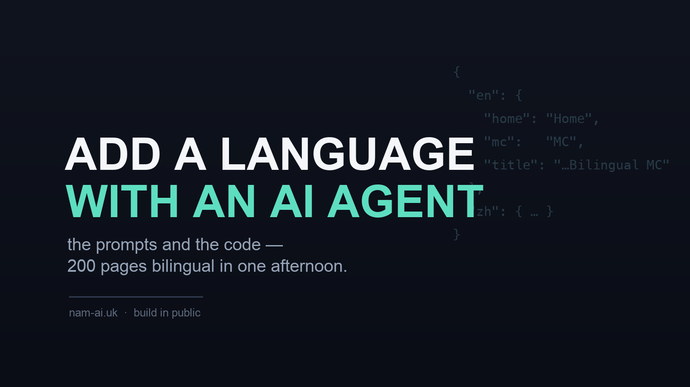
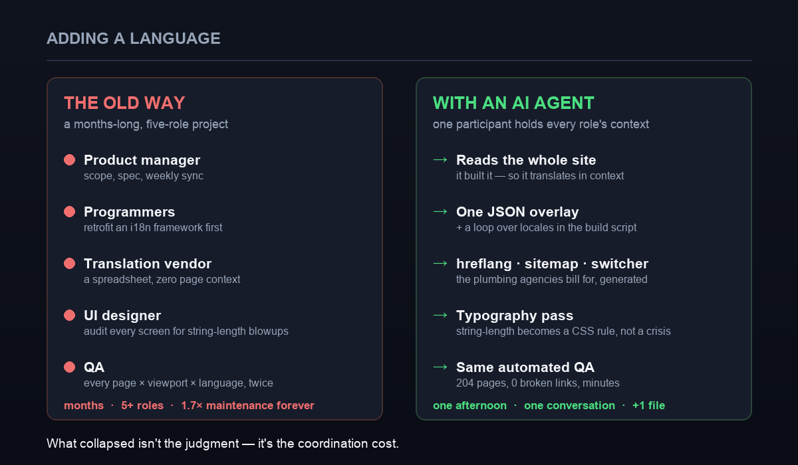
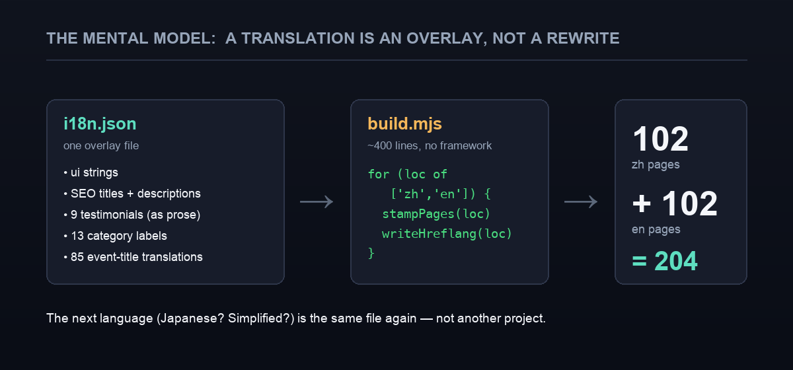

「幫網站加英文」是那種聽落好細、其實唔細的任務。任何在 2000 或 2010 年代的公司做過本地化的人都知道,它是一個*項目*——一班五種角色的人、一個以月計的行事曆,加一條永遠甩唔甩的維護帳單。

上星期,我替一個一百頁的網站加了完整的英文鏡像——總共 200 多頁、真正的上下文翻譯、整套國際 SEO 層、一個語言切換器、逐語言的排版——**一個下午**,靠驅動一個 AI agent 做完。這篇不是講那個網站(那是[它自己的系列](/zh/posts/rebuilding-my-wifes-website-part-1/))。它講的是**方法**:我用過的 prompt、令整件事變得便宜的程式碼形狀,以及——因為這很重要——機器沒有做的那部分。

如果你有一個一直想翻譯的網站,你可以照抄這套。

## 目錄

## 先講,這件事以前的成本

我不是為了充篇幅而懷舊——這個對比*本身*就是重點。舊時的儀式:



*真正塌縮的不是翻譯本身——是五種角色之間的協調。*

- 一個**產品經理**去定範圍、寫規格、主持每週的本地化同步會。
- **程式員**要*先*改造出一套 i18n 框架——幾個星期,把寫死的字串抽進資源檔,一個字都未譯到之前。
- 一個**翻譯供應商**對著一份零頁面上下文的試算表工作,產出經典笑話(「Home」譯成「住宅」),再在以週計的審稿循環裡來回。
- 一個 **UI 設計師**審視每一個畫面,防範**字串長度爆版**——那條永恆的本地化稅:一個 4 字的中文標籤變成 30 字的英文,於是按鈕被截斷、導覽列爆成兩行。
- **QA** 對每一頁 × 每一個尺寸 × 兩種語言做回歸測試,做兩次,因為修好一個語言的版面,弄壞了另一個。

幾個月。五種以上的角色。而且此後,兩種語言 ≈ 1.7 倍的維護面。記住這個畫面,然後我們用一場對話去做同一件事。

## 令它變便宜的心智模型:是疊加,不是重寫

在任何 prompt 之前,先有這個令整件事變得可行的想法:**第二種語言是疊加在你現有網站上的一層,不是第二個網站。** 你不用 fork 你的頁面;你加一個字串檔,然後讓你的 build 在幾個語言之間循環。



*一個疊加檔,加一個迴圈。這之後的下一種語言,又是同一個檔——不是另一個項目。*

具體來說,整個「本地化項目」就是一個 JSON 檔:

```json
{
  "en": {
    "nav": { "home": "Home", "about": "About", "portfolio": "Portfolio", "courses": "Courses" },
    "seo": {
      "home": { "title": "Krystle Cheung | Hong Kong Bilingual MC & Emcee", "description": "…" }
    },
    "testimonials": { "toby": "Thank you Krystle for all your help on our big day!" },
    "categories": { "opening": "Kick-off & Opening Ceremonies" },
    "events": { "party-lny": "Lunar New Year Corporate Party" }
  }
}
```

⋯⋯加上 build 腳本裡一個迴圈,由*同一批*模板印出兩種語言:

```js
for (const loc of ["zh", "en"]) {
  const strings = loc === "zh" ? source : i18n.en; // zh = 原文,en = 疊加層
  for (const page of pages) {
    render(page, loc, strings);   // 同一個模板,第二把聲音
    writeHreflang(page, loc);     // 下面那個機械式 SEO 層
  }
}
```

這之後的一切,只是叫 agent 把那個檔填好,再生成圍繞它的那些接線。而那就到 prompt 出場了。

## 真正做事的那幾條 prompt

以下貼近我實際打過的字,只略作整理。要留意的是它們*為甚麼*行得通:agent 早已讀過(其實是*建過*)每一頁,所以它是*帶著上下文*去翻譯的;而我明確叫它把那些繁瑣的機械層**成批**做完,而不是逐頁來問我。

**一 —— 先定架構(最重要的一條)。**

> 在 `/en/` 下加一個完整的英文鏡像。不要改設計,也不要改現有的中文頁。整件事由一個疊加檔 `data/i18n.json` 驅動,裡面放所有英文字串:導覽、SEO 標題同描述、關於頁的簡介、所有客戶評價、分類標籤、以及每個活動標題一條。在 build 裡,對 `["zh","en"]` 做迴圈,由同一批模板印出兩者。網址保持一樣,只加 `/en/` 前綴。

這一步把整個設計前置了。點名那個檔、那些語言、以及「同一批模板」,就阻止了 agent 發明一套比你需要的更重的框架。

> [!tip] 告訴它*不要*碰甚麼
> 「不要改設計或中文頁」這句做了很多事。Agent 很熱心;一條邊界跟一條指令一樣有用。我在原本那種語言上得到零回歸,正是因為我明確把它圍了起來。

**二 —— 帶上下文翻譯,不要逐字。**

> 把 `i18n.json` 裡的英文字串,填成一個母語讀者真的會寫出來的自然英文——不是字面翻譯。客戶評價要讀起來像真的評價;把「司儀」譯成 "MC",不是 "ceremony master";官方活動要用它們完整的官方英文名。保持品牌聲音:溫暖、專業、精煉。

這條,正是一個對著試算表的翻譯供應商*做不到*的,因為他們從未見過頁面。Agent 見過,所以「好多謝 Krystle 喺我 Big Day 咁幫手!」變成了一個英文讀者會寫的句子,而一長串的「佐敦谷水道中秋綵燈展亮燈儀式」得到它真正的官方英文名,而不是一個字面直譯。

**三 —— 機械式地生成 SEO 接線。**

> 為每一對頁面,生成國際 SEO 層:本地化的 `<html lang>`、一個自我指向的 canonical、`rel="alternate"` hreflang 分別對 `zh-HK`、`en-HK` 同 `x-default`(絕對網址)、`og:locale`,以及一個 sitemap,當中每個 `<url>` 都帶住兩種語言的 `xhtml:link` alternate。這是機械式的——200 多條網址全部做,不要逐頁問我。

出來的,正正是那些代理商收真金白銀的樣板:

```html
<link rel="alternate" hreflang="zh-HK" href="https://example.com/portfolio-item/party-lny/" />
<link rel="alternate" hreflang="en-HK" href="https://example.com/en/portfolio-item/party-lny/" />
<link rel="alternate" hreflang="x-default" href="https://example.com/portfolio-item/party-lny/" />
```

⋯⋯而在 sitemap 裡(留意 `<urlset>` 上的 `xmlns:xhtml` 命名空間),每條網址都宣告了每一個語言變體、*包括它自己*:

```xml
<url>
  <loc>https://example.com/portfolio-item/party-lny/</loc>
  <xhtml:link rel="alternate" hreflang="zh-HK" href="https://example.com/portfolio-item/party-lny/" />
  <xhtml:link rel="alternate" hreflang="en-HK" href="https://example.com/en/portfolio-item/party-lny/" />
  <xhtml:link rel="alternate" hreflang="x-default" href="https://example.com/portfolio-item/party-lny/" />
</url>
```

**四 —— 一個記得讀者位置的切換器。**

> 在 header 同手機選單加一個語言切換,保留深層路徑:由 `/en/portfolio-item/party-lny/` 切換,要落到 `/portfolio-item/party-lny/`,反之亦然——另一種語言的對應頁,永遠不要落去首頁。

它是一個很小的函式,但這就是「有人會用的切換器」同「無人會用的」之間的分別:

```js
// /en/portfolio-item/party-lny/  ⇄  /portfolio-item/party-lny/
const swapLocale = (path) =>
  path.startsWith("/en/") ? path.replace(/^\/en/, "") : "/en" + path;
```

**五 —— 把字串長度變成一個排版工序,而不是一場危機。**

> 英文字串比中文長得多(一個 4 字的標籤可以變 30 字)。做一個排版工序:給每種語言自己的字距同可讀性規則,並確認長的活動標題在卡片裡優雅地換行,而不是溢出。

那條舊的字串長度稅——本身就是一個設計師的 sprint——變成了幾條 CSS 規則:

```css
:lang(zh) { letter-spacing: 3px; }              /* 寬字距在中文裡讀起來優雅 */
:lang(en) { letter-spacing: normal; }           /* 同樣的字距在英文裡就顯得鬆散 */
```

因為版面本來就建到會換行(彈性網格、沒有固定高度的卡片),"Kick-off & Opening Ceremonies"(29 字)跟「起動 / 開幕典禮」(7 字)坐在同一個位置,都不會爆版。

## 機器沒有做的那一件事

這裡是那句誠實話,也是令其餘一切站得住腳的一句:**agent 沒有取代判斷。** 始終要有人決定客戶評價應該*讀起來像*客戶評價、英文的品牌聲音是溫暖而專業、「司儀」是 "MC" 而不是字典會給你的某個詞、以及某些客戶名字在翻譯時應該匿名。那些是品味的決定。

塌縮了的,是**協調成本**——那條五角色的接力,壓縮進一場對話,當中一個參與者同時握著翻譯員、程式員、SEO 專員、設計師同 QA 的上下文。*這*種語言的邊際成本跌到一個 JSON 檔。*下一*種(日文?簡體中文?)的邊際成本,又是同一個檔。

> [!important] 這個模式不只適用於翻譯
> 「一個疊加檔 + 一個迴圈 + agent 生成機械層 + 一個人保留品味」,其實不是關於 i18n。它是現在很多「繁瑣但有結構」的工作的做法:機器做那 200 頁的機械工序,你做那五十個判斷。本地化只是一個格外乾淨的例子。

## 驗證它(那個沉悶但必要的部分)

這一切都不是靠感覺上線的。檢查,跟任何一次 build 都是同一套自動化流程:**生成 204 頁、一次內部連結爬蟲報告全部零斷連、以及對成對的 zh/en 頁做 smoke test。** 唯一牽涉的 shell 指令:

```bash
npm run build   # 印出全部 204 頁 + 跑連結檢查
```

然後 push,大約一分鐘後上線——就是[我寫過的那套 git 連結 Cloudflare 部署](/zh/posts/deploy-free-with-github-and-cloudflare/)。


*成果:英文鏡像,視覺上跟原版一模一樣,由那個疊加檔同迴圈生成。一個 JSON 檔份量的新原始內容,產出了一百頁新頁面。*

用一個對比作結。舊的 WordPress 做多語言,通常是靠一個外掛——WPML,本身就是一個又重又收費的附加元件:雙倍的資料庫列、多一個要修補的相依、加你的效能分數掉一大截。這裡:**雙倍的頁數、同樣的 100 分 Lighthouse、次秒級繪製、零新增相依。** 疊加加迴圈的做法,不會為了第二種語言而向網站抽稅;它只是⋯⋯印多一些頁。

## 真正的重點

工具不只令翻譯更快——它溶解了圍繞翻譯的那張*組織架構圖*。一個曾經需要五個人加一季的任務,現在需要一個人、一個下午,以及那份紀律:寫清晰的 prompt,把判斷的決定留給自己。

所以如果有一個網站,你一直想向第二批讀者打開:那個疊加檔很小、那些接線可以生成、而機器很樂意做那 200 頁的機械工序。你帶品味來;把苦工交出去。

*在考慮替你的網站加第二(或第三)種語言,想在動手前對這套方法做個 sanity check?[電郵我](mailto:nam@wistkey.com)——很樂意睇睇你的設定。*

---

*如果你從這篇得到一點東西:[在 Medium 追蹤我](https://nam0403.medium.com/)、[訂閱或收藏 nam-ai.uk](https://nam-ai.uk) 睇更多 build-in-public 的記錄,亦歡迎[在 LinkedIn 連繫我](https://www.linkedin.com/in/nam-chan/)——我鍾意同肯動手出貨的人交流。*

---

**重建我太太的網站系列:**[第一篇——WordPress → 靜態](/zh/posts/rebuilding-my-wifes-website-part-1/) · [第二篇——介面](/zh/posts/rebuilding-my-wifes-website-part-2/) · [第三篇——SEO](/zh/posts/rebuilding-my-wifes-website-part-3/) · [第四篇——上線後的教訓](/zh/posts/rebuilding-my-wifes-website-part-4/) · 第五篇——你在這裡(把它變成雙語)。
