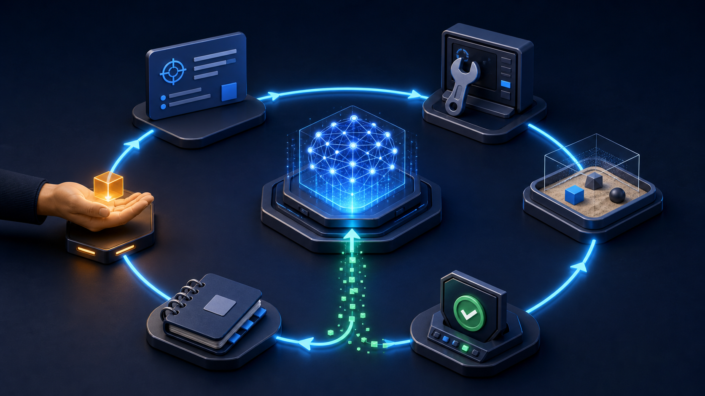
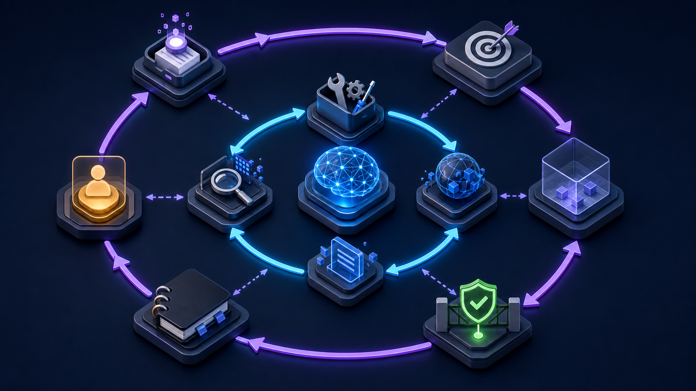
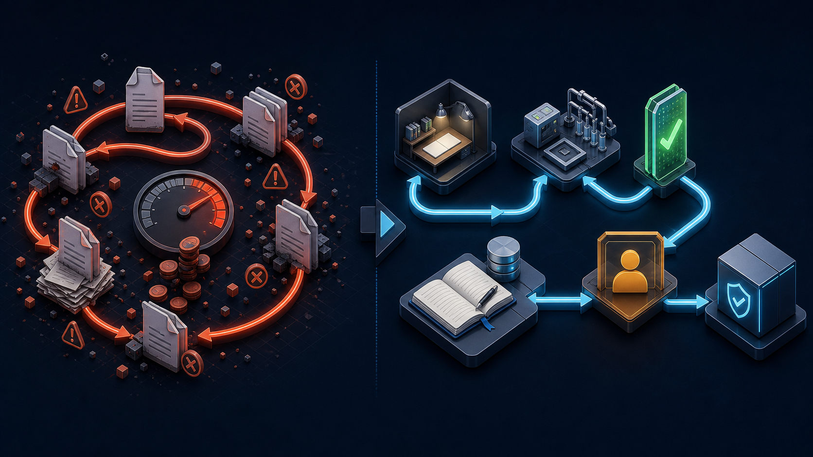

*模型只在正中央；外圍經過設計的循環，才是將重複嘗試變成可控進度的關鍵。*

「Loop Engineering」是近期其中一個聽起來比實際內容神秘的 AI 新名詞。

最短的解釋是：**你不再逐步親手提示 Agent，而是設計一個有邊界的系統，負責交工作、讓它行動、檢查真實證據、記錄結果，再決定是否繼續下一輪。**

Prompt 是要求一次嘗試；Agent harness 為這次運行提供工具與環境；Loop 再加上重複、驗證、狀態，以及停止的理由。

名稱很新，架構其實不新。軟件工程一直都有 feedback system、job runner、state machine、retry 和 quality gate。真正的轉變，是循環內的執行者現在可以理解不整齊的背景資料、選擇工具，再因應結果調整下一步。

## 目錄

## 先講清楚：甚麼是 Agent Loop？

大部分會使用工具的 Agent，在運行時本身已有一個小型內循環：

1. 模型閱讀目標與目前狀態。
2. 它選擇下一個動作，或者呼叫工具。
3. 環境交回 observation：檔案、測試結果、API 回應或錯誤。
4. 模型按證據決定下一步，或者輸出最終答案。

OpenAI 的 [Agents SDK 文件](https://openai.github.io/openai-agents-python/running_agents/) 幾乎用同一方式描述 Runner：呼叫模型、執行工具或 handoff、加入結果，再重跑，直至得到最終輸出或超出 turn limit。Anthropic 的 [Building Effective AI Agents 指南](https://www.anthropic.com/engineering/building-effective-agents) 講得更直接：Agent 通常就是模型按環境回饋使用工具，循環行動，再由停止條件保持控制。

這是 **inner loop（內循環）**，解釋一次 Agent run 如何向前走。

Loop Engineering 一般指再設計外面的 **outer loop（外循環）**：

- 甚麼事件觸發工作？
- Agent 下一個應該拿哪一項工作？
- 它會得到哪些背景與權限？
- 它可以在哪個安全環境內行動？
- 甚麼證據才算成功？
- 誰或甚麼機制負責檢查？
- 哪些狀態要保留到下一次運行？
- 何時重試、交回人手，或者停止？



*Inner loop 完成一次運行；outer loop 決定應該有甚麼運行、可以改甚麼，以及「完成」究竟代表甚麼。*

Addy Osmani 最近的 [Loop Engineering 文章](https://addyosmani.com/blog/loop-engineering/) 將這一層形容為：小系統自己找工作、分派、檢查、記錄完成狀態，再選下一件事。2026 年 6 月一篇關於 coding agent loop 的 [preprint](https://arxiv.org/abs/2607.00038) 亦提出一個實用的「loop specification」概念：trigger、goal、verification、stopping rule 和 memory。用詞仍在發展，但實際結構已經相當清楚。

## Prompt、Harness 與 Loop 是三個不同層次

| 層次 | 它回答的問題 | 常見內容 |
| --- | --- | --- |
| Prompt | 模型現在應該做甚麼？ | 目標、背景、限制、輸出格式 |
| Harness | 一次運行如何安全地完成工作？ | 工具、沙箱、權限、context loading、tracing |
| Loop | 工作如何重複並逐步收斂？ | Trigger、queue、verifier、state、budget、retry 與 stop rules |

你仍然需要好的 prompt。Loop Engineering 不會取代 prompt engineering，就像 deployment pipeline 不會取代好程式碼。它只是將槓桿移高一層：prompt 變成可重複工作系統裡的一個元件。

這個分別亦可避免一個常見錯誤：將模糊 prompt 放入無限 retry，然後稱它為 Agent system。單純重複不等於進步。**Observation 必須包含有用證據，而下一次嘗試必須能夠按證據改變。**

## 一個實用 Loop 的八個部分

我習慣先將 loop 寫成一份短合約。

1. **Trigger** — CI 失敗、新 support ticket、每日排程，或者人手要求。
2. **Goal** — 一個可以變成 true 的結果，而不是「不停改善所有東西」。
3. **Context** — 相關 repo 檔案、ticket、policy 與上一輪狀態；不是將所有文件一次過塞進去。
4. **Actions** — 小而清楚的工具集合，每個工具都有明確輸入、輸出與權限邊界。
5. **Observation** — 來自真實環境的最新結果：測試、log、diff、metric 或 API response。
6. **Verifier** — 判斷證據是否符合目標的檢查機制。
7. **State** — 試過甚麼、改過甚麼、尚欠甚麼，以及上次為何失敗。
8. **Terminal states** — `done`、`needs_human`、`blocked`、`budget_exhausted` 或 `unsafe`；永遠不要只有「繼續跑」。

> [!important] 重要
> 在決定自主程度之前，先定義證據。如果你說不清甚麼證據可以證明工作完成，就不要先將工作自動化。Agent 很有信心地說「done」只是輸出，不是驗證。

對於 deterministic 工作，最可靠的 verifier 通常仍是普通軟件：測試、type check、schema、policy engine、數值門檻或乾淨的 diff。第二個模型可以評論語氣或模糊之處，但有真實後果的改動，不應只由另一個模型決定是否通過。

Anthropic 將 maker-checker 版本稱為 [evaluator-optimizer workflow](https://www.anthropic.com/engineering/building-effective-agents)：一個模型產出，另一個模型評估並將 feedback 送回循環。當準則清晰，而且再做一輪能帶來可量度改善，這個 pattern 就特別有用。

## 一個我真的會用的小型 Loop

由沉悶而且容易驗證的工作開始：**在隔離 branch 內修復一個已知 CI failure，但不要自動 merge。**

還未選 framework 之前，先寫好 loop contract：

```yaml
name: repair-one-ci-failure
trigger: one reproducible failed check selected by a human
goal: the selected check passes without breaking the rest of the test suite
context:
  - failing test output
  - relevant source and test files
  - project engineering rules
allowed_actions:
  - inspect files
  - edit files in an isolated worktree
  - run approved test and static-analysis tools
verification:
  - reproduce the failure before editing
  - selected check passes after editing
  - broader test suite passes
  - diff contains only relevant changes
limits:
  attempts: 5
  wall_clock_minutes: 30
  destructive_actions: false
terminal_states:
  - done
  - needs_human
  - blocked
  - budget_exhausted
```

實作可以使用 framework、現成 coding agent、scheduled automation，或者簡單 state machine。概念上，它只需要做到以下流程：

```python
state = load_state()

for attempt in range(1, 6):
    action = agent.next_action(goal=goal, state=state)
    observation = sandbox.run(action)
    evidence = verifier.check(observation=observation, workspace=sandbox)

    state.record(attempt=attempt, action=action, evidence=evidence)

    if evidence.accepted:
        finish(status="done", evidence=evidence)
        break
    if evidence.needs_human or evidence.unsafe:
        finish(status="needs_human", evidence=evidence)
        break
else:
    finish(status="budget_exhausted", evidence=state.latest_evidence)
```

模型當然重要，但留意大部分工程決定放在哪裡：allowed actions、isolated workspace、evidence object、attempt limit 和 terminal states。

## 如何安全地開始使用 Loop Engineering

### 1. 選擇有清晰 feedback signal 的工作

好的第一個 loop，證據應該便宜而且可以重複取得：失敗測試變綠、broken link 成功回應、schema 通過驗證，或者 queue item 補齊所有必要欄位。

不要一開始就用「改善產品」或「令客戶更開心」。這些可能是好目標，但太多判斷會被隱藏在 loop 裡面。

### 2. 先手動運行，再加入排程

首十次由你親自 trigger。閱讀建議動作、工具結果、diff 和 verifier output。這個階段是在找 specification 的漏洞。

等 supervised 版本表現穩定，才加 timer 或 event trigger。Automation 會同時放大好設計與錯誤假設。

### 3. 收窄可以行動的範圍

只提供真正需要的工具。將 read tool 與 write tool 分開。使用 isolated branch、worktree、container 或 sandbox。涉及 production、對外訊息、付款、刪除或擴大存取權限，一律要求人手批准。

OpenAI 現時的 [human-in-the-loop 指南](https://openai.github.io/openai-agents-python/human_in_the_loop/) 正是用 pause-and-resume 處理敏感 tool call。背後原則與供應商無關：approval 應該是 loop 內一個正式 state，而不是希望模型「應該會記得問」。

### 4. 重要檢查要保持獨立

不要問同一個已經載入所有背景的 Agent：「你肯定嗎？」然後將它的 yes 當成證據。先用 deterministic check。需要質性評審時，使用另一個 evaluator 和窄而清楚的 rubric，只給它 artifact 與 evidence，不要讓 maker 的說服式解釋影響判斷。

### 5. 保存少量而可檢查的 State

將 task ID、attempt、evidence、decision 和 terminal status 儲存在 conversation 之外。不要用不停增長的 transcript 充當 database。明天的 run 應該知道今天發生過甚麼，但不需要重讀今天每一個 token。

### 6. 每一個維度都要有 Budget

設定最大 turns、tool calls、運行時間和成本。亦要限制同時開啟的 work items，以及同一個 failure 的 retry 次數。無法完成的 loop 應該變成一項清晰的人手 queue item，而不是一張沉默地增長的帳單。

### 7. 量度整個 Loop，而不只是模型

追蹤完成率、錯誤「done」判斷、人手介入、被 revert 的改動、平均 attempts、時間和成本。即使模型更強，如果 verifier 太弱或工具回傳混亂 observation，整個系統仍然可以變差。

## 預期會遇到的失敗模式



*沒有證據與 exit rule，重複只會累積錯誤；有明確工具邊界與可信檢查，才會累積有用進度。*

- **Self-approval：** maker 自己改功課，然後替不利證據找理由。
- **Runaway retries：** 沒有 terminal state 處理不確定性，loop 只好不停改東西。
- **Stale state：** 環境已改變，仍將昨日 diagnosis 當成今日事實。
- **Permission creep：** 為了方便加入一個新工具，卻悄悄擴大 blast radius。
- **Parallel collision：** 多個 worker 沒有隔離，卻同時修改相同 state 或檔案。
- **Verifier gaming：** Agent 只針對檢查拿高分，而不是達成真正目標。
- **Comprehension debt：** 改動到達的速度快過團隊理解與承擔的速度。

> [!warning] 注意
> Loop 是放大器。它不知道自己在放大好判斷，還是幫人逃避判斷。涉及業務意義、安全與責任的邊界，仍要由人掌握。

所以我不會由一座全黑、完全自動的「software factory」開始。我會先做一個 loop、一條 queue、一個 isolated workspace、一道 evidence gate，再由一個人閱讀每次結果。只有營運數據證明它值得信任，才逐步擴大。

## 甚麼時候不應該建立 Loop？

如果工作只做一次、步驟早已確定、feedback 主要是主觀判斷，或者錯誤行動代價高而難以逆轉，普通 prompt 或固定 workflow 可能更合適。

Anthropic 的建議很務實：由最簡單方案開始，只有 agentic complexity 能夠明顯改善結果時才加入。如果一個 script 已能可靠完成，就用 script；如果一次 model call 加 retrieval 已經足夠，就不要加入五個 Agent 和 scheduler。

Loop Engineering 最適合三個條件同時成立的工作：

- 工作會重複出現；
- 下一步確實取決於最新的環境 feedback；以及
- 成功可以被充分檢查，足以控制是否繼續。

## 真正的重點

AI Agent Loop Engineering 不是取代軟件工程的魔法。它只是將軟件工程用在重複的 Agent 工作上。

有用的轉變，是由「下一個完美 prompt 是甚麼？」改為問：

**哪一個系統會選下一項工作、限制行動、收集可信證據、記住狀態，並因為正確理由而停止？**

設計得好，Agent 不需要你逐步拖住，同時又不會減少責任；設計得差，就只是將有自信的 retry 自動化。

我最短的版本是：**不要只 loop 個 prompt；要 loop 證據。**

*如果你的團隊有重複的工程或營運流程，可能適合轉成有邊界的 Agent loop，我很樂意一起整理 goal、verifier 與安全閘門——[電郵聯絡我](mailto:nam@wistkey.com)。*

---

*如果這篇文章令一個嘈吵的 AI 新名詞變得實在一點，可以[在 Medium 追蹤我](https://nam0403.medium.com/)、[訂閱或收藏 nam-ai.uk](https://nam-ai.uk) 閱讀更多實用 Agent Engineering 筆記，亦歡迎[在 LinkedIn 連繫我](https://www.linkedin.com/in/nam-chan/)——最想聽到的，始終是 demo 以外真正有效的方法。*
