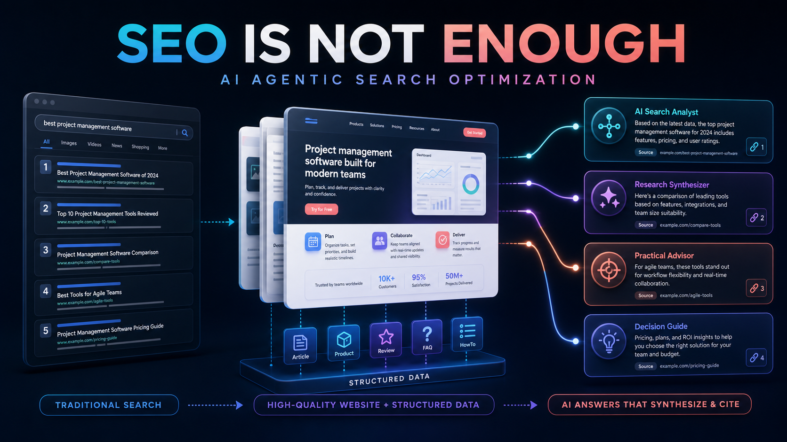
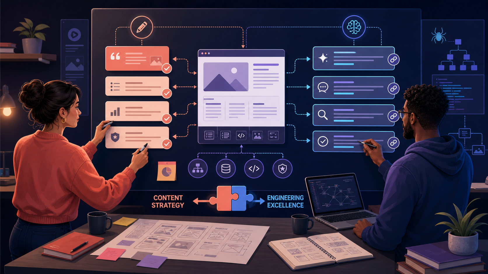
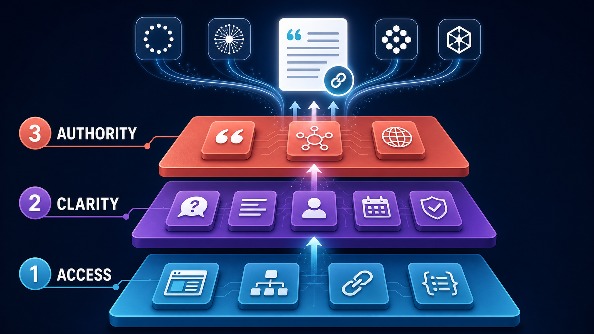

過去二十年,網站搜尋的目標很清楚:讓頁面被收錄、搶到正確 keyword 的排名、贏得那一下 click。

這套玩法沒有消失,但它已經不再是整段搜尋旅程。

愈來愈多人直接向 Claude、Grok、ChatGPT 或 Gemini 問一條完整問題,然後拿走一個完整答案。系統可能同時拆開幾個相關查詢、打開多個網站、比較不同說法,最後用幾個 citation 組成建議。用戶甚至不會見到那十條藍色連結。你的頁面可以排名不錯,卻完全沒有出現在真正影響決定的答案裡。

Visibility 的單位變了。問題不再只是**「我的頁面排第幾?」**,而是**「Agent 有沒有理解我的公司、相信我的說法,再揀我的頁面做證據?」**

我相信,對很多商業和技術搜尋來說,這條問題將會比傳統排名更重要。SEO 仍然是地基;**AI Agentic Search Optimization,就是正在地基上面長出來的那一層。**

## 目錄

## 搜尋正在變成一套「生產答案」的系統

幾個平台的運作方法不完全一樣,但方向非常一致。

- [OpenAI 說明](https://help.openai.com/en/articles/12627856-publishers-and-developers-faq),任何公開網站都有機會出現在 ChatGPT Search;想內容進入摘要和 snippet,就不要阻擋 `OAI-SearchBot`。
- [Anthropic 的文件](https://support.claude.com/en/articles/8896518-does-anthropic-crawl-data-from-the-web-and-how-can-site-owners-block-the-crawler)把 `Claude-SearchBot` 和由用戶觸發的 `Claude-User` 分開;阻擋它們,可能降低網站在 Claude 搜尋結果裡的可見度。
- [Google 解釋](https://developers.google.com/search/docs/appearance/ai-features),AI Overviews 和 AI Mode 可以做「query fan-out」:同時搜尋多個子題和資料來源,再組成一個附有 supporting links 的答案。
- [xAI 的文件](https://docs.x.ai/developers/tools/web-search)則形容 Grok 的 web search 會即時搜尋、瀏覽網頁、抽取資料,並回傳 citations。

換句話說,搜尋結果愈來愈不像終點,而是**製造答案的原材料**。

傳統 SEO 問的是:爬蟲能否 index 這一頁?演算法應否把它排高?Agentic search 會再問多幾層:模型能不能抽出準確答案?它知不知道是誰提出這個 claim?資料是否最新?有沒有其他來源支持?在這一段答案裡,這是不是最值得引用的 source?

所以這件事不可能只交給 marketing team。



_Content strategy 和 technical delivery 已經是同一套系統。再好的答案,藏在爛 rendering 後面也是隱形;再完美的 schema,包住一堆普通文案也不值得引用。_

Marketer 最清楚客戶會問甚麼、用甚麼語言、有哪些疑慮、需要甚麼證據。Developer 控制 rendering、crawler access、semantic structure、performance 和 structured data。如果兩邊各自寫計劃,最後只會做出一個為昨天搜尋框而設的網站。

## AI Search Optimization 的三個層面

這套 playbook 日後可以拆得很深,但起步我會先抓住三層:**Access、Clarity、Authority**。



_AI 看不到的內容不可能引用;看不懂的內容不可能信任;而一個沒有權威、沒有原創價值的來源,它也沒有理由特別選你。_

## 1. Access：先讓真正的內容可以被讀取

第一步一點都不性感:確認搜尋系統真的 fetch 到你希望它使用的頁面。

不要只看 `robots.txt`。CDN、web application firewall、bot protection、redirect、canonical tag、HTTP status、internal links 和 JavaScript rendering 都要一起 audit。重要資訊應該以真正文字出現在送到瀏覽器的頁面裡,而不是只藏在圖片、動畫,或者要經過幾次 client-side interaction 才出現。

如果你想在 AI search 被看見,就要檢查相關 search bot 的 access。一份簡化示意可能包括:

```text
User-agent: OAI-SearchBot
Allow: /

User-agent: Claude-SearchBot
Allow: /

User-agent: Claude-User
Allow: /
```

這只是示意,不是叫所有網站盲目 copy。已經容許 `User-agent: *` 的網站未必需要額外列出;不同機構對 search、user retrieval 和 model training 也可以有不同取態。重點是**有意識地作決定**,而不是 `robots.txt` 說 allow,結果 CDN 又靜靜把 crawler 擋成 403。

Accessibility 也開始直接影響 agent。OpenAI 特別提到,清楚的 ARIA role、label 和 state 能幫助 browser agent 理解互動元件。對 screen reader 友善的 semantic HTML,同時也給 agent 一張比較乾淨的頁面地圖。

> [!warning] 注意:不要由 `llms.txt` 開始
> 有些服務可能會讀它,但它不是 AI 排名魔法檔案。Google 已經明確說明,出現在其 AI features 不需要新的 AI text file 或特殊 schema。先修好 crawlability、internal links、rendered text 和 page structure。

**Marketer 的工作:**決定哪些內容必須公開,而且可以直接用來回答問題。  
**Developer 的工作:**證明 crawler 和 user-directed agent 真正能夠 reach、render 和理解它。

## 2. Clarity：寫可以回答問題的 facts,不是 keyword 霧

一頁不斷重複同一句 keyword 的文案,不代表 agent 會有信心引用。

先由客戶真正會問的問題開始。每個重要問題,先給一段直接、可以獨立成立的答案,再慢慢補 nuance。Heading 要清楚。產品、公司、人物和地點的名稱要一致。誰寫、何時發佈、何時更新、claim 由甚麼證據支持,全部不要讓模型猜。

一頁 service page,至少應該清楚回答:

- 這項服務做甚麼,以及不做甚麼;
- 適合哪一類客戶;
- 覆蓋甚麼地區或限制;
- 流程如何運作;
- 這個承諾背後有甚麼 methodology、經驗或實證。

然後把同一份意思放進頁面結構。真正適用時,使用正確的 `Article`、`Person`、`Organization`、`Product` 或其他 schema.org type。Structured data 的作用是釐清頁面,不是在用戶看不到的地方創作另一套事實。

Google 的建議其實非常「悶」:structured data 必須和畫面上的內容一致,亦沒有甚麼 AI 專用 schema。這正正就是重點。**清楚,比新奇重要。**

一個很好用的 review 問題是:如果 agent 只抽走這一個 section,它仍然能否準確知道主體、範圍、證據和日期?如果不行,這段內容可能太依賴 marketing context,或者太沉迷 clever wording。

**Marketer 的工作:**建立 question map,寫出準確而有用的答案。  
**Developer 的工作:**用 semantic HTML、metadata 和 structured data 保存那份意思。

## 3. Authority：發佈真正值得引用的東西

Access 讓你入場,Clarity 讓人看懂。但如果另外二十頁都在說同一堆話,兩樣都不足以令 answer engine 選你。

最強的內容,通常也是最難 commodity 化的內容:

- 原創 data、benchmark 或 screenshot;
- 一套真正用過、而且有名字的方法;
- 第一手 implementation details 和限制;
- 有 measurable before-and-after 的 case study;
- 連繫到真實身份和 track record 的專家觀點;
- 每個 claim 旁邊直接連結 primary source。

這裡就是傳統 authority signal 和 AI citation value 交會的地方。爭取其他可信網站的相關引用;讓公司、作者和產品 identity 在網站及公開 profile 保持一致;保留 stable URL;舊 claim 過時就修正,不要不停生產差不多的 duplicate page。

Agent 要組成一個答案,需要可以 attribution 的證據。給它一句乾淨的 claim、背後的 proof,以及相信你確實接近這個題目的理由。

Measurement 也要一起改。Search Console 和傳統 SEO report 繼續保留,但要加入 AI referral、被引用頁面、assisted conversion,再用一組真實客戶問題定期測試 ChatGPT、Claude、Gemini 和 Grok。OpenAI 已經在 ChatGPT Search referral URL 加上 `utm_source=chatgpt.com`;Google 則暫時把 AI-feature traffic 混在較大的 Web search report 裡,所以不會有一個 dashboard 自動告訴你全貌。

> [!important] 重要:不要追逐某一個 model 今日的用字
> Model、index 和 retrieval 方法一定會繼續改。建立一個技術上可到達、語意上清楚、內容上真正有權威的 source。這比追逐今日的 prompt trick 更經得起 model update。

## SEO 是地基,不再是終點

我不是在宣佈 SEO 已死。剛剛相反:一頁被 block、太慢、重複、internal linking 混亂或者根本不能 index 的內容,在兩個世界都不會有好結果。Title、internal link、technical hygiene、有用內容和真正 authority 仍然重要。

但終點正在移動。

舊的 optimization target 是搜尋結果頁上的一個位置。新的 target 是 generated answer 裡的一席位——再下一步,是 agent 的 action plan 裡面有你。Agent 可以在真人到訪網站之前,已經完成 research、comparison、shortlist 和 recommendation。當這件事成為日常,在 reasoning chain 裡成為最清楚、最可信的 source,就會比某一條 keyword 排第三更重要。

所以 marketer 和 developer 現在就應該一起規劃:

1. **Access:**相關系統能否到達和理解內容?
2. **Clarity:**它能否抽出一個主體、範圍和日期都正確的答案?
3. **Authority:**這個答案是否足夠原創和可信,值得引用?

這篇只是第一層。之後我會再深入寫 crawler audit、entity 和 structured-data design、answer-ready content architecture,以及當搜尋結果由 ranking 變成 citation 之後,究竟應該如何量度 visibility。

現在開始學習的品牌,不會放棄 SEO。它們會把 SEO 變成下一代搜尋介面的 infrastructure。

_如果你正在思考的,不只是網站如何排名,而是 AI agent 究竟如何理解它——這正是 Wistkey 日常處理的 content-and-engineering 問題。[電郵我](mailto:nam@wistkey.com),我可以給你一個實際的起步方向。_

---

_如果這個框架對你有用:[在 Medium 追蹤我](https://nam0403.medium.com/)、[訂閱或收藏 nam-ai.uk](https://nam-ai.uk) 等之後的深入篇,亦歡迎[在 LinkedIn 連繫](https://www.linkedin.com/in/nam-chan/)——很想知道 AI search 已經怎樣改變你的團隊。_
