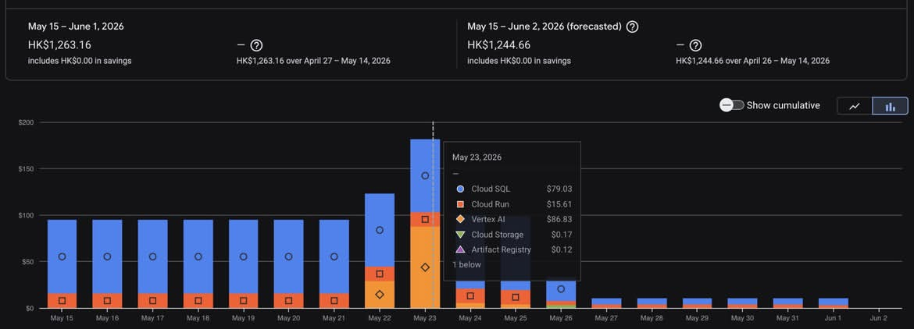

上個月，我把我們其中一個 Google Cloud 項目的開支從**每月約 $2,800 降到約 $300**。一年大約省下 **$30,000**，而我只花了一個下午——坐在 Claude 旁邊，讓它驅動 `gcloud` CLI。

沒有改一行 code。沒有停機。甚麼都沒有重新架構。



*帳單主控台裡的樣子：當過度配置的資源——Cloud SQL、一兩個閒置服務，那些老面孔——被重新調整之後，每日開支像懸崖一樣掉下去。*

## 目錄

## 「浪費」從來不是架構問題

最讓我意外的是：省下來的錢，沒有一分是靠修正一個「壞」系統得來的。架構本身沒問題。浪費幾乎全部來自**當初合理、但之後再沒更新過的假設**——一個為了發佈高峰而配置、但那個高峰再沒回來的資料庫、一台「暫時」24 小時開著的 staging、保留期停在預設值的日誌、沒人盯著的 dev 流量。

這才是大部分雲端帳單真正的形狀。不是一個你能指著說「這裡設計錯了」的缺陷，而是一百個曾經正確、然後悄悄不再正確的小設定。

問題是，把它們逐一審視非常**沉悶**——正正就是那種慢、要細心、要逐項讀完的工作，最容易一拖再拖。所以它永遠做不完。

而這，正是 AI 改變的地方。

## Agentic 工作流程

設定其實很簡單：**Claude 負責推理，`gcloud` 負責觸及，而我負責把關。** 它是一個循環，不是一條神奇的指令。

我把它分成四個階段，而次序本身就是重點。

### 一、只讀審計

只給 agent 讀取權限——*只有*讀取。讓它在整個項目裡跑 `describe` 和 `list`、從 Cloud Monitoring 拉使用率、讀帳單分項。它會建立一份清單：有甚麼、花多少、實際用了多少。

```bash
# 這階段 agent 會跑的東西——全部只讀
gcloud sql instances describe prod-db --format="yaml(settings.tier,settings.dataDiskSizeGb,settings.availabilityType)"
gcloud compute instances list --format="table(name,machineType.basename(),status)"
gcloud compute addresses list --filter="status=RESERVED"
gcloud recommender recommendations list \
  --recommender=google.compute.instance.MachineTypeRecommender \
  --location=us-central1-a --format="table(description,primaryImpact.costProjection.cost.units)"
```

> [!important] 重要
> 這階段用一個**最小權限、只讀的 service account**。agent 不可能弄壞它連寫都寫不到的東西。所有有趣的事，都發生在你授予寫入權限之前。

### 二、提出方案並估算

現在 Claude 把清單變成一份排好序的改動列表：砍甚麼、每月估計省多少，以及最關鍵的——每一項的**風險等級**。可逆的瘦身放最上，任何涉及刪除或正式環境重啟的放最下。

這一步你要細讀，把不要的劃掉。agent 提出方案，你決定哪些連候選資格都有。

### 三、一次一個改動，每步都有把關

到這裡才拿出寫入權限，而且只針對手上那一個改動。每一項：先在 **staging 或非正式環境**做，確認服務仍然正常，再上正式環境——任何具破壞性或影響正式環境的動作，都由我親自批准。

> [!warning] 注意
> 永遠不要讓 agent 在無人看管下跑 `delete` 或正式環境的 `patch`。把「就這十個改動一起做吧」批次執行，正是把一個省 $30k 的成果變成一次故障的方法。一次一個，驗證，下一個。

### 四、驗證，並留一條退路

每個改動之後，確認東西仍然運作（零停機是一個**檢查**，不是一個願望），並且下一個結算週期的帳單真的往下走。任何動到磁碟或資料庫的操作，先做快照。

## 累積起來的節省

同一套流程，逐項套用。資料庫是最大的一筆；其餘都是那些悶聲不響、慢慢疊起來的勝利。

### 為託管資料庫瘦身（Cloud SQL / RDS）

這是最大的一條。那個 instance 一直按著一個早已不存在的負載輪廓配置——CPU 和記憶體大部分時間閒著，但我們每小時、每天都在為那個高峰付錢。

```bash
# 在 Monitoring 確認低使用率、並先做好備份之後：
gcloud sql backups create --instance=staging-db          # 安全網
gcloud sql instances patch staging-db --cpu=2 --memory=7680MB   # 縮小規格（自訂 CPU／記憶體），先在這裡測試
```

> [!caution] 小心
> Cloud SQL 改機型會觸發一次短暫重啟。先在 staging 證明可行，再把正式環境安排在低流量時段。在非正式環境，把 HA 降成 `--availability-type=zonal` 往往是白撿的錢。

### 縮減並排程 staging

staging 不需要在星期日凌晨三點運行。把機型調小，再排一個時間表，讓它只在工作時間開著——單是這樣，就能把那些 instance 砍掉大約三分之二。

```bash
gcloud compute resource-policies create instance-schedule work-hours-only \
  --region=us-central1 --timezone="Europe/London" \
  --vm-start-schedule="0 8 * * 1-5" --vm-stop-schedule="0 20 * * 1-5"
gcloud compute instances add-resource-policies staging-web \
  --zone=us-central1-a --resource-policies=work-hours-only
```

### 收緊日誌保留

日誌 bucket 保留期停在冗長的預設值，就會一直為你永遠不會再讀的儲存付錢。把非正式環境的保留期降到合理數字，再為最嘈吵、最沒用的日誌加上排除過濾器。

```bash
gcloud logging buckets update _Default --location=global --retention-days=30
```

> [!note] 備註
> 保留期是唯一要放慢腳步的地方：縮短之前，先確認這裡沒有任何東西是**合規或審計**所必需的。

### 削減 dev 頻寬與閒置資源

dev 和 CI 是 egress 漏錢的地方：跨區的雜訊流量、本可快取卻反覆拉取的數據，還有那個經典——**保留著卻沒接上任何東西的 static IP**，正因為它閒置而在計費。孤兒磁碟和舊快照也是一樣。

```bash
gcloud compute addresses list --filter="status=RESERVED"    # 閒置 = 仍在收費
gcloud compute disks list --filter="-users:*"               # 未掛載的磁碟
```

### 清掉過度配置與舊有預設

長尾的部分：過大的開機磁碟、一個閒置的負載平衡器、一個為了 demo 而開的 GKE node pool、兩年前那些「暫時」的設定。單看都很小，加起來卻是帳單很大的一塊。

## 安全守則，集中一處

如果你甚麼都不記得，記住這幾條：

- **先只讀。** 在寫入權限存在之前，把整個審計做完。
- **最小權限。** 只為手上那一個改動、狹窄地授予寫入權限，之後收回。
- **任何破壞性或影響正式環境的動作，都要人把關。** agent 提出方案；由人批准刪除和正式環境的改動。
- **先 staging 再正式。一次一個改動。中間要驗證。**
- **動磁碟和資料庫之前先備份。** 快照很便宜，後悔很貴。
- **可逆優先於不可逆。** 先縮小，再談刪除。只有在你確定的時候才刪，而且放到最後。
- **改完之後盯著帳單和監控。** 直到下一期帳單確認、而且甚麼都沒壞，這個成果才算數。

## 真正的重點

工具其實沒那麼重要，習慣才重要。Claude 和 `gcloud` 找到的東西，一個有耐性的工程師本來也找得到——它們只是把那個有耐性、很悶的部分變得夠快，快到真的會被做完。這差不多就是「AI 導入」在現實中的樣子：不是魔法，只是終於去做那些你一直拖著的細心工作。

帳單從來不是問題。那些沒再被檢視的假設才是。現在，它們會在一個星期二的下午被重新檢視——而且是安全地——這，才是值得留住的部分。

*你的雲端帳單也在不知不覺間漲上去了嗎？歡迎交流——[電郵我](mailto:nam@wistkey.com)。*
