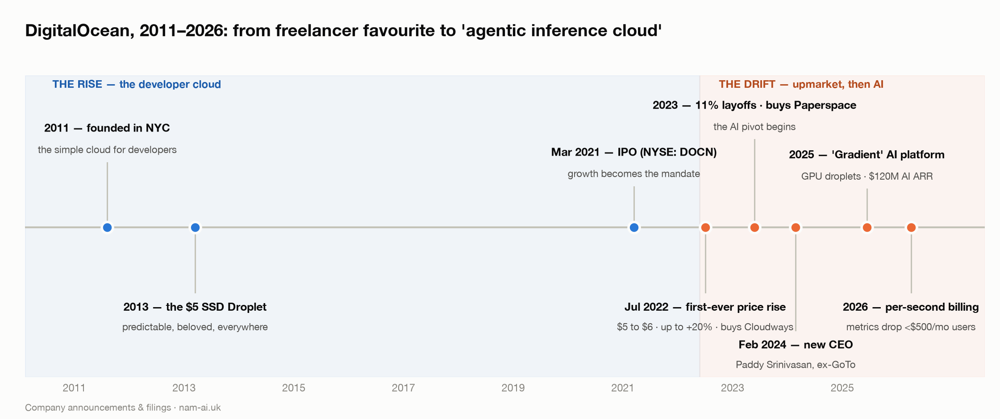

有整整十年,如果你是 freelancer 或者兩三個人的小團隊,「這個放哪裡 host?」只有一個標準答案:**開一個 $5 的 DigitalOcean droplet**。客戶的 WordPress、staging 機、side project、自己的 VPN,全部塞得進去。價錢從不變動,介面不跟你作對;半夜兩點壞了甚麼,總有一篇 DigitalOcean 社群教學等著你——通常是 Google 第一條結果,通常寫得比你在修的那件東西的官方文件還好。

到了 2026 年,我問同一班人「你的東西跑在哪」,答案變成 Hetzner、Vultr、Hostinger、一台裝了 Coolify 的機、「某個 PaaS」。幾乎沒有人再說 DigitalOcean。

但有趣的地方是:DigitalOcean 並沒有倒下。營收剛突破 **9.01 億美元**,增長在放緩多年後重新加速。真正發生的事安靜得多,也值得細看——**這間公司一步一步走向大客戶,把最初的用戶留在原地**,而每一步在董事會裡都說得通。如果你的客戶是 freelancer,或者你自己就是,整條軌跡都值得研究:同一套劇本,遲早輪到你喜歡的每一件工具。



*十五年濃縮成一條線:先是十年的「開發者之雲」,然後四年逐步走向大客戶,最後走向 AI。資料來源:公司公告及財報。*

## 目錄

## 當年為甚麼人人都愛它

DigitalOcean 在 2013 年前後以一個真正激進的產品拿下 freelancer 市場:一台 SSD 伺服器,**每月 $5,固定**。沒有四十個輸入欄的計價器,沒有驚喜附加費,沒有「視乎用量」的定價頁。帳單*無聊*得很——而對一個要向客戶開發票的獨立開發者來說,成本就應該無聊。

不過真正的護城河其實不是伺服器,而是**教學文章**。DigitalOcean 的社群文件教會了我們一整代人 nginx、systemd、UFW、Postgres 備份。再加上 Hacktoberfest 和一個乾淨的控制台,DO 不只是一間主機商,它是你*學會成為*「懂得管伺服器的人」的地方。AWS 賣給 CTO;DigitalOcean 賣給真正動手做事的人。

正因為有這份信任,後來的事才特別刺眼。

## 轉捩點:2022 年 7 月

2021 年 3 月,DigitalOcean 以 DOCN 在紐交所上市——上市公司天生背負一個使命:每季都要增長,永遠都要。十六個月後,[2022 年 7 月,公司史上第一次加價](https://www.digitalocean.com/blog/new-4-dollar-droplet-updated-pricing):人人喜愛的 $5 droplet 變成 **$6**,各產品線加幅**最高達 20%**,再補上一個縮水的 $4 檔(512 MB——夠跑個 DNS resolver,跑不起客戶的網站)。

一美元本身不是甚麼滔天大罪,重點不在這裡。重點是「價錢永遠不變」*本身就是產品*,而它變了。那份心理契約,斷了。

更清晰的信號是**技術支援**的變化。回應速度如今是[一條收費產品線](https://www.digitalocean.com/pricing/support):

| 方案 | 月費 | 首次回應 |
|---|---|---|
| Starter | 免費 | < 24 小時,電郵 |
| Developer | $24/月 | < 8 小時 |
| Standard | $99/月 | < 2 小時,另有即時對話 |
| Premium | $999/月 | < 30 分鐘,另有 Slack 頻道 |

把中間那一行再讀一次:**想在一個工作天之內有人回覆你,每月 $24——比它所支援的那台伺服器還要貴。**對一個客戶網站當機的 freelancer 來說,「免費」的意思是*明天*。沒有甚麼比一道貴過你整月帳單的支援收費牆,更能清楚表達「你已經不是我們的目標客戶」。

## 跟著錢走

財務數字自己會說故事,不需要加鹽加醋:


*營收一直向上,但增長率由 35% 冷卻到 2024 年的 13%——然後 AI 的錢讓它重新加速。資料來源:DigitalOcean 季度業績;2025 財年於 2026 年 2 月公佈。*

由上市到 2024 年:增長率由約 35% 跌到約 13%,公司在 [2023 年 2 月裁走約 11% 員工](https://www.theregister.com/2023/02/15/digitalocean_layoffs/),先後收購 Cloudways(3.5 億美元,託管主機)和 [Paperspace(1.11 億美元,GPU 雲)](https://techcrunch.com/2023/07/06/digitalocean-acquires-cloud-computing-startup-paperspace-for-111m-in-cash/),並在 2024 年 2 月換上新 CEO Paddy Srinivasan。要解決增長放緩,答案從來不會是多賣幾台 $6 droplet。

到 2025 年,這場轉向有了名字:**[Gradient](https://www.digitalocean.com/blog/introducing-digitalocean-gradient)**——DigitalOcean 的「agentic inference cloud」:GPU droplet、模型推理、agent 工具鏈。而且真的有效:[2025 財年收 9.01 億美元,增長 15%](https://investors.digitalocean.com/news/news-details/2026/DigitalOcean-Announces-Fourth-Quarter-and-Fiscal-Year-2025-Financial-Results/),當中 **AI 年度經常性收入達 1.2 億美元,按年增長 150%**,並預告 2026 年增長約 21%。年花 100 萬美元以上的客戶,收入增長 123%。

然後是讓這篇文章成立的那個細節:2025 年第四季,DigitalOcean **重整了對外公佈的客戶指標,把月費 500 美元以下的帳戶剔除在外**。它如今向投資者強調的客戶群,起跳點是每年 10 萬美元。

$5 droplet 的客戶,不只不再是優先項目——他們連*被統計*的資格都沒有了。

> [!note] 平心而論
> 這一切都不是醜聞,而是光明正大執行的策略。平台依然好用,文件依然出色,2026 年 1 月改行按秒計費對用戶更是真心友善。DigitalOcean 沒有在死亡,2025 年反而可能是它近年最好的一年。它只是深思熟慮地決定了:不再*為你和我*而存在——而繼續假裝它還是,只會讓你出於懷舊而多付錢。

## 2026 年的數學題

情懷放一邊,看看今天的錢買到甚麼。小型生產環境的主力規格——2 vCPU / 4 GB 共享 CPU——2026 年 7 月的標價:


*同一個形狀的機器,四張帳單。Hostinger 是 24 個月合約的優惠價(續約約 $17–25);Hetzner 是其美元標價——歐盟機房 €5.49 未連稅——而且已經是 Hetzner 自己 2026 年 6 月加價之後的數字。資料來源:各供應商定價頁及公開 API,2026 年 7 月 10 日。*

[$24 的 Basic Droplet](https://www.digitalocean.com/pricing/droplets) 帶 80 GB SSD 和 4 TB 流量。Hetzner 的 CX23 用大約四分之一的價錢,給你同樣的核心數和記憶體,外加 **20 TB** 流量。Vultr 同規格的方案是 $20。DigitalOcean 的超額流量收 [$0.01/GiB](https://docs.digitalocean.com/products/droplets/details/pricing/)——即是**每超 1 TB 約 $10,而 Hetzner 大約收 €1**。

如果你是 DigitalOcean 的老客戶,第一步最誠實的做法是看清楚自己究竟租了甚麼。API 會告訴你(`doctl` 是 DO 的官方 CLI):

```bash
# 每個規格 slug 的配置和月費,直接由 DO 取回
doctl compute size list --format Slug,VCPUs,Memory,Disk,PriceMonthly
```

再拿你的 slug 對照上面那張圖。這個十分鐘的盤點,就是大多數人發現自己「用 2019 年的價錢買 2026 年的算力」的一刻——跟我在[雲端帳單那篇](/zh/posts/cut-cloud-costs-with-claude-and-gcloud/)寫過的「沒人重新審視的假設」是同一個問題,只是換了個 logo。

## Freelancer 究竟搬去了哪裡

觀察這個圈子這幾年,加上我自己也搬過客戶的工作負載,出走潮大致流向五個目的地。

### Hetzner:性價比之王,但要加個新註腳

這間德國供應商由 2023 年左右成為發燒友的預設選擇:每一歐元換到的規格誇張,歐盟機房送 20 TB 流量,貨真價實的硬件。註腳是新的,而且重要:**Hetzner 在 2026 年加了兩次價**——4 月一次,然後 [6 月 15 日再一次:共享 Intel 線由 €3.99 加到 €5.49,獨立 vCPU 方案更是翻倍有多](https://docs.hetzner.com/general/infrastructure-and-availability/price-adjustment/)(CCX13:€15.99 → €42.99)。現有機器維持原價,新開的付新價。

即使加完價,€5.49 的 CX23 仍然讓 $24 的 droplet 無地自容。但這裡的教訓可以推而廣之:**便宜的供應商終有一天也會加價。忠誠不是策略,可攜性才是。**

```bash
# Hetzner 的 CLI——在 Falkenstein 開一台 CX23,Ubuntu 24.04
hcloud server create --name app-01 --type cx23 --image ubuntu-24.04 --location fsn1
```

留意地理:著名的 20 TB 流量只適用於歐盟機房;美國和新加坡機房送的流量少得多(分別約 1 TB 和 0.5 TB),而且提供的是另一套較貴的方案組合。

### Vultr:最接近的直接替代品

如果你要的不是新哲學,而是「DigitalOcean,但便宜一點、機房多一點」:32 個數據中心,$5 的 1 GB 方案,2 vCPU / 4 GB 主力機 **$20**,沒有預繳花招。名單上心智模型最接近的替代品——用法一樣,單價略好,機房多很多(亞洲尤其多,在香港做事很有感)。

### Hostinger:新手潮

每一個 YouTube 贊助環節都在賣的那間。硬件是真心大方——KVM 2 有 2 vCPU / **8 GB** / 100 GB NVMe,**每月 $8.99**——但這個價要一次過簽 24 個月,而且**續約時大約是每月 $17–25**。就算按續約價計仍然划算;只是記得用續約價做數,不要用橫額上的價,並在第 23 個月設個提醒。

### Coolify 浪潮:在任何 VPS 上自建 Heroku

最有意思的轉變不是某間供應商,而是一種工作流程。[Coolify](https://coolify.io)(GitHub 58,000+ 星)和 Dokploy 給你一個自架的 PaaS:push 即部署、自動 HTTPS、一個儀表板管理所有客戶的應用,底層用哪家 VPS 都可以。真正取代「$5 droplet + 一篇 DO 教學」文化的,就是它——當年那篇教學,如今變成了一件產品。

```bash
# 在一台全新的 Ubuntu LTS 上執行(Coolify 最低要求 2 核 / 2 GB / 30 GB——CX23 剛好夠)
curl -fsSL https://cdn.coollabs.io/coolify/install.sh | sudo bash
```

一個 freelancer 用一台 €10 的 Hetzner 機配 Coolify 跑六個客戶應用,付的錢比當年一台 DigitalOcean droplet 還少。這條數,乘以幾千人,*就是*那場出走潮。

### 託管 PaaS:給從來不想碰伺服器的人

Railway、Render、Fly.io——「我收費是為了交付功能,不是為了幫 nginx 打補丁」的選項。每單位算力貴一點,每單位*注意力*便宜很多。對一部分 freelancer 是正確答案,但拿來跟裸 VPS 比價並不公平,所以點到即止。

> [!tip] 提示:按工作揀目的地
> 幫客戶做一個 WordPress 網站 → Hostinger(小心續約價)或任何 $5 級 VPS。手上有一批客戶應用 → Hetzner 或 Vultr 上跑 Coolify。有真實流量的產品、又不想碰運維 → 託管 PaaS,或者老實說,留在 DigitalOcean 的 App Platform 也不錯。沒有唯一贏家——而「不再用預設答案做決定」,正正就是離開的意義。

## 真的要走:毫不浪漫的搬遷流程

對一個典型的小網站,搬家是一個下午的事,不是一個項目。

```bash
# 1. 先替舊 droplet 留一份可還原的快照(先關機,確保資料一致)
doctl compute droplet-action snapshot 123456789 --snapshot-name "pre-migration-2026-07"

# 2. 把內容同步到新機(封存模式,壓縮傳輸)
rsync -avz /var/www/ root@203.0.113.10:/var/www/
```

前一天先把 DNS TTL 降到 300,資料庫用新鮮的 dump 還原(不要搬檔案系統),用 `/etc/hosts` 指向新 IP 測試,然後才切換記錄。搬遷的對外流量計入你的免費額度;就算超額,$0.01/GiB 的價錢下搬 100 GB 最多也是一美元左右——讓人困在大型雲上的「出走贖金」,在這裡幾乎不存在。

> [!warning] 注意:無聊的地方才會出事
> 搬遷出問題,從來不是 rsync 失敗——是那個被遺忘的 cron job、Let's Encrypt 的續期、從沒離開過舊機的 `.env`。關掉舊伺服器之前,先核對 `crontab -l`、`systemctl list-units --type=service` 和 certbot 的狀態,而那份快照,留一個月再刪。

## 決定留低的話

留下來是說得過去的:團隊熟悉那個控制台;App Platform 加託管資料庫是一套確實整齊的組合;發票來自一間美國上市公司(有些客戶的採購部門在乎這個);文件依然一流;按秒計費也讓突發性的 CI 工作負載便宜了不少。$4 和 $6 的 droplet 仍然存在,跑小東西仍然很好。

只是,留下要留得*清醒*——按 2026 年的價錢、知道其他選擇收多少錢之後的決定,而不是出於 2015 年的感激。

## 帶走的一課

這裡沒有反派。一間上市公司跟著增長走向大客戶,再跟著增長走進 AI,每一步在會議室裡都合情合理。但這些合理步伐加起來的結果是:那個教會 freelancer 管伺服器的平台,如今在指標裡連他們都不數了——而這班人,理性地帶著當年那些教學給他們的技能,搬到仍然為他們定價的地方去。

要在這個故事的每一次重播裡保護自己,靠兩個習慣:**讓工作負載保持可攜**(容器、Coolify 之類的部署層、config 放進 git——「一個下午就能搬走」必須一直保持廉價),以及**每年重新審視一次帳單**,像審視任何其他假設一樣。平台會改變策略;你的忠誠,應該留給算術。

*還在用 2019 年的價錢買 2026 年的算力?或者不確定自己的架構是否真的一個下午搬得走?這正好是我的日常工作:[電郵我](mailto:nam@wistkey.com),我樂意看看你的配置。*

---

*覺得這篇有價值的話:[在 Medium 追蹤我](https://nam0403.medium.com/)、[訂閱或收藏 nam-ai.uk](https://nam-ai.uk) 等下一篇,也歡迎[在 LinkedIn 連繫](https://www.linkedin.com/in/nam-chan/)——交流基建心得,隨時奉陪。*
