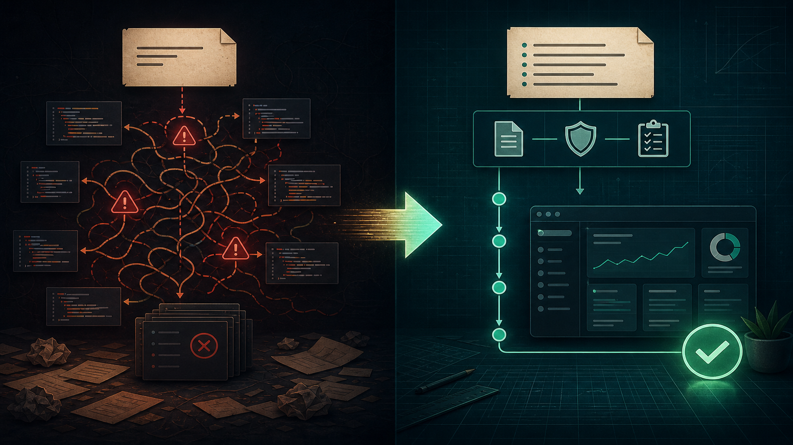

我平時 Claude Code 同 Codex 都會用，而結果好不好，最大分別通常不是有沒有一句「神 prompt」。真正有影響的，是我有沒有像一個 engineer 把工作交給另一個 engineer 一樣，把事情講清楚。

好的 prompt 不是咒語，而是一份精簡 handover：**想得到甚麼結果、哪些 context 真正重要、界線在哪裡、用甚麼證明完成，以及甚麼時候應先 plan、後落手改 code**。

我對照了 Anthropic 現時的 [Claude Code prompt library](https://code.claude.com/docs/en/prompt-library)、[best practices](https://code.claude.com/docs/en/best-practices)，以及 OpenAI 的 [Codex best practices](https://learn.chatgpt.com/guides/best-practices) 和 [prompting guide](https://learn.chatgpt.com/docs/prompting)。兩邊用詞不同，但核心建議其實非常接近。

以下 5 個習慣，是我會留下來的部分。

## 目錄

## 一、先講結果，不要先寫死做法

開頭先講完成之後應該有甚麼改變。除非實作次序本身就是 requirement，否則不要把 prompt 寫成一份僵硬的施工清單。

較弱：

```text
打開 auth.ts，加一個 function，改 middleware，之後再 update controller。
```

較好：

```text
修正 login flow：當 access token 過期，user 應可 refresh session，
而不是被送回 sign-in page。保留現有 security model 和 public API。
```

第二個 prompt 給 agent 一個清楚目的地，同時留空間讓它檢查 code。真正的問題可能根本不在 controller。兩家官方指引都在講同一件事：描述 outcome，將找路的工作交給 agent。

> [!tip] 提示
> 當自己是一個 tech lead：交代方向、context 和權限界線。除非步驟本身是 requirement，否則不用指定它每一個要讀的 file 和要跑的 command。

## 二、只附上會改變答案的 context

Coding agent 可以搜尋整個 repository，但它不會知道你最重視哪一個內部決定、screenshot、error log 或現有 implementation。

有用的 context 通常很具體：

- 能重現問題的 error output；
- 相關 folder 或可能的 execution path；
- 應跟隨的現有 component pattern；
- 目標 UI 的 screenshot；
- 定義 API contract 的官方文件。

```text
Checkout 只會在信用卡過期後失敗。由 src/payments/ 開始調查，
以 tests/payment-retry.spec.ts 作為 behaviour reference。
附上的 log 來自 token refresh 後第一次 retry failure。
```

這比把整個 repo 或 4,000 行 log 貼進去好。Context 是一種 budget：放進真正會改變答案的東西，其餘讓 agent 自己找。


*一份好用的 prompt 有五份工作。字多，不等於 context 好。*

## 三、講清楚界線，以及哪些東西不能碰

最昂貴的 agent 錯誤通常不是 syntax error，而是 scope error：改了 public interface、加了新 dependency、重寫不相關 module、碰到 production data，或者順手「執靚」一堆這次根本沒要求改的 code。

把重要 constraints 寫進 prompt：

```text
只可使用 package.json 已有的 libraries。不要改 database schema 或 public API。
保留 user 現有的 uncommitted changes。任何 production-facing 或 destructive
action，先問再做。
```

清單要短到 agent 看得見。「寫 clean code」幫助不大；「不要改 schema」就可能救回你一個下午。

如果某條規則每個 task 都適用，就不要每次重複貼。Claude Code 用 `CLAUDE.md`，Codex 用 `AGENTS.md`；repo 結構、build command、coding convention 和長期 do-not rule，都應放在這些持久設定裡。

> [!warning] 注意
> 文字界線只能引導 agent；permissions、sandbox、tests 和 review 才是更硬的安全欄。出錯成本高的工作，兩種都要有。

## 四、把「完成」寫成可以觀察的證據

「整到佢 work」會迫 agent 自己猜幾時應該停。一個 test、screenshot、metric 或 expected output，才能完整閉合 feedback loop。

```text
先用 failing test 重現 bug，再做最小而安全的修正。之後跑 focused test
和現有 auth suite。兩者都 pass，而且 expired session refresh 時不會 redirect
去 /login，才算完成。最後列出改過的 files 和仍然存在的風險。
```

Anthropic 將 verification 稱為 Claude Code workflow 裡最高 leverage 的做法。OpenAI 亦建議為 Codex 講清楚「done」的定義，並要求它跑 tests、lint、type check、visual check 或 final diff review。

證據應配合工作類型：

- backend change → focused tests 加相關 suite；
- UI change → browser interaction 加 screenshot comparison；
- performance work → 數字 baseline 和 target；
- migration → schema／data verification 加 rollback path；
- documentation → link 和 example check。



*真正的分界不是「短 prompt 對長 prompt」，而是模糊工作對可驗證工作。*

## 五、複雜工作先 discovery，再 implementation

如果 task 橫跨幾個 system，或者 requirement 仍然模糊，不要硬塞成一次過 implementation prompt。先叫 agent 調查、挑戰假設、提出 plan。

```text
閱讀現有 authentication flow，找出加入 passkey 會影響的所有 component。
暫時不要改 code。先寫一份 plan，涵蓋 data model change、fallback login、
migration、security risk、tests 和 rollout；需要 product 決定的地方要標出來。
```

先 review 那份 plan，盡早修正方向，之後才批准 implementation。Claude Code 同 Codex 的官方文件都有 plan-first workflow，特別適合模糊或高風險 task。兩邊亦鼓勵新 evidence 出現時立即 steer：對話本身是 engineering loop 的一部分，不代表第一個 prompt 寫失敗。

但也有一條界線。如果 session 已堆滿不相關工作和多次失敗嘗試，就開一個 clean session，把學到的東西整理成更好的 spec 再開始。更多對話，不一定等於更好 context。

## 我實際使用的 template

```text
Goal
<完成後，user 或 system 應得到甚麼 outcome？>

Context
<相關 files、symptoms、logs、screenshots 或 reference patterns。>

Constraints
<哪些不能改？甚麼 out of scope？哪些 action 要先批准？>

Done when
<Tests、browser checks、metrics、expected output 和 final review。>

複雜 task
<改 code 前先調查並提出 plan；標出未解決的 decisions。>
```

不是每個 prompt 都需要所有 heading。兩行的 bug fix 一樣可以非常好。這個 template 更像 diagnostic：agent 行錯方向時，通常有其中一塊欠了。

## 真正的重點

Claude Code 同 Codex 都有能力自己探索陌生 codebase。Prompt 不需要扮演它們的 planner；prompt 應交代只有你知道的東西：**意圖、優先次序、風險承受程度，以及完成的證據**。

最短的版本是：*告訴它要去哪裡，給它真正有用的地圖，標出懸崖，再一起定義怎樣才算到達。*

這比我試過任何一句 magic phrase 都可靠。

*如果你的團隊正嘗試把 coding agent 由精彩 demo 變成可靠 engineering workflow，歡迎交流——[電郵我](mailto:nam@wistkey.com)。*

---

*想看更多 AI-assisted engineering 的實戰筆記，可以[在 Medium 追蹤我](https://nam0403.medium.com/)、[訂閱或收藏 nam-ai.uk](https://nam-ai.uk)，亦歡迎[在 LinkedIn 連繫我](https://www.linkedin.com/in/nam-chan/)——很想知道你在 codebase 裡試到甚麼有效方法。*
