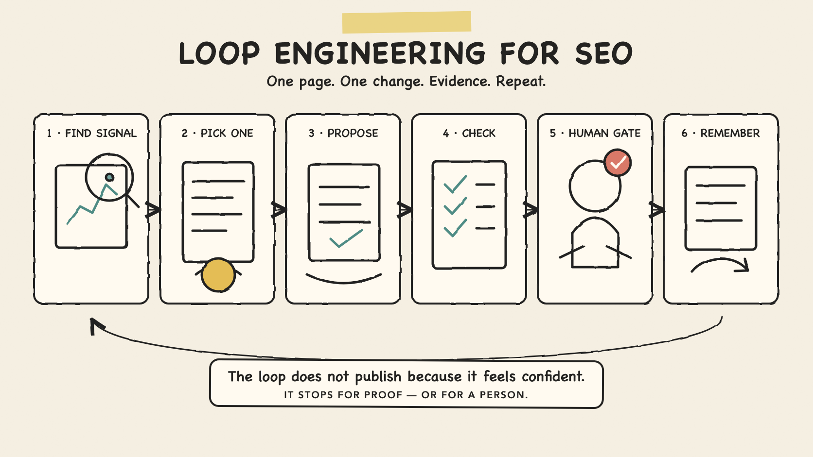
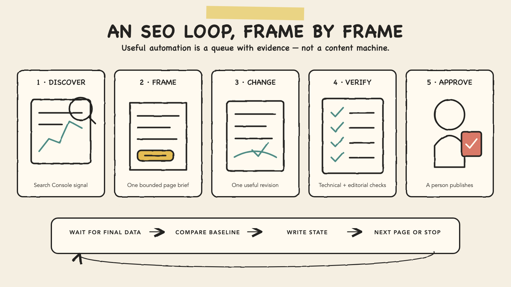
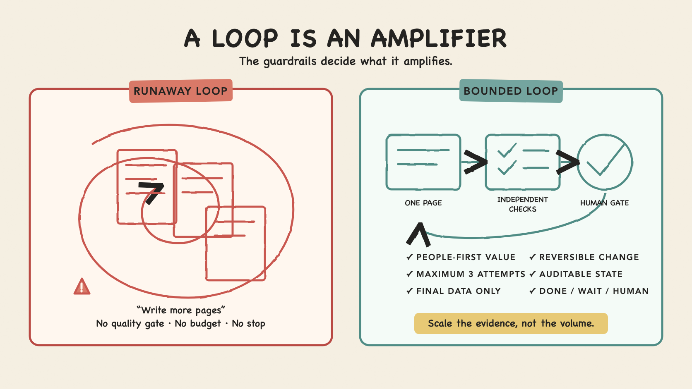

_一個實用的 Loop，不會因為 Agent 聽起來很有信心就自動發佈；它會停下來等證據，或者等一個人。_

大部分「AI 做 SEO」示範，最後都走到同一個地方：輸入關鍵字、生成文章、發佈，然後重複。

這不是 Loop Engineering，只是一部加了 repeat 按鈕的內容生成器。

真正經過工程設計的 SEO Loop 幾乎相反。它先讀取你自己網站的證據，只選擇**一個現有頁面**，提出**一項有邊界的改善**，通過技術與編輯檢查，停下來讓人審批，記錄發生過甚麼，然後等到有足夠數據才判斷預先定義的量化結果是否改善。

目標不是更多內容，而是下一輪作出更好的決定。

我最近寫過一篇 [AI Agent Loop Engineering 入門](/zh/posts/ai-agent-loop-engineering/)。這篇再行前一步：拆解一個我真的願意放到網站營運裡的 SEO Loop。

## 目錄

## Loop Engineering 改變了甚麼？

Addy Osmani 最近對 [Loop Engineering 的解釋](https://addyosmani.com/blog/loop-engineering/) 很實用，因為它將工程師的工作提升到 prompt 上一層。你不再親自逐步告訴 Agent 下一步做甚麼，而是設計一個小系統：自己找工作、交出一項有邊界的任務、檢查結果、記住狀態，再決定是否繼續。

這個名詞仍然很新，但工程 pattern 其實很熟悉：

1. **Discover**：找出最新訊號。
2. **Frame**：將一項工作連同限制與驗收條件包好。
3. **Act**：只在狹窄的權限邊界內行動。
4. **Verify**：用不只依賴 maker 自我判斷的證據驗證。
5. **Persist**：保存結果，讓下一次運行不用由零開始。
6. **Stop、wait、escalate 或 repeat**：按明確規則停止、等待、交回人手或再跑一輪。

Prompt 仍然存在，只是不再等於整個系統。

## 沒有可量度結果，就沒有學習循環

第一次運行之前，先為 Loop 寫一份 **measurement contract**。它應該定義：

- 從哪個資料來源觀察結果；
- 一個 primary outcome metric；
- 哪些 guardrail metrics 不可以變差；
- baseline 與 comparison window；
- 至少要有多少證據才可以作決定；以及
- 在甚麼條件下等待、修改、交回人手、還原或停止。

沒有這份 contract，系統可以重複，卻不能從自己造成的結果中學習。它只會向最容易看見的活動優化——生成了多少文章、推出了多少改動、花了多少 budget——而不是向業務真正重視的結果優化。

這裡的「學習」不一定代表重新訓練底層模型，而是**營運層面的學習**：Loop 讀取結果、與已保存的 baseline 比較、記錄決定，再使用這份 state 選擇下一步。

所以，不同 Loop 需要不同證據：

| Loop                            | Observation source              | 可選的 measurable outcome                                     |
| ------------------------------- | ------------------------------- | ------------------------------------------------------------- |
| 改善現有搜尋頁面                | Google Search Console           | 相關 page-query 組合帶來的有用 clicks                         |
| 改善站內 engagement 或轉換      | Google Analytics                | Engaged sessions、key-event rate、leads、purchases 或 revenue |
| 改善 Facebook 或 Instagram 廣告 | Meta Ads Manager                | Campaign result、conversion value 或 cost per result          |
| 一邊優化，一邊保護品質          | 網站檢查、客服資料與人手 review | 沒有 broken journey、誤導聲明或不能接受的客戶結果             |

這些只是候選 metrics，不是放諸四海皆準的答案。Metric 必須配合目標。Search impressions 可以反映需求，卻不能證明訪客得到價值；page views 可以反映閱讀，卻不能證明轉換；cheap clicks 看似有效率，亦可能完全沒有帶來合資格結果。

## 為甚麼 SEO 是好例子——同時亦很危險？

SEO 適合放進 Loop，因為工作會重複，而環境會交回訊號。Search Console 可以按頁面與 query 提供 impressions、clicks、click-through rate 和 average position。網站本身亦能暴露 broken link、意外的 `noindex`、重複 title、缺少 canonical 和 build failure。稍後的量度窗口，則可讓你判斷改動值不值得再做下一輪。

但 SEO 亦最能解釋為甚麼 Loop 一定要有 guardrail。

Google 的指引要求創作者專注於[有用、可靠、以人為本的內容](https://developers.google.com/search/docs/fundamentals/creating-helpful-content)，而不是主要為操控排名而做的頁面。Google 的 spam policy 亦明確列出 [scaled content abuse](https://developers.google.com/search/docs/essentials/spam-policies)：大量製造低價值或不原創的頁面去影響搜尋結果，不論內容由 AI、人手還是其他流程產生。

> [!warning] 注意
> Publishing loop 不等於 quality loop。如果成功指標是「產生多少頁」，Agent 就會向頁數優化。它可以令一套薄弱的內容營運跑得更快，卻不會令網站更有用。

所以安全的自動化邊界應該很刻意：讓 Loop **發現、分析、草擬和檢查**；發佈仍交由人決定。即使營運證據日後證明部分流程可以收窄人手 gate，品牌、法律或專業知識聲明，我仍會永久保留人手審批。

## 選模型之前，先寫 Loop Contract

我會由一份普通得不能再普通的 contract 開始。這是設計文件，不是可以直接執行的 framework configuration：

```yaml
name: improve-one-existing-seo-page
trigger: weekly manual review
goal: improve one useful existing page for a query it already serves
discovery:
  source: Google Search Console final data
  comparison_window_days: 28
  maximum_candidates: 5
measurement:
  primary_metric: useful page-query clicks
  diagnostic_metrics:
    - impressions
    - click-through rate
    - average position
  downstream_guardrail: GA4 organic landing-page key-event rate
  baseline_window_days: 28
  comparison_window_days: 28
  minimum_evidence: defined by the owner before the run
selection:
  pages_per_run: 1
  requires_human_choice: true
allowed_changes:
  - clarify the title and introduction
  - answer one evidenced reader question
  - add one relevant internal link
  - repair a verified technical issue
verification:
  - site build passes
  - links resolve
  - page remains indexable and canonical is correct
  - claims have sources or first-hand evidence
  - change adds value beyond rewording competitors
limits:
  revision_attempts: 3
  automatic_publish: false
remeasure_after_days: 28
terminal_states:
  - approved_to_publish
  - wait_for_data
  - needs_human
  - no_useful_change
  - budget_exhausted
```

它很沉悶，而這是一句讚美。

Contract 在模型有機會即場發揮之前，已經定義好資料來源、範圍、容許改動、檢查、budget 和停止狀態。更強的模型可能寫出更好的 draft，但不應該靜靜改寫營運規則。



_內容改動只佔其中一格；發現、檢查、審批與量度，才是系統其餘部分。_

## SEO Loop 逐步拆解

### 一、由 First-party Evidence 發現機會

Loop 讀取過去 28 日已 finalise 的 Search Console 數據，並與之前 28 日比較。它可以按頁面與 query 分組，再尋找以下訊號：

- 一個現有頁面在相關 query 有明顯 impressions，但 clicks 很少；
- 一個一直有用的頁面開始流失 clicks，而題目對受眾仍然重要；
- 兩個頁面正在競爭相同 intent；
- 某個 query 暴露了一條現有頁面只間接回答的問題；或者
- 技術回歸令重要頁面更難被 crawl 或理解。

官方 [Search Analytics API](https://developers.google.com/webmaster-tools/v1/searchanalytics/query) 支援 dimensions、filters 和 date range，但它**不保證交回每一行數據**，一般只會在內部限制內回傳 top rows。近期數據亦可能未完整。一個負責任的 Loop 會記錄這些限制，而不是將部分資料包裝成對整個網站很有信心的結論。

Discovery 應該使用自己的 Search Console property 與網站證據，而不是自動向 Google Search 發出 query 去 scrape ranking。Google 的 spam policy 禁止未經批准的 machine-generated search traffic。

### 二、將一個 Candidate 寫成任務，而不是模糊願望

「改善 SEO」不是一項任務；「檢查這個現有頁面與已觀察 query 之間的 intent mismatch」才是。

Handoff 應該包含：

- 頁面以及它原本要幫助的受眾；
- 相關 queries 與量度窗口；
- 現有 title、description、headings 和 internal links；
- 網站的專業範圍與資料來源；
- 只可以修改哪些檔案；
- 必須通過哪些檢查；以及
- 哪些情況一定要停下來交回人手。

開始時，我只容許每次運行處理一頁。範圍小，diff 才讀得到，結果亦較容易歸因。如果同時改五頁和十二個 template，即使圖表上升，你也不知道是哪一個決定有效。

### 三、讓 Maker 提出最小而有用的改動

Agent 可能發現頁面本身已經很好，根本不需要修改。`no_useful_change` 是一個成功的 terminal state；它避免 Loop 為了證明自己有用而製造工作。

真的有改動理由時，我會按以下次序處理：

1. 修正事實或技術問題；
2. 令 title 與 opening 準確描述頁面；
3. 將已經存在但埋得太深的答案帶到前面；
4. 加入欠缺的 first-hand evidence、實例或有用比較；
5. 改善一條真正相關的 internal path；最後才
6. 在 intent 確實不同、而網站又有原創價值可以提供時建立新頁面。

Google 建議 title 應該清楚、精簡，亦提醒避免 [keyword stuffing 與 boilerplate title](https://developers.google.com/search/docs/appearance/title-link)。所以 Loop 要解釋 proposed title 為何對人更準確，而不只是計關鍵字。

### 四、使用兩種 Verification

技術驗證可以 deterministic：

- 網站 build 成功；
- route 正常回應；
- internal links 可以到達；
- 除非 brief 明確批准，canonical URL 不變；
- 頁面維持可 index；
- 如有 structured data，必須通過驗證；以及
- diff 只觸及批准範圍。

Editorial verification 則需要一份窄而清楚的 rubric，最好由另一個 reviewer 執行：

- 改動有沒有更直接回答已觀察的 intent？
- 有沒有原創經驗、證據或分析？
- 事實聲明有沒有支持？
- 即使搜尋流量不存在，這一頁仍然值得發佈嗎？
- Maker 加入的是真正價值，還是只是令文章更長？

Maker 不應該是自己 draft 的唯一裁判。第二個 Agent 可以找問題，但真正了解產品、受眾和聲明的人，仍要擁有 publish decision。

### 五、經過 Human Gate 才發佈

Loop 交出一個精簡 review packet：baseline data、入選原因、before/after diff、verification results、risk notes，以及建議量度日期。

Reviewer 可以批准、拒絕、直接編輯，或者只提出一項具體修改。拒絕亦要寫入 state；下星期的 Loop 不應該扮失憶，再次發現同一個壞主意。

發佈後提交 sitemap 可以幫助 discovery，但 Google 說得很清楚：[sitemap 只是一個提示](https://developers.google.com/search/docs/crawling-indexing/sitemaps/overview)，不保證 crawl 或 index。Loop 不能因為提交過 URL，就將狀態標記為「已 index」。

### 六、等待、量度，再將結果寫回 State

SEO feedback 又慢又嘈。Loop 不應該因為昨日 CTR 動了一下，就每天改同一個 title。

要按你正在改動的 customer journey 階段，選擇量度來源：

- [Google Search Console](https://developers.google.com/webmaster-tools/v1/searchanalytics/query) 用 impressions、clicks、click-through rate 和 average position 顯示頁面在 organic search 的表現。它適合找 page-query 機會與觀察搜尋能見度，卻不能證明點擊之後的業務結果。
- [Google Analytics](https://developers.google.com/analytics/devguides/reporting/data/v1/api-schema) 可以透過 sessions、engaged sessions、key events、key-event rates 和 revenue metrics 量度站內行為，讓 Loop 判斷新增流量是否仍有 engagement，或者有沒有完成預期行動。
- 大家有時會分開稱為 Facebook Ads console 或 Instagram Ads console，但付費社交廣告一般都在 [Meta Ads Manager](https://www.facebook.com/business/ads/instagram-ad) 管理。Paid-social Loop 的 primary metric 可以是 qualified leads、purchases、conversion value 或 cost per result；reach、impressions、frequency、clicks 和 spend 則是輔助診斷，不應單獨當作成功。

不要將所有拿得到的數字都塞進 objective。選擇**一個 primary outcome**，再用少量 diagnostics 與 guardrails 解釋它。否則 Loop 可以在一堆 metrics 中挑一個剛好上升的，然後自行宣佈成功。

對一個規模不大的網站，我會將 28 日比較窗口當作自己的營運決定——不是 Google 的承諾——而且只用 finalised data。記下 baseline、發佈日期、改動、檢查與下一次量度日期。窗口結束後：

- 如果頁面仍然有用，而目標 signal 改善、又沒有令人擔心的 trade-off，就標記 **done**；
- 如果 impressions 太少或資料未完整，就 **wait_for_data**；
- 如果 position、需求、季節性或其他改動令歸因不清，就 **needs_human**；
- 如果仍有一個由證據支持的下一步，而且 attempt budget 未用完，就 **revise**；或者
- 三次 revision 後 **stop**，不要無限 tuning。

這份 state，就是 Loop 與重複失憶之間的分別。

## 一個具體 SEO 例子

假設有一間做 on-premises AI 的顧問公司，網站已有一頁 `/private-ai-deployment/`。以下數字完全虛構，只為令決策過程容易看見。

在 28 日 finalised data 裡，頁面從包括「private AI deployment checklist」的 query cluster 得到 12,400 impressions 和 190 clicks，即 1.53% click-through rate，average position 是 7.8。Measurement contract 將相關 organic clicks 設為 primary metric，同時用頁面的 Google Analytics key-event rate 作 downstream guardrail：如果 clicks 增加，但訪客立即離開，或者不再完成預期行動，就不能算成功。

這些數字不能證明 title 有問題。Position、device、結果頁版面、品牌熟悉度與 query intent 都會影響 clicks。它們足以建立一個 **review candidate**，但不足以批准 rewrite。

Loop 將頁面資料包好，再發現三件事：

1. title 是「Our AI services」，沒有清楚描述頁面；
2. 頁面中段已有一份基於團隊實戰經驗的 deployment checklist，但 introduction 完全沒有提到；以及
3. 相關 security 文章沒有由這一頁連過去。

Maker 提出一項有邊界的 revision：

- 使用一個準確描述 private AI deployment checklist 的 title；
- 將現有 checklist 的精簡摘要帶到 opening 附近；
- 保留 first-hand deployment notes 與限制；以及
- 加入一條真正相關的 internal link 到 security 文章。

它**不會**虛構二十個地區頁面、不會在每個 heading 重複同一句 phrase，亦不會製造客戶成效。

通過技術檢查與人手批准後，頁面發佈，baseline 寫入 state。再過 28 日 finalised data，可能出現三種結果：

| 證據                                      | Loop 決定                         |
| ----------------------------------------- | --------------------------------- |
| 相關 clicks 改善，而且 GA4 guardrail 維持 | 記錄為有用改動，然後停止          |
| Impressions 太少，或者 data window 未完整 | 等待，不要「優化」noise           |
| 頁面失去有用流量，或者內容變差            | 交回人手、檢查原因，並考慮 revert |

重點不是承諾 SEO 一定上升，而是令每一個下一步都能追溯到證據。

## SEO Loop 合理地可以做甚麼？

當 supervised 版本變得可靠，同一個 pattern 可以協助：

- **Opportunity triage：** 按 Search Console signal 排出一條細小 review queue；
- **Content maintenance：** 找出資料過時、引用失效或產品行為已變的頁面；
- **Technical regression checks：** 找 broken links、意外 indexability change、missing canonical 或 invalid structured data；
- **Internal-link suggestions：** 建議真正相關的頁面連接，再交由編輯審批；
- **Snippet experiments：** 為現有而有用的頁面提出更清楚的 title 與 description；
- **Content consolidation：** 找出重疊頁面，交由人決定 merge 或 redirect；以及
- **Reporting：** 清楚解釋改過甚麼、有甚麼證據，以及哪些項目正在等待。

Loop 最強的地方，是將一個又大又模糊的 backlog，變成一條細小而可檢查的決策 queue。

## 它不應該做甚麼？



_Loop 會放大自己的目標。「更多頁面」與「更多證據」會建立出完全不同的系統。_

我不會容許 SEO Loop：

- 大批自動發佈 AI-generated pages；
- 透過 automated queries scrape Google Search results；
- 虛構專業經驗、作者、reviews、客戶成效或 citations；
- 未經 review 修改 canonical、redirect、robots rules 或 sitemap；
- 單靠 average position 判斷成功；
- 純粹為了令頁面看似「fresh」而 rewrite；
- 不斷重交沒有改動的 sitemap；或者
- 證據變得含糊後仍繼續花費。

這些不是罕見 edge case。當速度得到獎勵，而 quality 只是一句 prompt，它們就是最自然的發展方向。

> [!important] 重要
> Outer loop 應該留在人手。Agent 可以執行 inner work：收集、分析、草擬、測試與報告；但頁面是否值得存在、聲明是否真實、是否足以用品牌名義發佈，仍要由人承擔。

## 如果星期一開始，我會怎樣做？

不要由 scheduler 開始。先用 spreadsheet 或小型 state file，每星期人手運行一次。

1. 選擇一個 primary measurable outcome，以及兩至三個 guardrails。
2. 記錄它們的定義、資料來源、baseline 與 comparison window。
3. 用 final data 拉一份 28 日 Search Console 比較。
4. 要求 Loop 最多提出五個 candidates，並列出每項證據。
5. 自己選擇一個現有頁面。
6. 只容許一項有邊界的改動，並要求可讀的 diff。
7. 跑技術與 editorial checks。
8. 只有人手批准後才發佈。
9. 將結果與下一次量度日期寫入 state。
10. 手動完成六個 cycle，再考慮自動化 discovery。

到時你會知道漏了哪些規則、哪些 signal 太嘈，以及 Loop 節省的判斷是否多過它消耗的判斷。

## 真正的重點

SEO 不需要另一部可以生成一千篇文章的機器。它需要一個 feedback system：找出一個值得處理的機會、小心改善、量度結果，亦懂得在證據說「等」或「停」時承認。

這就是 Loop Engineering 帶來的東西：不是無限自主，而是有結構地重複。

真正有用的單位不是文章，而是**有證據支持的決定**。如果沒有將可量度結果寫回 state，就沒有 learning loop，只有重複的 automation。

圍繞這個單位建立 Loop，AI 才能令 SEO 營運更一致，而不是將網絡變成堆滿自信文字的垃圾場。

_如果你正在考慮一個 evidence-led SEO 或 content operations loop，我很樂意一起整理 data source、verifier、state 與 human gates——[電郵聯絡我](mailto:nam@wistkey.com)。_

---

_想繼續閱讀 AI、工程與商業交界的實戰筆記，可以[在 Medium 追蹤我](https://nam0403.medium.com/)、[訂閱或收藏 nam-ai.uk](https://nam-ai.uk)，亦歡迎[在 LinkedIn 連繫我](https://www.linkedin.com/in/nam-chan/)——我最有興趣的，始終是那些離開 demo 之後仍然站得住的系統。_
