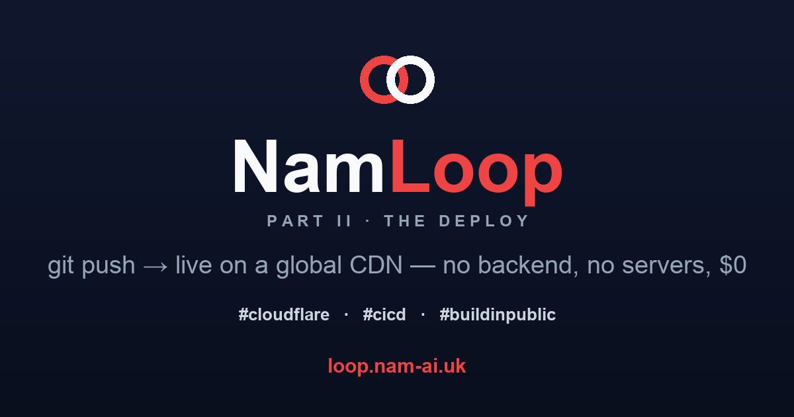
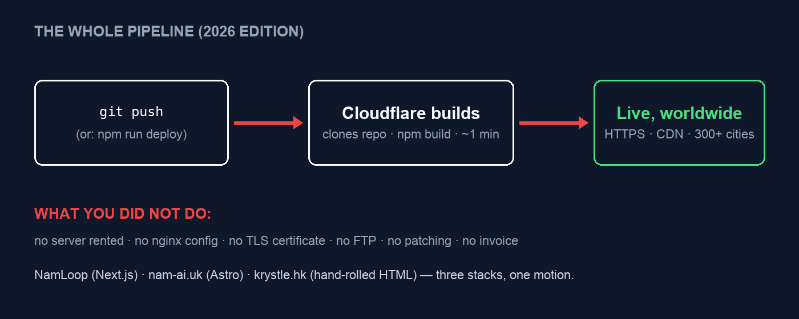
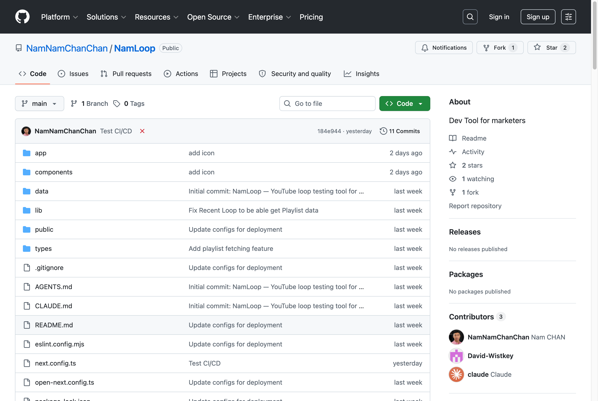

在[第一篇](/zh/posts/vibe-coding-namloop/)，我用一個週末 vibe code 出 **NamLoop**——一個無廣告的 YouTube 循環播放器，大半還是睡前做的。這一篇講最不起眼的一步：把它放上互聯網。

只是，它根本算不上「一步」。部署 NamLoop 用的時間，**比替它改名還少**。它現在跑在 **[loop.nam-ai.uk](https://loop.nam-ai.uk)**，全球 CDN、HTTPS、自訂域名、push 即部署——每月費用正好 **$0**。同一個星期、同一個動作，我還用同樣的方式上線了另外兩個網站。

如果你學會部署網站是幾年前的事，請重新校準。以下是它現在的樣子——以及誠實的注意事項。

## 目錄

## 「部署」曾經是甚麼意思

給記得的人做一場短短的招魂：租 VPS。`apt-get upgrade` 的焦慮。抄一段 Stack Overflow 的 nginx 設定然後祈禱。為 TLS 設 certbot 的 cron。半夜 FTP 上傳檔案，然後刷新兩次——因為第一次是快取。設一個日曆提醒去續期，免得網站變黑。

部署曾經是一門*紀律*。對一個週末玩具來說，它往往就是玩具永遠留在 `localhost` 的原因。

## NamLoop 的整個部署，總共兩條指令

NamLoop 是一個**自己沒有後端**的 Next.js 應用——沒有資料庫、沒有登入、沒有伺服器狀態。它需要的所有「後端」就是 YouTube 的 IFrame API，由瀏覽器直接呼叫。正是這一個特性，讓下面的一切變得微不足道。

Repo 裡帶著兩個小小的設定檔——`wrangler.jsonc` 和 `open-next.config.ts`（[OpenNext](https://opennext.js.org/) 轉接器，把 Next.js 打包給 Cloudflare 的 Worker runtime，開了 `nodejs_compat`）。有了它們，第一次部署的全部內容是：

```bash
npx wrangler login    # 一次性：瀏覽器授權 Cloudflare
npm run deploy        # 建置 + 部署到 Cloudflare Workers
```

兩條指令。結果：一條跑在 Cloudflare 免費 `workers.dev` 子域名上的網址——`namloop.<我的帳號>.workers.dev`——由 300 多個城市的節點提供服務，TLS 包在內，沒有任何要續期的東西。打包出來的 Worker 約 **1 MB gzipped**，不需要任何其他 Cloudflare 資源——沒有儲存桶、沒有 KV，甚麼都不用開。

> [!note] 免費網址是真的，只是醜
> `namloop.chankwunnam0304.workers.dev` 從第一分鐘就能用——可分享、HTTPS、全球。中間那截帳號 slug 就是代價。私人工具到此為止已經夠；任何你會說出口的東西，就要下一步。

## 自訂域名：儀表板上的一個動作

因為我的個人域名本來就在 Cloudflare，給 NamLoop 一個真正的地址——**loop.nam-ai.uk**——只是 Worker 設定裡的一個動作：加自訂域名。DNS 記錄自動建立、證書自動簽發、舊的 `workers.dev` 網址照常運作。

這是這個生態安靜的竅門：**你的 DNS 在哪裡，重力就在哪裡。** 誰託管著你的域名，誰的部署就是一下點擊，其他人的就是兩下。

## CI/CD 升級：不再打 deploy

在筆電上跑 `npm run deploy` 沒問題——直到筆電成為瓶頸。成年人版本——**git 連結的自動建置**——花幾分鐘設定：在 Cloudflare 儀表板連上 GitHub repo、告訴它建置指令，完成。從此以後：



*整條管線。第二行那部分，到現在還是有種不合法的感覺。*

Push 到 `main` → Cloudflare 克隆、建置、部署——大約一分鐘後上線。我一個星期內做了三次，三個完全不同的技術棧：

| 網站 | 技術棧 | 部署 |
| :--- | :--- | :--- |
| [loop.nam-ai.uk](https://loop.nam-ai.uk) | Next.js 16 + OpenNext（本篇） | Worker，git push |
| [nam-ai.uk](https://nam-ai.uk) | Astro（靜態輸出） | Worker 托管靜態檔案，git push |
| [krystle.hk](https://krystle.hk) | 手寫靜態 HTML（[有自己的系列](/zh/posts/rebuilding-my-wifes-website-part-1/)） | Worker 托管靜態檔案，git push |

三個技術棧，一個動作。靜態那兩個，整套「基礎設施即代碼」就是這麼大的一個檔案——這是 nam-ai.uk 的真實設定，全文：

```jsonc
{
  "name": "nam",
  "compatibility_date": "2026-07-04",
  "assets": {
    "directory": "./dist",
    "not_found_handling": "404-page"
  }
}
```

> [!warning] 我真正撞過的唯一一個坑
> 我第一次 git 連結部署**失敗了**。repo 裡沒有 `wrangler.jsonc` 時，Cloudflare 的建置偵測到 Astro，好心地想*改造*這個網站——在建置途中安裝 SSR 轉接器，然後乾脆地 exit 1。修法就是上面那個設定檔：宣告「這是一個靜態檔案資料夾，直接托管」，所有魔法就停了。教訓：**你把自己是甚麼講得越清楚，平台就越容易。** 約定俗成很好——直到它猜錯。

而本著誠實的家風：寫這篇文的此刻，NamLoop 最新的 commit 標題就叫 **「Test CI/CD」**——在 GitHub 上旁邊是一個紅色 ✗。Push 即部署很容易，但它不是不會失敗。跟舊時代的分別是：一次失敗的部署是一個紅色圖示加一次重試，不是半夜壞掉的正式伺服器。



*Repo 實驗中。對，最新 commit 是「Test CI/CD」加一個紅交叉。這也算一種文檔。*

## 「無後端」才是整個竅門

這一切不是 Cloudflare 獨有——Vercel、Netlify 提供同樣的 push 即部署循環，純靜態的話 GitHub Pages 也做到。它們全都對免費層友好、設定極輕的原因，是**項目的形狀**：靜態檔案和小型邊緣函數，可以用接近零的邊際成本複製到幾百個節點。請求與請求之間，沒有任何東西在為你「運行」。沒有東西要修補、沒有東西要擴容、沒有東西要開發票。

也正因如此，誠實的前提很重要：

- **邊緣 runtime 不是 Node。** 這個項目裡的真實例子：Worker runtime 跑不動 Next 的圖片優化器，所以設定裡把它關了。大部分東西都能跑；例外會在建置時自己喊出來。
- **一旦需要狀態，舊世界就回來了**——資料庫、登入、佇列、備份。平台樂意賣給你它們的版本（KV、D1、R2⋯⋯），那也是一條好路，但它是一條*路*，不是一個剔選框。「部署微不足道」是對無後端項目說的。
- **輕度綁定是魔法的價錢。** 這裡一個 `wrangler.jsonc`，那裡一個 `vercel.json`。靜態資料夾要搬家是幾分鐘的事；倚賴平台儲存的技術棧就不是了。

## 真正的重點

在過去幾年的某一刻，部署不再是一種技能，而變成了一個**預設值**——對這一整類項目來說，web 有了一個「儲存掣」。第一篇講的那道距離——*「好想有」*和*「它存在了」*之間——本來有兩半。AI 塌縮了「做出來」那一半。這一篇是另一半——它早已塌縮，安靜地躺在免費層裡。

也就是說，最後的藉口沒有了。難的不是做出來，也不是上線。是決定它值得存在。

*NamLoop 在 [loop.nam-ai.uk](https://loop.nam-ai.uk)，程式碼在 [GitHub](https://github.com/NamNamChanChan/NamLoop)——如果你的團隊還在用半夜 FTP 的方式部署，我可以幫忙——[電郵我](mailto:nam@wistkey.com)。*

---

**NamLoop 系列：**[第一篇——一個週末 vibe code 出來](/zh/posts/vibe-coding-namloop/) · 第二篇——你在這裡。
