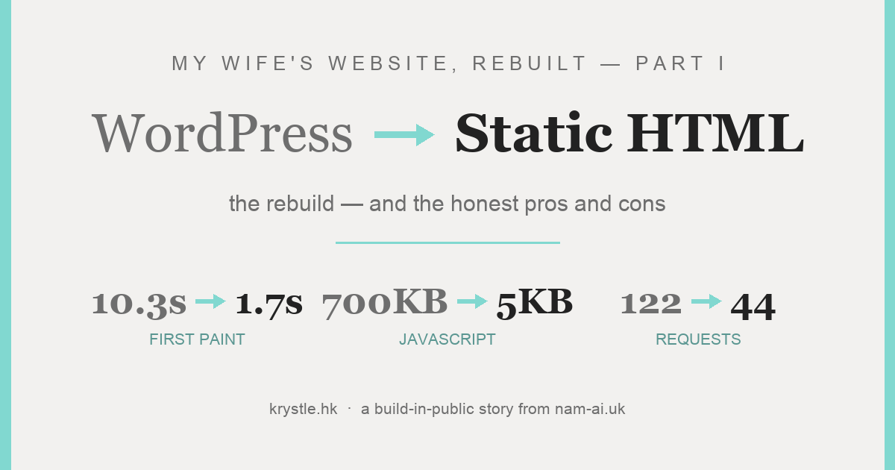
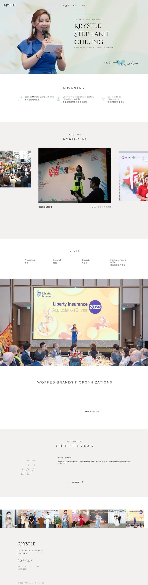
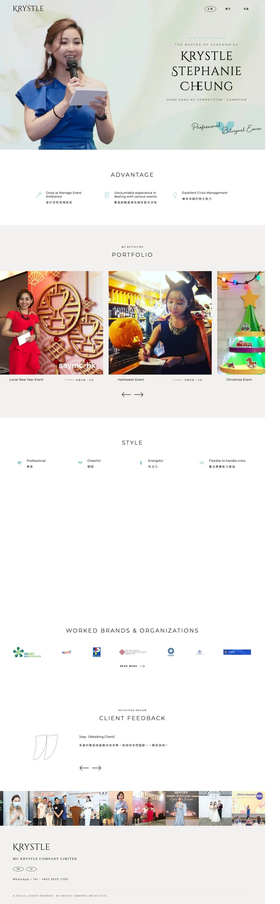
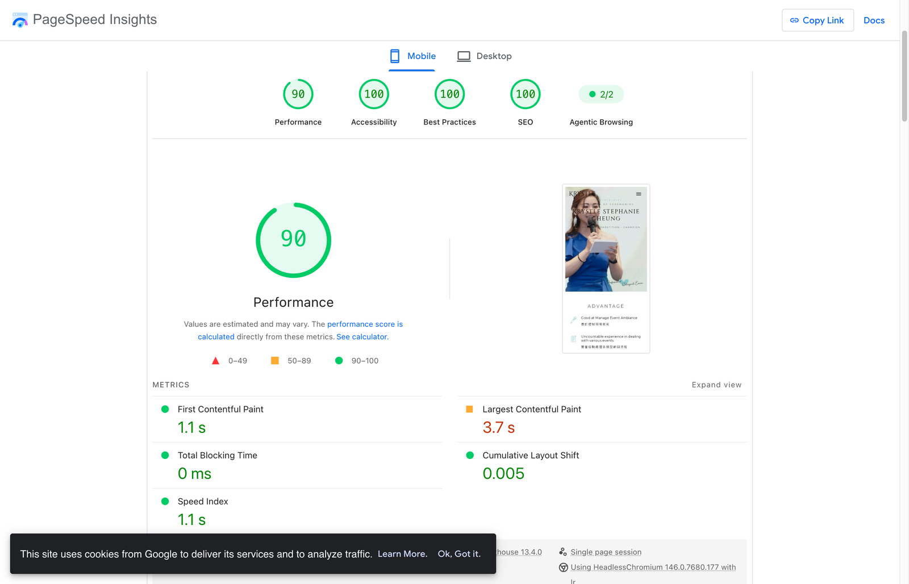

我太太 **Krystle（張可澄）** 是香港的專業雙語司儀——主持過五千多場活動，拿過香港司儀大賽冠軍。她的作品集網站 **[krystle.hk](https://krystle.hk)**，就是新客戶找到她的地方。

上個週末我終於認真看了它的引擎蓋底下。網站跑 WordPress + Elementor + 一個重型主題，Lighthouse **56 分**、最大內容繪製要 **13.8 秒**——還藏著一個真正教人心痛的 bug，痛到值得專門寫一篇（那是[第二篇](/zh/posts/rebuilding-my-wifes-website-part-2/)的故事）。

與 Claude Code 合作一個星期日晚上之後：整個網站重建成 **102 頁零依賴的靜態 HTML**。同一個設計、同一批網址。首次繪製 **1.7 秒**、只載 **約 5 KB** JavaScript、零死鏈。

這是第一篇——重建本身，以及誠實地看：離開 WordPress 甚麼時候是划算的交易（甚麼時候不是）。

*原本的 WordPress 首頁⋯⋯*

*⋯⋯以及重建版。看上去是同一個網站——這正是要求。底下的一切都換掉了。*

## 目錄

## 審計：網站實際在載入甚麼

第一步：爬完 sitemap，下載全部 101 頁和 2,186 個資源檔（223 MB），逐頁截圖，再跑一次節流的 Lighthouse 做基準。

單是首頁就載入 **20 個 CSS、70 個 JS——122 個請求、2.2 MB**。裡面包括每一頁都載入的 React、ReactDOM 和 lodash⋯⋯由 WooCommerce 帶進來，而這家「商店」有**零件商品**。還有 Contact Form 7——而全站有**零張表格**。沒有人選擇過這些；主題、頁面編輯器和十年的外掛，各自把朋友都帶來了，就成了這樣。

字體自成一場小災難：**17 個請求、872 KB**——Noto Sans TC、Montserrat、Roboto 的每一個字重，大部分根本沒用到。

> [!note] 留給第二篇的 bug
> 審計還發現：一個壞掉的「Load More」按鈕，一直把她 85 場活動中的 **76 場**靜靜地藏起來，對每一位訪客。那個故事——以及介面如何重建到不可能再壞——在[第二篇：介面](/zh/posts/rebuilding-my-wifes-website-part-2/)。

## 計劃：同一個網站，百分之一的程式碼

要求刻意訂得很嚴。同樣的外觀。同樣的頁面。**同樣的網址**——不能有 404，Google 索引要活著。不重新設計。只是把 WordPress 用外掛做的每一件事，改用幾乎「甚麼都沒有」來做：

| WordPress（重） | 重建（輕） |
| :--- | :--- |
| Slider Revolution 大圖輪播（~700 KB JS） | 一張合成圖 + CSS 定位的文字層 |
| jQuery + GSAP 捲動動畫 | 約 30 行 IntersectionObserver + CSS transition |
| Isotope 篩選 + AJAX「Load More」 | 85 張卡全部在 DOM；篩選＝顯示／隱藏——零網絡請求 |
| Magnific Popup 燈箱 | 原生 `<dialog>` + 約 40 行 JS |
| Google Fonts：17 個請求、872 KB | 自家托管子集：5 個檔、392 KB |
| WooCommerce / CF7 / Instagram 外掛 | 刪除；垃圾網址 301 |

（這些替代品實際的樣子和手感——大圖、篩選、燈箱、手機版——是[第二篇](/zh/posts/rebuilding-my-wifes-website-part-2/)的地盤。）

## 建造

架構就一個念頭：**手寫模板 + 一個小小的 Node 建置腳本 + JSON 資料檔**。Python 腳本把下載回來的 WordPress HTML 解析成乾淨的 JSON——導航、大圖、推薦語、84 個客戶 logo 牆、每場活動的資料。然後 `build.mjs`（無框架、約 400 行）蓋出全部 **102 頁**，[sharp](https://sharp.pixelplumbing.com/) 管線從 397 張原圖生成 **805 個影像衍生檔**（WebP 方格圖、兩個燈箱尺寸、og:image）。

整個網站現在只載 **約 19 KB CSS 和約 5 KB JavaScript**——比舊網站*最小的一個外掛檔案*還要少。其中最關鍵的是中文字體：完整的 Noto Sans TC 極其龐大，所以建置時把它子集到網站**實際用到的 919 個字**（272 KB，可變字重軸保留）。

## 一個 debug 戰爭故事

**幽靈般的 6.5 秒 LCP。** 重建之後，Lighthouse 的模擬節流模式堅稱 LCP 是 6.5 秒，有五秒的「render delay」。但它**自己的 filmstrip 顯示大圖在 1.9 秒已完整畫出**，而真實的 DevTools 節流 trace（4× CPU、Slow 4G）量到的 LCP 是 **207 毫秒**。幾小時的變因測試——關動畫、inline CSS、換測試伺服器（冷知識：Python 的 `http.server` 說的是 HTTP/1.0、沒有 keep-alive，會進一步扭曲模擬器）——證明那是量度的假象。

> [!tip] 未經盤問的數字，不要急著優化
> 模擬器說 6.5 秒。Filmstrip 說 1.9 秒。真實 trace 說 0.2 秒。當一個指標跟像素打架，先看 filmstrip 和真實 trace 再動手「修」——說謊的是分數，不是頁面。

（本來還有第二個戰爭故事——一個字體的 kerning 資料把 Krystle 自己的姓氏弄壞了。那是介面的 bug，所以它住在[第二篇](/zh/posts/rebuilding-my-wifes-website-part-2/)。）

## 結果

| 指標（節流手機） | WordPress | 靜態重建 |
| :--- | :--- | :--- |
| 首次內容繪製 | 10.3 秒 | **1.7 秒** |
| Speed Index | 10.3 秒 | **2.5 秒** |
| 真實 trace LCP（4× CPU、Slow 4G） | — | **約 0.2 秒** |
| 首頁請求數 | 122 | 約 44 |
| 字體 | 872 KB · 17 請求 · 第三方 | **392 KB · 5 請求 · 自家托管** |
| 載入的 JavaScript | 約 700 KB（含 React + jQuery） | **約 5 KB 原生** |
| Lighthouse 無障礙 | 94 | **100** |
| Lighthouse 最佳實踐 | 96 | **100** |

（SEO 那一欄——85 → 100——在[第三篇](/zh/posts/rebuilding-my-wifes-website-part-3/)有它自己的記分板。）

收工前的 QA：102 頁裡全部 **815 條站內連結**逐一檢查——零死鏈；篩選、load-more、燈箱在真實瀏覽器裡逐一操作過；桌面和手機截圖跟原站逐頁比對。

然後是無聊但緊張的那一步——完整備份 WordPress，把 DNS 切到 Cloudflare。**[krystle.hk](https://krystle.hk) 已經以重建版上線**，所以我一直保留裁決權的那位裁判終於開口了：

*上線後的 PSI，手機：90–95 之間（PSI 每次跑都浮動幾分）——阻塞時間 0 毫秒、版面偏移 0.005。同一個測試，舊站幾小時前只有 57。*

*桌面：全線 100——首次繪製 0.3 秒、LCP 0.6 秒。至於那個幽靈般的 6.5 秒 LCP？真實世界的手機 LCP 是 2.9–3.7 秒、桌面 0.6 秒。假象留在了實驗室。*

## 誠實的利弊

大部分「我們離開了 WordPress」的文章都跳過這一節。這個交易是真實的，兩個方向都是。

**我們得到的：**

- **結構性的快，不是調校出來的快。** CDN 上的預渲染 HTML 不需要快取外掛，因為根本沒有東西需要繞著快取。桌面 0.3 秒首次繪製不是優化成果，是預設值。
- **一整類故障消失了。** 沒有 PHP、沒有資料庫、沒有外掛要更新、沒有後台可以被攻擊、沒有 nonce 對快取的競態。第二篇那種「內容在失敗的 API 後面靜靜消失」的 bug，現在*結構上不可能發生*。
- **接近零的營運成本和維護。** Cloudflare 免費層上的一個資料夾。星期二晚上沒有東西要修補。
- **內容變成了資料。** 85 場活動住在 JSON 裡；批量修改——重新分類一批、換一季照片、旺季後加十場活動——是一次搜尋取代或五行腳本，加一句建置指令。在 Elementor 裡那是 85 頁逐頁點擊，所以那些修改一直*沒有發生*。對一盤在增長的生意，這比速度更重要。
- **擁有權。** git 裡的純文字檔：可以 diff、可以搬去任何主機，而且——在 2026 年這不是小事——對 AI agent 完全可讀。

**我們放棄的：**

- **CMS。** Krystle 不能再自己登入後台改頁面。每個修改都要經過資料檔和一次建置。在*我們家*沒問題——她的「駐場工程師」跟她睡同一張床——但這是最誠實的頭號成本。
- **外掛生態。** 要表格？現在是外部服務。要商店？別——用真正的電商平台。舊網站「擁有」這些能力（並在每次載入時為它們付費，卻一項都沒用上），但真正需要它們的網站不該走這條路。
- **多了一個建置步驟。** 要有人負責那約 400 行的建置腳本。比 20 個外掛的面積小得多，但不是零，而且不能用滑鼠點。
- **改設計＝改程式碼。** 沒有拖放。改樣式就是改 CSS。

> [!important] 真正的決策準則
> 「資料生成靜態頁」適合內容**有結構、成批修改**的網站——作品集、形象站、菜單、活動列表。它不適合每天親自寫文章的非技術站主，或者靠外掛過活的網站。問題從來不是「WordPress 差嗎？」，而是：*這個網站由誰改、多常改、改的東西是甚麼形狀？*

## 這件事真正說明了甚麼

這跟我平時對客戶講的 AI 導入故事一模一樣，只是這次發生在自己家。Agent 做了那些因為太沉悶而永遠沒人做的部分：爬完每一頁、生成 805 個影像檔、蓋出 102 頁、檢查 815 條連結。我做需要品味和判斷的部分：留甚麼、刪甚麼、甚麼時候該說「這個分數在說謊」——以及對太太公開門面的最終話事權。

單靠我們任何一方，都不可能在一個週末交出這個。這正是重點。

---

**本系列：**第一篇——你在這裡 · [第二篇——介面：同樣的設計，一個真正運作的介面](/zh/posts/rebuilding-my-wifes-website-part-2/) · [第三篇——SEO 的故事](/zh/posts/rebuilding-my-wifes-website-part-3/) · [第四篇——網站上線了，然後是教訓](/zh/posts/rebuilding-my-wifes-website-part-4/)。

*你的網站是不是也比應有的更慢？歡迎找我看看——[電郵我](mailto:nam@wistkey.com)。*
