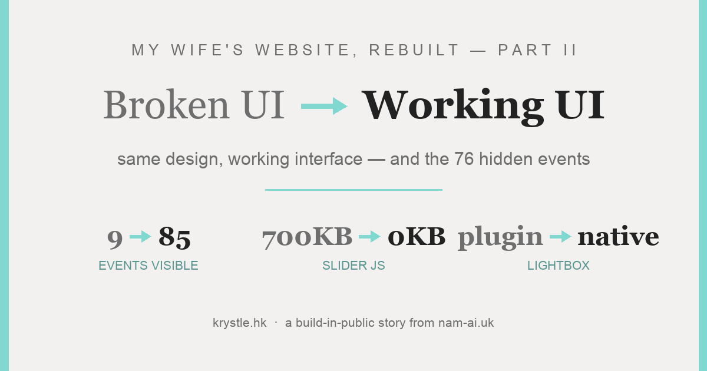
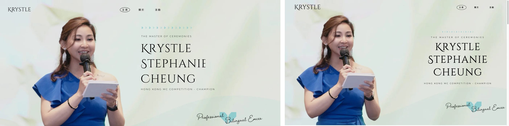
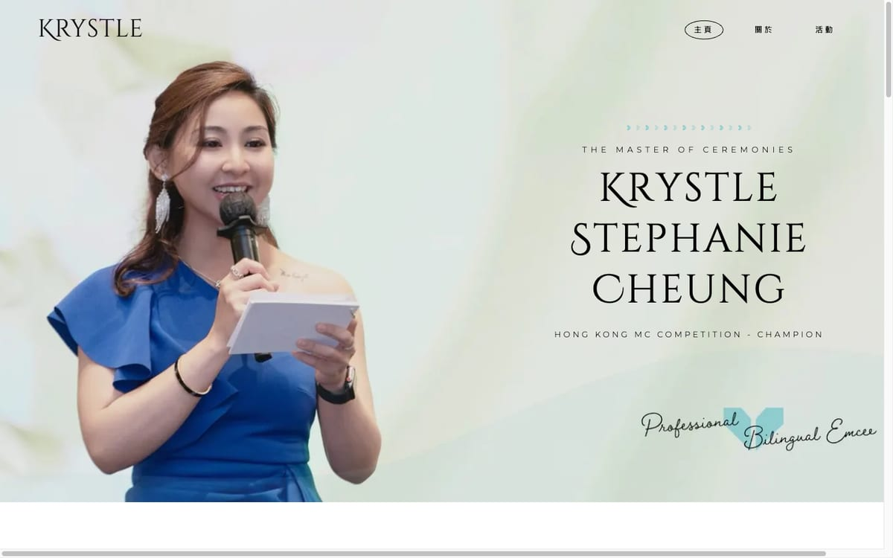
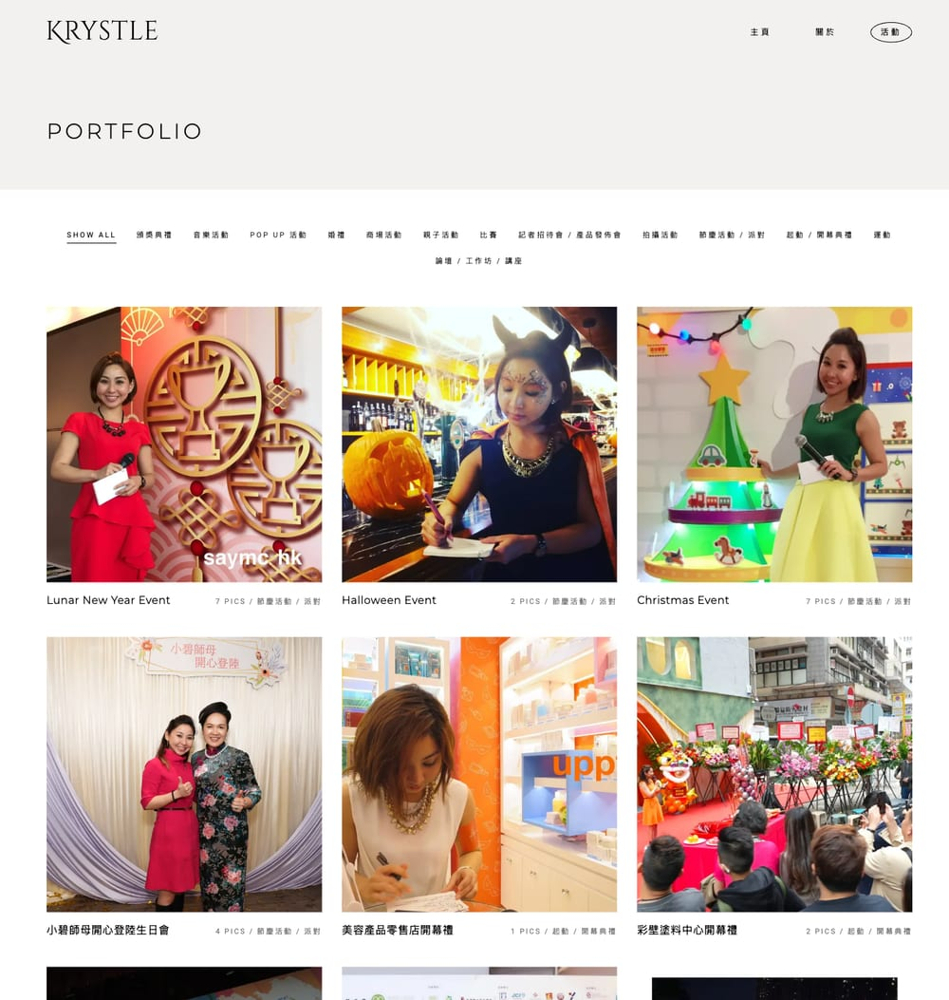
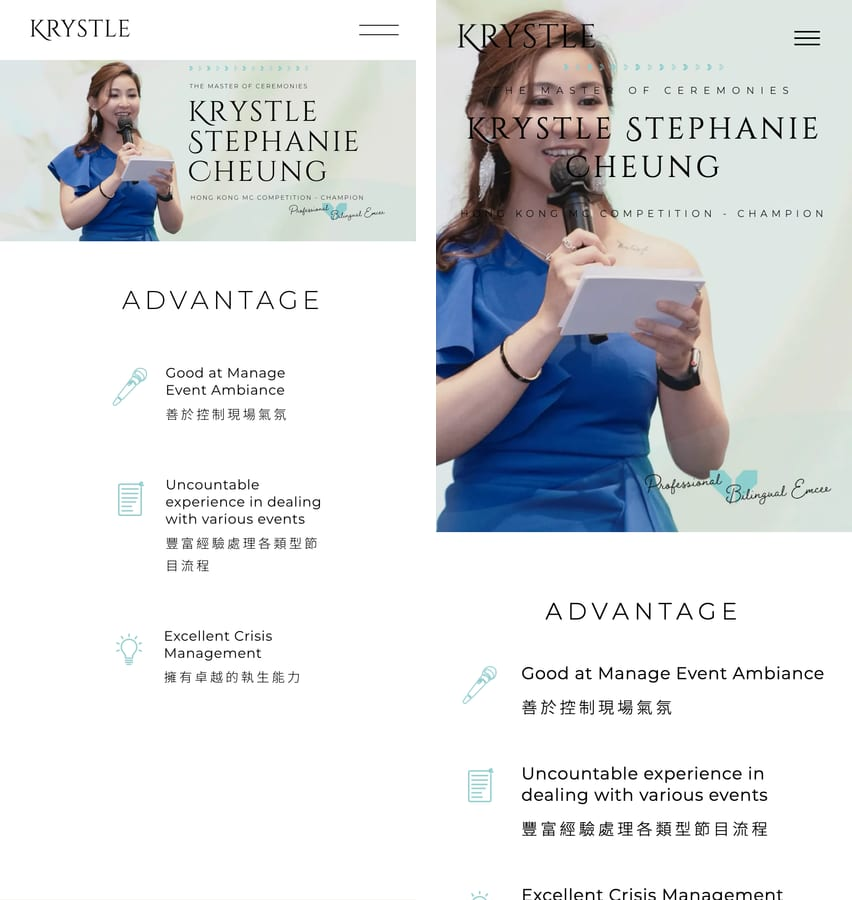
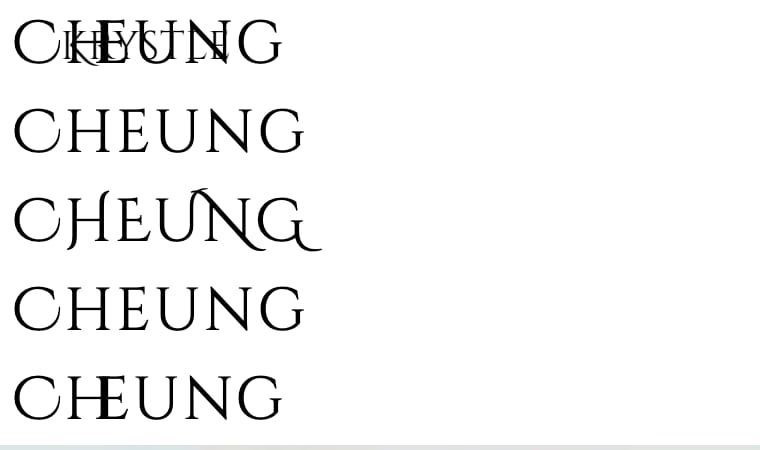

在[第一篇](/zh/posts/rebuilding-my-wifes-website-part-1/)，我們把太太 Krystle 的 WordPress 作品集——**[krystle.hk](https://krystle.hk)**——重建成 102 頁靜態 HTML：架構、數字，和誠實的利弊。

這一篇講你真正*看得到、摸得到*的部分：介面。要求寫明**不重新設計**——同樣的外觀、同樣的排版、同樣的手感。所以這裡的每張截圖都應該看起來很無聊。有趣的是，底下每一個互動都換掉了——包括那個一直把她 85 場活動中的 **76 場**靜靜藏起來的互動。

## 目錄

## 同樣的設計——這正是重點

在寫重建的第一行程式碼之前，審計先把設計的 DNA 抽了出來，好讓它被忠實重現：Tiffany 藍綠色 `#81D8D0` 點綴、暖白 `#F2F1EF`、大圖用 Cinzel Decorative、襯線點綴用 Cormorant Infant、標題用 Montserrat、內文用 Noto Sans TC——全站纖細字重加寬字距。



*還原度檢查——左原版，右重建。如果你分不出來，介面的工作就成功了。*

## 大圖區：700 KB 的輪播，換成一張圖

舊的大圖區跑 Slider Revolution——大約 **700 KB 的 JavaScript**，用來顯示⋯⋯一幅靜態構圖。重建版用一張合成圖加 CSS 定位的文字層。零 JavaScript，同樣的畫面。



*重建後的大圖區。輪播外掛用 700 KB 做的事，`position: absolute` 免費做到。*

捲動進場動畫也是同樣待遇：jQuery + GSAP 變成約 30 行 `IntersectionObserver` 加 CSS transition。

## 那個藏起 76 場活動的作品集

這就是第一篇預告的 bug。用真實瀏覽器開著 network 面板逛舊網站時，有一個請求一直失敗：

`wp-json/cassia/v1/get-posts → 403`

主題的「Load More」按鈕透過一個 REST 請求載入活動，而請求需要一個**烤進頁面快取裡的 security nonce**。快取外掛保存頁面的時間，比 nonce 的壽命長。所以對真實訪客來說，nonce 永遠是過期的、端點永遠回 403——作品集就靜靜地停在頭 **9 場（共 85 場）**。


*每位訪客看到的：九場活動，和一個看起來正常、實際甚麼都不做的 Load More 按鈕。*

> [!warning] 靜默的介面故障最昂貴
> 按鈕照樣顯示，畫面沒有任何錯誤。它多半已經壞了很久——而對一位司儀來說，作品集*就是*銷售簡報：客戶一直只看到九分之一。如果你的網站靠按鈕或無限捲動載入內容，今天就開一個無痕視窗，親手按一下。

重建版的作品集讓這種故障**結構上不可能發生**：全部 85 張卡預先渲染在 HTML 裡。篩選是顯示和隱藏；按鈕只是多顯示九張。以下是實際上線的程式碼（稍作精簡）：

```js
// 作品集篩選 + load-more（所有卡片都在 DOM；零網絡請求）
var PAGE = 9, shown = PAGE, active = '*';

function apply() {
  var vis = 0;
  cards.forEach(function (c) {
    var match = active === '*' ||
      (' ' + c.getAttribute('data-cats') + ' ').indexOf(' ' + active + ' ') > -1;
    c.classList.toggle('hide', !(match && vis < shown));
    if (match) vis++;
  });
}

more.addEventListener('click', function () { shown += PAGE; apply(); });
```

沒有 nonce、沒有快取、沒有端點——沒有東西可以 403。



*85 場活動，終於全部到得了。篩選和 Load More 的手感跟原版一模一樣——只是它們真的能用。*

## 燈箱：外掛變成 `<dialog>`

每個活動頁都有相冊和燈箱。舊的是 Magnific Popup（jQuery）。新的是平台本身：原生 `<dialog>` 元素，加約 40 行 JavaScript 處理鍵盤和滑動。焦點處理正確、Esc 能關、成本是零。


*85 個活動頁之一——原生 `<dialog>` 燈箱，鍵盤和滑動都有。*

## 手機版：一樣，但誠實

這裡沒有花招——手機版的目標就是跟原版*無法分辨*，減去那十秒的等待。



*手機版，前後對比。同樣的排版；分別在載入，不在外觀。*

順手也縫合了審計裡兩個小的介面傷口：舊首頁兩個「Read More」按鈕的 href 是**空的**（按了甚麼都不會發生），而頁尾 logo 連去的是主題廠商的示範網站，不是她自己的首頁。

## 戰爭故事：一個弄壞她名字的字體

最後審稿時，Krystle 的姓氏顯示成「CHŒUNG」——H 和 E 黏成一團。在大圖區。在她自己的網站上。

第一個猜想：Cinzel Decorative 的 OpenType 連字。關掉連字——照樣黏。在瀏覽器裡做了一個五行測試矩陣，真相水落石出：**字體檔本身有一對錯誤的負值 kerning**，把 E 拉進了 H 裡。而 letter-spacing 並不會中和 kerning——kerning 在它底下照常生效。



*找到元兇的五行矩陣：預設 / 關連字 / 大寫 / 關全部特性 / 加字距。*

修正，來自實際上線的 CSS：

```css
.hero-text h1 {
  font-kerning: none;   /* 字體的 kern pair 有錯——H 和 E 相撞 */
}
```

> [!note] 字體也是資料，而資料會有 bug
> Google 提供的這個字體檔，就是含著一對壞掉的 kerning。再多的「我們的程式碼是對的」都敵不過上游的資料 bug——唯一的防禦，是用自己的眼睛逐字看渲染出來的像素。

## 真正的重點

重建後的介面，你可以親自到 **[krystle.hk](https://krystle.hk)** 評判——如果設計看起來沒變，那就是成功。「重建介面」不代表重新設計任何東西，而是讓同一個介面變*真*：按鈕真的載入、篩選真的篩選、燈箱真的打開、名字真的渲染正確。舊網站大部分 JavaScript 的工作，不是在成就體驗——是站在訪客和內容之間。

---

**本系列：**[第一篇——WordPress → 靜態 HTML，以及誠實的利弊](/zh/posts/rebuilding-my-wifes-website-part-1/) · 第二篇——你在這裡 · [第三篇——SEO 的故事](/zh/posts/rebuilding-my-wifes-website-part-3/) · 第四篇即將推出。

*你網站的介面，真的在做它看起來在做的事嗎？值得檢查——發現嚇人的東西的話，[電郵我](mailto:nam@wistkey.com)。*
