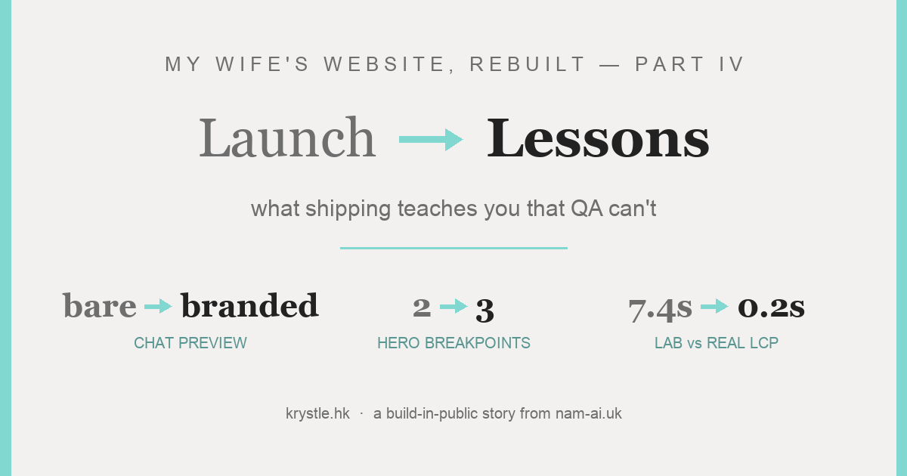
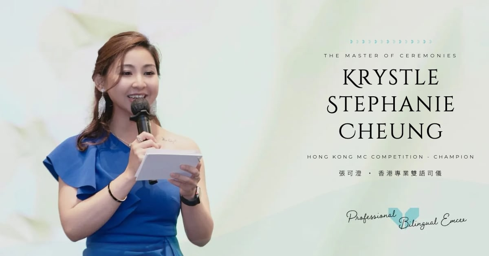
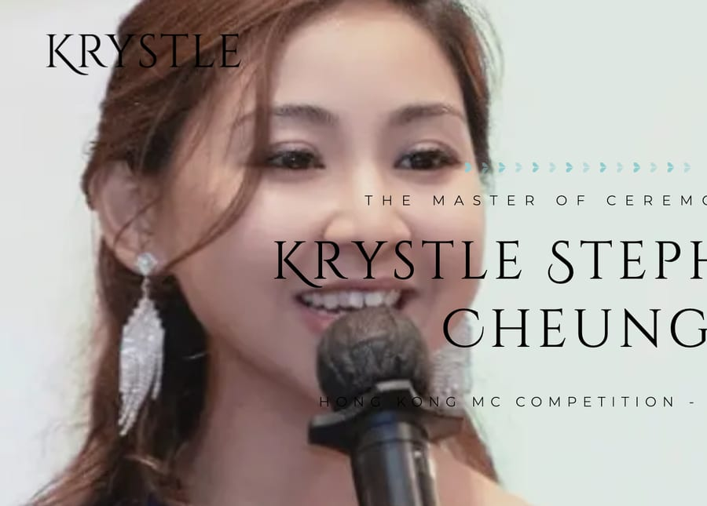
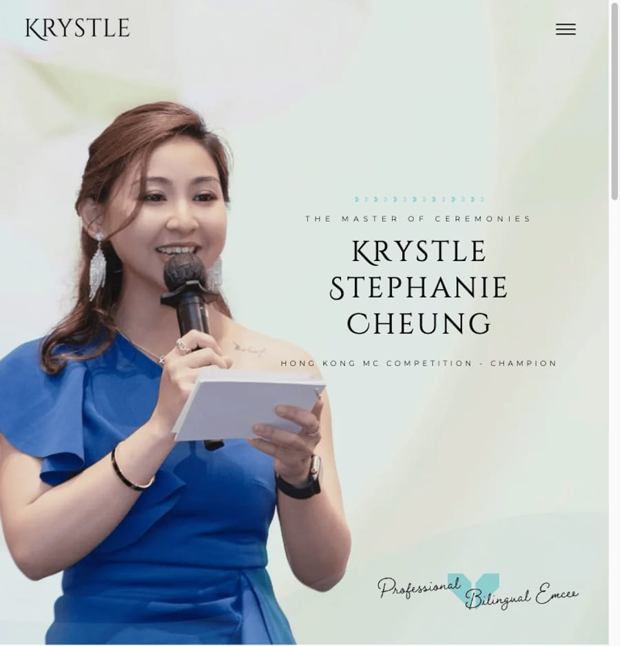
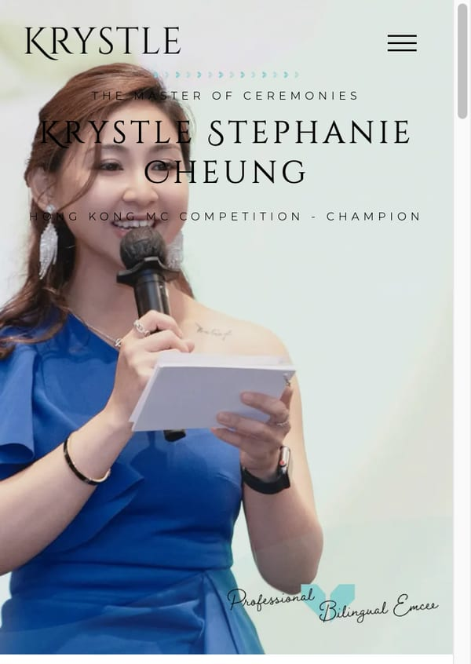

[第一至三篇](/zh/posts/rebuilding-my-wifes-website-part-1/)在高點收尾：**[krystle.hk](https://krystle.hk)** 重建完成、上線 Cloudflare、記分板全線 100。QA 檢查了 815 條連結、按過每一個按鈕、逐頁跟原站比對過。

然後我太太在 WhatsApp 分享了她自己的網站，再傳給我一張截圖：預覽卡是**空的**。標題是一條粗體網址。沒有圖。沒有描述。對一位靠群組轉介接生意的司儀來說，那張預覽卡*就是*名片——而它看起來像一條可疑連結。

<!-- TODO(nam): 在這裡放你手機那張 WhatsApp 截圖——它是完美的開場。

*一切由這個訊息開始。* -->

這一篇是現實檢查的章節：三件**上線之後**才現身的事，和每一件教會我們的東西。（第三篇預告過「張可澄 司儀」的*排名*跟進——那需要 Search Console 累積幾星期的數據才值得寫，所以還在路上。這一篇是上線第一天教的事。）

## 目錄

## 故事一：WhatsApp 預覽——第二篇修好訪客看到的，第三篇修好 Google 看到的。群組裡的朋友看到的？這是第四篇。

第一反應：重建在第三篇已經上齊 Open Graph 標籤——是不是壞了？用爬蟲的方式檢查，就是用它們真正的 user-agent：

```bash
curl -s -o /dev/null -w "%{http_code}" -A "facebookexternalhit/1.1" https://krystle.hk/
# 200——而且回應裡帶著完整的 OG 標籤。沒被擋，也沒缺。
```

`facebookexternalhit` 和 WhatsApp 的 agent 都拿到 200 和完整標籤，apex 和 `www` 都一樣。og:image 也存在（200、25 KB）。*現在*甚麼都沒壞。真正的原因有兩個：

1. **WhatsApp 的預覽快取是化石紀錄。** 這條連結在 DNS 切換*之前*被分享過——當時應門的還是零 OG 標籤的舊 WordPress。WhatsApp 和 Facebook 按網址積極快取預覽。那張空白卡不是新網站失靈，是舊網站的鬼魂。
2. **原本的 og:image 本身也弱**——一張六成是空白水彩的 hero 裁圖。壓成聊天縮圖後，看到的是⋯⋯甚麼都沒有。

> [!tip] www 的紅鯡魚
> 截圖寫著 `www.krystle.hk`，所以我燒了二十分鐘懷疑子域名。兩個主機名都正常出貨；canonical 和 `og:url` 都指向 apex。預覽有問題時，先懷疑**快取**，再懷疑網址。

### 修法：由網站自己渲染的 banner

與其在圖片編輯器裡拼一張宣傳卡（還要到處找字型檔），我們把 headless 瀏覽器指向**已上線的首頁**、視窗開成正好 **1200×630**、藏起導航、注入一行字——**張可澄 · 香港專業雙語司儀**——然後截圖。品牌字型像素級一致，因為那*就是*網站的字型——連第二篇的 kerning 修正都包括在內。49 KB，遠在 WhatsApp 大圖預覽的上限之內。



*那張 banner：由 live hero 渲染出來，不是在編輯器裡重造的。*

然後是元資料，一字不差來自上線頁面——留意**新檔名**，它就是按網址快取的爆破器：

```html
<meta property="og:image" content="https://krystle.hk/img/og/banner-krystle.jpg">
<meta property="og:image:secure_url" content="https://krystle.hk/img/og/banner-krystle.jpg">
<meta property="og:image:type" content="image/jpeg">
<meta property="og:image:width" content="1200">
<meta property="og:image:height" content="630">
<meta property="og:image:alt" content="香港雙語司儀 MC Krystle Cheung 張可澄">
```

首頁、關於、作品集和 404 用這張 banner。**85 個活動頁保留各自的活動照片**做 og:image——在群組分享某一場活動，預覽就是*那一場*，比任何通用 banner 都更好的宣傳。

最後一里路是人手的：WhatsApp 仍然按網址抓住舊預覽。分享到一個*新*的對話，馬上就是新卡；頑固的快取，用 Facebook 的 **Sharing Debugger →「Scrape Again」**（WhatsApp 用的就是 Facebook 的爬蟲基建）。

## 故事二：沒有人測試的 768px

第二天早上，對已上線的網站做真實裝置尺寸的巡查。手機（390px）：正常。桌面（1440px）：正常。**iPad 直向（768px）：載入了手機的構圖，她的名字直接排在她臉上**，還削出畫面外。



*768px，QA 遺忘的視窗：手機構圖、平板尺寸、名字壓在臉上。*

QA 以最經典的方式錯過它：「手機」是 390、「桌面」是 1440，中間的尺寸從來沒人打開過。但 601–1024px 是真實存在的觀眾——iPad、橫向手機、小筆電。

真正的教訓：**藝術指導（art direction）不等於響應式縮放。** 這個 hero 不是一張會縮小的圖——它是三個*不同的構圖*：桌面（她在左、文字在右）、平板（她在左、頭頂留更多空間）、手機（直向裁切、文字在上）。原設計師三張都做了。重建的斷點卻把手機構圖派給了 ≤900px 的一切——為手機裁圖定位的文字，落在平板尺寸渲染的錯誤圖上⋯⋯正好在臉上。

修法是正規的三路 art direction——這是上線中的標記：

```html
<source media="(max-width:600px)"  srcset="/img/hero/mobile-828.webp"  width="828"  height="1150">
<source media="(max-width:1024px)" srcset="/img/hero/tablet-1200.webp" width="1200" height="1250">
<!-- 1024px 以上用桌面  -->
```

⋯⋯加上每個範圍對應的文字定位，和每個 source 的 `width`/`height`（零版面偏移）。大約 15 行 CSS 加兩個 HTML 屬性。*找到它*只需要看一眼沒有人看的視窗。



*修正後：平板拿到平板的構圖，名字在留白裡。*



*手機 hero 微調後——完整構圖不裁切，臉部清晰。*

## 故事三：逮住幽靈 LCP

第一篇留下了一個未解的伏筆：Lighthouse 模擬器說 LCP 6.5 秒，它自己的 filmstrip 顯示 1.9 秒，真實 trace 說 0.2 秒。上線後劇情變厚：**Google 的 PSI 對真實網站從沒顯示過那個幽靈**（手機 LCP 2.9–3.7 秒、桌面 0.6 秒——就是第一、三篇刊出的截圖）。但對*同一條上線網址*跑一次原裝 Lighthouse CLI，模型仍然給出 **7.4 秒**。同一頁、同一網絡——兩個「實驗室」數字相差四秒。

報告自己就帶著鐵證：`observedLoad: 344ms`、`observedFirstPaint: 1334ms`。頁面*實際上*幾乎瞬間畫完一切——模擬器在把那一次繪製所依賴的東西不斷放大。

於是二分法。對上線網站測了十一個變體。關動畫——沒變。關跑馬燈——沒變。Inline CSS——*更差*。用單張 hero 圖取代 `<picture>`——沒變。移除字型 preload——沒變。`font-display: optional`——沒變。改成 `window.load` 之後才用 JavaScript 載入字型——**仍然 6.5 秒**。整個移除 `@font-face`——**1.35 秒**。

> [!important] 根本原因
> Lighthouse 的 **Lantern** 模擬器為 LCP 建一張「悲觀」依賴圖，把**繪製前所有在途的網絡請求**都算進去。一個 272 KB 的中文字型子集（加四個拉丁子集）在模擬的 Slow-4G 上 ≈ 幾秒鐘的模型延遲，直接黏在 LCP 上——無論 `font-display` 說甚麼、無論真實瀏覽器根本會先用後備字型即刻繪製、再隱形地換上。每一個用 CJK 字型的網站都會撞上這個矛盾；如果你為香港或台灣的觀眾做網站，你的實驗室 LCP 大概正用同一種方式騙你。

終結調查的一擊：移除字型讓模擬的 *FCP 變差*，同時「修好」了 LCP。這個模型連內部都不自洽。到了這一步，你已經不是在優化網站——你是在優化一個模型的意見。

處理：保留對真實用戶最優的字型策略（preload + swap；FCP 1.7 秒），相信三個互相吻合的量度（filmstrip、DevTools trace、真實數據），讓 CrUX 的實地數字慢慢累積——反正 Google 排名看的就是它。

> [!note] 額外冷知識：連你的 CDN 都會改你的網站
> 上線後 SEO 一度是 92 而不是 100——Cloudflare 的 AI 爬蟲控制功能會在邊緣往 `robots.txt` 注入一行 `Content-Signal:`，而 Lighthouse 會標記它不認識的指令。儀表板上撥一個掣就回到 100。值得記住：你部署的東西，已經不一定是你端出去的東西。

## 上線教會我們的事

這三件事沒有一件會出現在本地 QA 裡：聊天軟件的快取比你的部署更老、一個沒人打開的視窗、一個模擬器對字型的意見。它們只存在於生產環境、有真實用戶的地方——而這次的用戶是最上心的那一位：網站的主人，在分享她自己的網站。

不過，這套工作流程經受住了實戰。Bug 報告（太太的一張 WhatsApp 截圖）→ 修復 → `git push` → 約一分鐘後上線。那個循環——而不是 Lighthouse 分數——才是真正值得擁有的東西。

系列的弧線也落在該落的地方：**[krystle.hk](https://krystle.hk)** 現在在每一個屏幕上都是對的，*包括沒有人測試的那些*——而在群組裡分享它，終於看起來像它本來的樣子：在宣傳 Krystle。

---

**本系列：**[第一篇——WordPress → 靜態 HTML，以及誠實的利弊](/zh/posts/rebuilding-my-wifes-website-part-1/) · [第二篇——介面](/zh/posts/rebuilding-my-wifes-website-part-2/) · [第三篇——SEO 的故事](/zh/posts/rebuilding-my-wifes-website-part-3/) · 第四篇——你在這裡。「張可澄 司儀」的排名檢查，等 Search Console 有話要說的時候。

*上線之後才學到東西？那是最好的一種 bug 報告——[電郵我](mailto:nam@wistkey.com)。*
