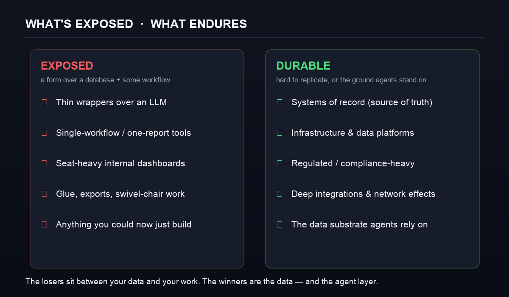

Satya Nadella 在一個 podcast 上講了個「SaaS 已死」的版本,然後互聯網做了它慣常做的事。他真正的說法,比那個標題更尖銳、也更有趣:他認為,商業應用程式大部分都只是[「一個 CRUD 資料庫,加一堆業務邏輯」](https://www.windowscentral.com/microsoft/hey-why-do-i-need-excel-microsoft-ceo-satya-nadella-foresees-a-disruptive-agentic-ai-era-that-could-aggressively-collapse-saas-apps)——而在 agent 的年代,那些邏輯會從個別應用程式*搬出來*、搬進 AI 那一層。微軟自己的 Charles Lamanna 講得更盡,[預測傳統商業應用程式在 2030 年前就會過時](https://thenewstack.io/microsoft-ai-business-agents-will-kill-saas-by-2030/)。

我就是建構「取代 SaaS 的那些東西」的人——在 [Wistkey](https://wistkey.com),我的正職就是替公司設計客製化的 agentic 工作流程——所以我有睇法,而且大部分都比標題悶。SaaS 不是在死。但它正在**被拆解、被重新定價**,而暴露出來的那一層,正正是公司老早已經俾到厭的那一層。以下是誠實的版本。

## 目錄

## Nadella 真正的意思

把一個典型的商業應用程式拆開,你會見到三樣嘢:一個資料庫(紀錄)、一些業務邏輯(規則同工作流程)、以及一個按座位收費的 UI(人類戳它的方式)。過去三十年,你把這三樣當成一件產品去買,每個功能買一次——一個 CRM、一個 HRIS、一個工單系統、一個 BI 儀表板、一個報銷 app——而你按人頭、按月、按 app 俾錢。

Agent 的論點是:中間那一層——業務邏輯——不再需要住在每一個 app 裡面。一個 agent 可以握住那些規則,同時讀寫幾個資料庫,並且*把工作流程做埋*,而不需要一個人類㩒過三個儀表板去令它發生。資料庫留低。邏輯向上搬進 agent。而夾在中間、按座位收費的那個 UI——你其實大部分錢是俾緊佢的那部分——變薄。

> [!note] 「死」是用錯的動詞
> 這不是死亡,是**遷移**。價值沒有消失;它移動了——向下沉入記錄系統,向上升進 agent 那一層——剩下夾在中間、按座位收費的那個 app,越來越難撐起自己的價錢。你站在「SaaS 已死」的哪一邊,大致取決於:你賣的,是不是那個中間層。

## 把「拆解」畫出來

*你保留真相之源。夾在它同實際工作之間、按座位收費的工具,變薄。*

舊的形狀,是一個放滿單一用途 app 的架,每個按座位收費,而它們之間有數量驚人的**人手黐合**——那些匯出、複製貼上、「轉櫈」式的工作:登入一個系統,把資料搬去另一個。那些黐合從來不是有人賣俾你的產品;它是你為「擁有十二個互不相通的工具」而俾的稅。

新的形狀,更扁平。你的**資料**——記錄系統——留在原地,甚至變得*更*核心。上面坐住一層 **agent**,跑為你的業務度身訂造的工作流程,直接打 API 同資料庫,一步就做完那個「三個 app 之間跳來跳去」的舞,因為它一個 GUI 都不需要。以前要買一個 SaaS、或者把五個駁埋一齊先做到的那個客製化工作流程,現在變成一件你可以⋯⋯直接建出來的事。

## 定價,一早就係破綻

如果你想知道一個市場往邊度走,睇佢點定價。在 agent 的年代,按座位的 SaaS 定價不只是過時——它是**結構性地壞了**。

*一個 agent 做得越好,你需要的座位越少——所以按座位收費,悄悄地是在俾錢叫供應商做差啲。資料來源:Bessemer 2026 AI 定價手冊、Gartner、各供應商定價頁。*

一句講晒個陷阱:**當「用家」是一個 agent,座位就在量度錯的東西。** 更糟的是,誘因反轉了——一個 agent 表現越好,客戶需要的人類座位越少,所以一個按座位的供應商,字面上是[俾錢叫佢做差啲](https://www.mindstudio.ai/blog/saas-pricing-ai-agent-era)。這就是為甚麼按座位在 SaaS 定價的佔比[一年內由 21% 跌到 15%](https://www.aimagicx.com/blog/death-of-per-seat-saas-pricing-ai-agents-2026),以及為甚麼 Gartner 預計到 2030 年,一大截企業 SaaS 開支會轉向用量、成效、或者 agent 為本的模式。

你可以即場睇住那些老牌廠商亂腳。Salesforce 的 Agentforce 在大約十八個月內[換了三個定價模式](https://www.saastr.com/salesforce-now-has-3-pricing-models-for-agentforce-and-maybe-right-now-thats-the-way-to-do-it/)——每次對話 $2、然後按動作計 credit、再然後一個按人頭的「數碼員工」授權——因為沒有人搞得掂:對一件人類已經不再逐個座位去做的工作,應該點收費。與此同時,成效定價在邊緣悄悄登場:Intercom 的 Fin 每解決一次對話收約 **$0.99**——你在問題真正解決時先俾錢,而不是為一次登入俾錢。

## Klarna 那個星號(拆嘢之前先讀呢段)

「用 AI 取代 SaaS」的招牌案例是 Klarna,而它同時是最好的警世故事——正因如此,更值得誠實引用。

Klarna 當時同時周旋於大約 **1,200 個 SaaS 應用程式**,並著手把它們整合到一個內部、AI 原生的技術棧上。好故事。但現實比標題更微妙:Klarna [與其說用純 AI 取代那些工具,不如說是用*其他*軟件取代](https://www.cxtoday.com/crm/klarna-didnt-replace-salesforce-it-replaced-them-with-alternative-saas-apps/)——HR 用 Deel、重整資料層、換了個組合——而它自己的 CEO [公開懷疑其他公司會唔會跟隨](https://techcrunch.com/2025/03/04/klarna-ceo-doubts-that-other-companies-will-replace-salesforce-with-ai/),話他不覺得這是 Salesforce 的終結,「可能剛好相反」。

> [!warning] 不要把「整合」當成「刪除」
> Klarna 真正的教訓,不是「炒晒你啲 SaaS 供應商、乜都自己建」。而是:一間浸死喺 1,200 個半用不用工具裡的公司,可以把那種蔓延——那些黐合、那些重疊、那九個沒有人完全用到的座位——**收攏**到一個更小的技術棧,上面用一層 agent 去做工作流程。記錄系統活下來了。圍住它那堆亂,沒有。

## 甚麼會死,甚麼會留低

咁到底邊啲 SaaS 真係暴露咗?用一條問題去分類:*這件嘢,是不是主要就是「一個資料庫上面加個表單、再加啲工作流程」?* 如果係,它就在爆炸範圍之內。

*輸家坐在你的資料同你的工作之間。贏家是資料本身——同上面那一層 agent。*

**暴露:** 薄薄地包住一個模型的 wrapper;你為了剛好一件事而買的單一工作流程或單一報表工具;座位密集的內部儀表板;那些整合同匯出的黐合;以及,坦白講,任何一間企業而家可以用一個星期自己建出來、而不用花一季去採購的東西。

**留低:** **記錄系統**(你的真相之源——agent 令它*更*值錢,而不是更沒用,因為它們需要一個權威的地方去讀同寫);基礎設施同資料平台;受監管、合規繁重、「我哋自己建」是負債而不是威水史的軟件;以及任何有深度整合、或者真正網絡效應、一句 prompt 複製不到的東西。

## 我建構這些時,實際見到甚麼

人哋叫我建的替代方案,幾乎從來不是「重建 Salesforce」。它們比那窄、也比那有用:*取代那九個團隊只用一半的工具座位授權;殺死 CRM 同財務系統之間那個轉櫈工作流程;退役那個我哋為了一份月度報表而買、每年 $40k 的單點方案。* 你保留記錄系統,在工作流程前面擺一個 agent。對一整類內部工具來說,「自己建定買」真的反轉了——不是因為「自己建」變得威風,而是因為一個客製化工作流程,由一個採購週期變成了一個下午。

這個反轉有一個誠實的代價,而我對每一個客戶都會講:**當你自己建,你就變成了供應商。** 不再有人收你錢去搞掂運行時間、保安修補、同那些邊緣情況。對一個「你營運的核心」工作流程,那份擁有權是值得的。對一件你要永遠維護落去的通用品,那個 SaaS 其實是幫緊你。而家的技能,不是「乜都自己建」——而是知道每一個工作流程,落喺條線的哪一邊。

> [!tip] 如果你賣 SaaS,求生的一步好清楚
> 在市場逼你之前,先離開純按座位。變成 agent 會*呼叫*的那個東西——開放乾淨的 API 同工具(這正是 MCP 講緊的一大部分),令你身處工作流程之內、而不是被繞過。如果做得到,擁有那個**記錄系統**,因為那是 agent 倚賴的一層。最危險的位置,是那個按座位收費的中間:一個資料庫上面的業務邏輯,論登入去賣。

## 真正的重點

SaaS 不是在死。**那層「一個資料庫加業務邏輯、再按座位收費」的中間**正在被掏空,而價值向兩端移動:它下面的記錄系統,同它上面的 agent 層。如果你買軟件,問題悄悄由「呢件事我哋買邊個 SaaS?」變成了「呢個工作流程,我哋係咪應該自己擁有?」如果你賣軟件,問題是一個 agent 會*穿過*你、定係*繞過*你。

「死亡」這個詞,做標題好過「拆解同重新定價」。但真正在發生的,是拆解——而且它是更值得你去為之部署的那件事。

*如果你的公司望住一堆互相重疊的 SaaS,想知道一層 agent 到底可以取代甚麼——同埋不應該取代甚麼——那正正是我在 Wistkey 會做的對話。[電郵我](mailto:nam@wistkey.com),我會俾你一個直接的判斷。*

---

*覺得有用?[在 Medium 追蹤我](https://nam0403.medium.com/)、[訂閱或收藏 nam-ai.uk](https://nam-ai.uk) 睇更多「不吹水」的 AI 落地文,亦歡迎[在 LinkedIn 連繫我](https://www.linkedin.com/in/nam-chan/)——我隨時樂意就呢啲嘢辯論一番。*
