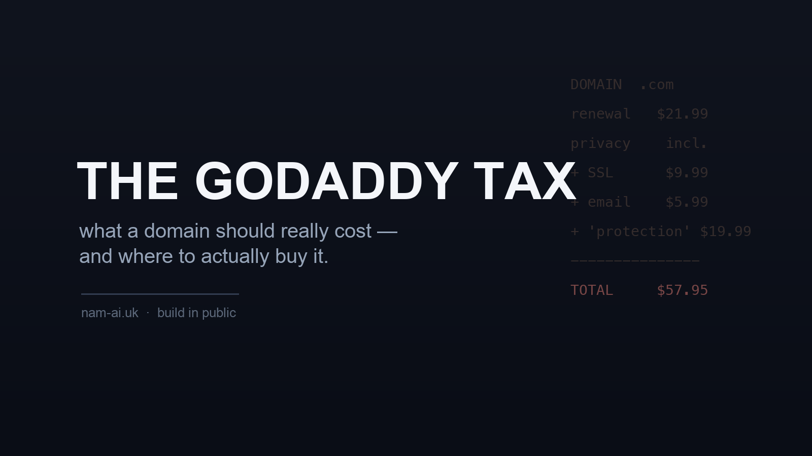
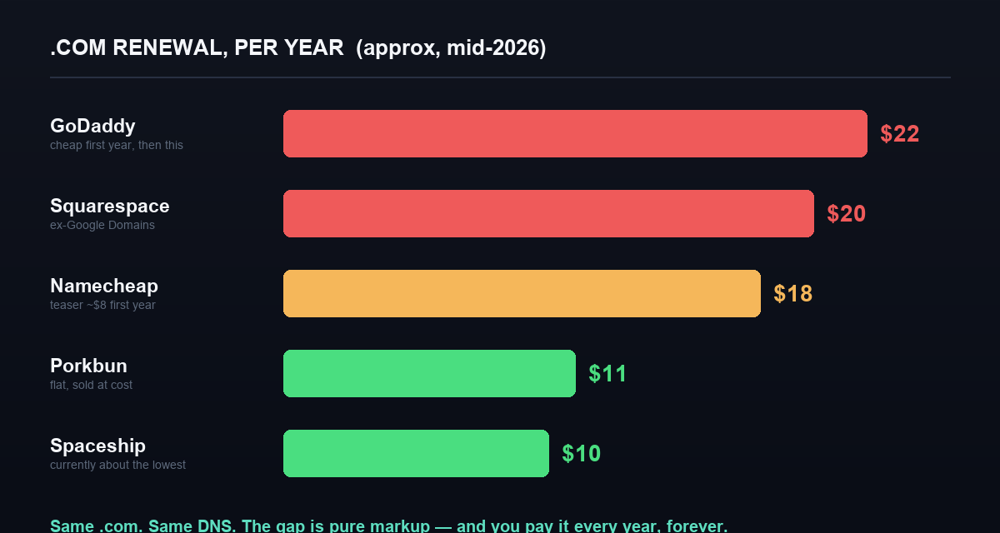
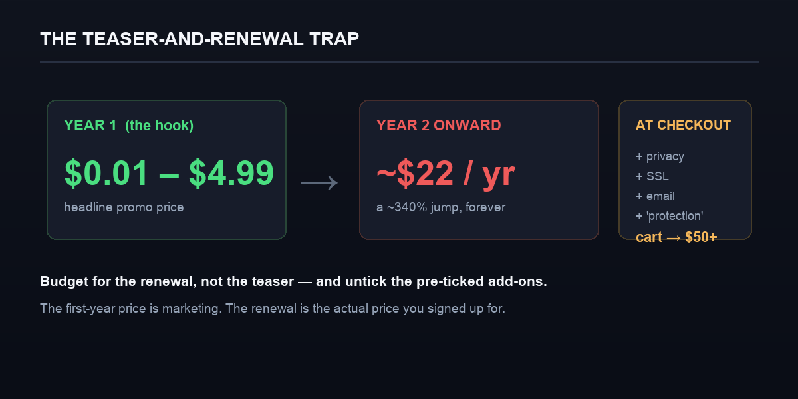

我手上有一小堆網域——每個項目一個,再加幾個囤住的。所以每個月總有一兩次續期通知彈出嚟,而不久之前,其中一個令我真係去睇清楚個數字:一個平平無奇的 `.com`,續期收約 **£17 / US$22**。同一個網域,在另外幾間註冊商,續期只收**一半**。

同一個名。同一套 DNS。一個網域*實際上係*的一切,通通一樣。唯一分別,是我當初喺邊度買。這道差距,在我腦裡而家有個名:**GoDaddy 稅**——而 GoDaddy 只是收得最出名的那一個。

這不是一篇打擊文;GoDaddy 的服務順滑、好用,幾百萬人用得開心。但如果你在付它的價錢,卻不知道其他選擇只收一半,那值得你花三十秒留意一下。以下是誠實的比較。

## 目錄

## 網域是大宗商品——咁點解會差兩倍?

有件事大家會忘記:**註冊商是個二手轉售商。** 全世界每一個 `.com`,最終都由同一個註冊局(Verisign)管理,以同一個批發價賣俾每一間註冊商——大約每年 $10 上下。GoDaddy、Namecheap、Porkbun 全部由同一個水龍頭入貨。他們賣俾你的,是上面薄薄一層的儀表板、DNS 管理同客服。

所以當一間收 $10、另一間就同一件*一模一樣*的產品收 $22,那 $12 的差距,並不是買到一個更好的網域。世上沒有「更好的 `.com`」這回事。那筆錢買的是品牌、行銷開支,以及一個假設:你不會去查。

> [!note] 破綻:按成本價的註冊商存在,而且好地地
> ~$10 才是真實價格的證據,是有信譽的註冊商日日以 ~$10 賣它,仲繼續做得住生意。如果一個網域真係要 $22 成本先供得起,他們就做唔住。多出來的,是利潤,不是成本。

## 一個 `.com` 各家的續期價

我拉了目前(2026 年中)的續期價。我特登用**續期價**、而不是首年價——下一節解釋點解。四捨五入,美元計:



*同一個 .com、同一套 DNS——差距純粹是加價,而你每年都要俾。資料來源:各註冊商自己的定價頁,加上比價追蹤網站,2026 年中。*

```
註冊商         .com 續期/年      備註
------------  ---------------   ---------------------------------
GoDaddy       ~$22              首年平,續期就貴
Squarespace   ~$20              接收了 Google Domains;之後變貴了
Namecheap     ~$18              首年約 $8,續期貴約 68%
Porkbun       ~$11              統一價,接近成本賣
Spaceship     ~$10             目前大約最平
```

以你實際會持有一個網域的十幾年計,$22 同 $10 一年的分別,是真金白銀——每個網域計,而我有成打。

> [!tip] 最平的那一檔在哪裡
> 補充一下:還有一個**按成本價的註冊商選項——Cloudflare**——它以批發價(約 $10.44)直接過俾你,零加價。代價是它只接受轉入(你不能在那裡註冊一個*新*名),而且會把網域綁在它自己的 DNS 上,所以那是跟「我去邊度買」不同的另一個決定。如果只是純粹買一個新網域,Porkbun 同 Spaceship 是最容易的按成本價之選。

## GoDaddy 實際上點賺你錢:首年劈價、續期翻價、加購

貴,不在標價那裡。真正收稅的,是三個機制:



*首年價是行銷。續期價才是你實際簽落去的價錢。*

**一、首年的誘餌價。** 那個「$0.01」或「$4.99 .com!」是一年的促銷。第二年就跳返去真正的約 $22——升幅超過 **300%**。促銷本身沒問題,但你該比較的是*續期*價,因為只要你一日擁有那個名,就一日要俾。

**二、預先剔好的加購。** 行一次 GoDaddy 的結帳流程,購物車會悄悄堆起附加項目——一張你其實可以向主機商免費攞的 SSL 證書、一個電郵計劃、一個「保護」或「擁有權」加購——於是一個 $12 的網域,除非你逐個剔走,否則變成 **$50+** 的訂單。有些,更是你在別處本來就免費有的東西。

**三、以前要收費的私隱。** WHOIS 私隱把你的姓名、地址同電話從公開紀錄裡隱藏。它本該免費——這點 GoDaddy 而家做到了——但多年來它是一個 $10–20/年 的收費項目,而不少註冊商至今仍當它是一個可以收錢的剔選框。免費私隱該是基本盤,不是一項「功能」。

> [!warning] 比較續期價,不是標題價
> 每一個「最平網域!」的廣告,報的都是首年促銷價。誠實的比較,是**續期**價、含私隱、加購全部剔走之後的價錢。以這個基準,上面那道差距是真實而且長期的。

## 我實際上點做

沒甚麼花巧——就是四個令網域成本悶悶哋、唔會失控的習慣:

- **把註冊商同其他一切分開。** 在一間平的註冊商買網域;網站主機愛擺邊擺邊;電郵再擺去另一處。把所有嘢塞進一個貴的儀表板,正正是你多俾錢買的那樣東西。網域是可攜的——你隨時可以把 DNS 指去別處。
- **以續期價作判斷。** 首年促銷是雜訊。買之前先查第二年的價;那才是你要長期共存的數字。
- **結帳時把所有嘢剔走。** 你需要那個網域。你幾乎肯定唔需要那些預選的 SSL、電郵、或者「保護」套餐。之後真係想要,再刻意加返。
- **審視你而家已經在俾的。** 你可以查到一個網域目前由邊間持有——然後再去查那間註冊商的續期價:

```bash
whois yourdomain.com | grep -i registrar
```

如果查返嚟是一間貴的註冊商,而你的續期價又在慢慢爬升,搬一個網域是大約十分鐘的事(解鎖、攞授權碼 / EPP code、在新註冊商發起轉入;通常會加一年,收費大約是新註冊商的價)。我搬過幾個,零停機——過程中 DNS 一直照常服務。

## 幾時俾多啲係值得的

公道啲講,因為目標是一個好決定、不是為某間註冊商護短:如果你想要**一個登入**搞掂你的網域、你的網站 builder、你的電郵同客服線,而且寧願完全不想去諗——GoDaddy(或 Squarespace)賣的正正是這樣,而那筆溢價買到的是實實在在的方便。對一個非技術的擁有者、想有「一個可以問責的對象」,那可以係值得的。

但要知道你在買甚麼:你俾溢價買的是包裝,不是一個更好的網域。如果你稍為懂一點技術——或者你只是讀到這裡——你就是那個「對你而言純粹是加價」的人。

## 真正的重點

一個 `.com`,大約是**每年 $10** 的大宗商品。高出很多的部分,是一項「懶得查」稅——而且它按年、按每個網域、靜靜地收,只要你一日擁有那個名。查一查你的續期價、剔走加購,如果個數字荒謬,就搬。這是經營任何網上事物裡,回報率最高(以每分鐘計)的雜務之一。

*手上有一堆網域,又搞唔清楚你在各處實際俾緊幾多?[電郵我](mailto:nam@wistkey.com)——很樂意幫你審視一下,如果值得,零停機幫你搬。*

---

*覺得有用?[在 Medium 追蹤我](https://nam0403.medium.com/)、[訂閱或收藏 nam-ai.uk](https://nam-ai.uk) 睇更多關於「唔使俾多錢」地經營網上事物的實話文,亦歡迎[在 LinkedIn 連繫我](https://www.linkedin.com/in/nam-chan/)——隨時交流。*
